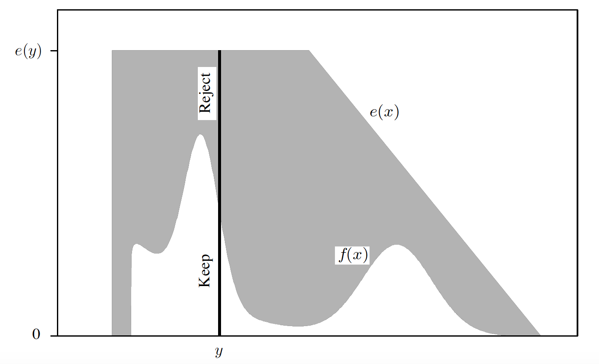

```{r setup, include=FALSE}
knitr::opts_chunk$set(echo = TRUE)
```

# Introduction
In the previous lecture we discussed Monte Carlo Integration (MCI), where we drew samples from some target distribution $f$ in order to approximate the integral $\int h(\x)f(\x)d\x$.  We also discussed ways to sample from an alternative density $g$ to reduce the variance of the standard MC estimator via importance sampling.  This could be applied even when the target density $f$ cannot be sampled from and is only known up to a multiplicative proportionality constant. 

Importance sampling can bring enormous gains with a good choice of $g$ by oversampling the "important" regions of the integrand, making an otherwise unfeasible problem amenable to MCI. It can also backfire with a bad choice of $g$ , yielding an estimate with infinite variance when simple Monte Carlo would have had a finite variance.

In our discussion of importance sampling, we were focused on integration.  But what if need to directly obtain samples from a target distribution $f$ when no software/method is available to do so?  This is common in Bayesian applications where sampling from some posterior distribution is required but is not easy to do (the exception is when conjugate priors are used).  The ability to sample exactly (or approximately) from $f$ can also be helpful for applying MCI. 

We will see later in this lecture that Markov Chain Monte Carlo (MCMC) approaches in particular may be preferable in cases where the dimension of the integral starts to become very large. We will discuss the relative pro's and cons of each approach introduced below, motivated by our Poisson GLMM example from the previous lecture. 

# Motivating Example:  MCEM-based estimation of the Poisson GLMM example

Let’s assume that we wish to utilize MCEM to fit the Poisson GLMM from the previous lecture.  If we recall, the likelihood can be written as the following:

$$L(\boldsymbol{\beta}, \sigma^2_{\gamma} | \boldsymbol{y}) = \prod_{i = 1}^{22}\int \left[f(\boldsymbol{y}_{i} | \boldsymbol{\lambda}_{i})\phi(\gamma_i| 0, \sigma^2_{\gamma}) \right] d\gamma_i$$

where $f(\boldsymbol{y}_{i} | \boldsymbol{\lambda}_{i}) = \prod_{j = 1}^5 f(y_{ij} | \lambda_{ij})$, $f(y_{ij} | \lambda_{ij})$ is the Poisson PMF with mean $\lambda_{ij}$ for the $i$th patient in the $j$th month, $\gamma_i$ is the unobserved subject-level random effect, $\log(\lambda_{ij}) = \boldsymbol{x}_{ij}\boldsymbol{\beta} + \gamma_i$, and $\phi(\gamma_i| 0, \sigma^2_{\gamma}) \sim N(0,\sigma^2_{\gamma})$.  Here  $\boldsymbol{x}_{ij} = (1, j)$ with corresponding $\boldsymbol{\beta} = (\beta_0,\beta_1)^T$, where $\beta_0$ is the population intercept $\beta_1$ is the regression coefficient for month.  Also,  $\boldsymbol{y} = (\boldsymbol{y}_1^T,\ldots,\boldsymbol{y}_n^T)^T$ is the vector of all observations in the study,  $\boldsymbol{y}_i$ is $5\times 1$ vector of words recalled in each month for subject $i$, $\boldsymbol{\lambda}_i = (\lambda_{i1},\ldots, \lambda_{i5})$,and $\boldsymbol{\gamma} = (\gamma_1,\ldots,\gamma_{22})$.


## Complete Data Log Likelihood

If we assume $\boldsymbol{\gamma}$ was known, then we could write the CDLL as 

\begin{align}
\log L_c(\boldsymbol{\beta}, \sigma^2_{\gamma} | \boldsymbol{y}, \boldsymbol{\gamma}) &= \log\left(\prod_{i = 1}^{22} f(\boldsymbol{y_{i}} | \boldsymbol{\lambda}_{i})\phi(\gamma_i| 0, \sigma^2_{\gamma})\right)\\
&=\sum_{i = 1}^{22} \log f(\boldsymbol{y}_{i} | \boldsymbol{\lambda}_{i}) + \log \phi(\gamma_i| 0, \sigma^2_{\gamma})\\
\end{align}

where $\log f(\boldsymbol{y}_{i} | \boldsymbol{\lambda}_{i}) = \sum_{j = 1}^{5}\log f(y_{ij} | \lambda_{ij})$.  

## Q-function 

Given this, the Q-function at step $t$ can we written as the following:

\begin{align}
Q(\boldsymbol{\theta}|\boldsymbol{\theta}^{(t)}) &= E[\log L_c(\boldsymbol{\beta}, \sigma^2_{\gamma} | \y, \boldsymbol{\gamma}) | \boldsymbol{y}_o, \boldsymbol{\theta}^{(t)}]\\
&=\sum_{i = 1}^{22} \int \left[\log f(\boldsymbol{y}_{i} | \boldsymbol{\lambda}_{i}) + \log \phi(\gamma_i| 0, \sigma^2_{\gamma})\right]f(\gamma_i | \boldsymbol{y}_o, \boldsymbol{\theta}^{(t)})d\gamma_i
\end{align}

where $f(\gamma_i | \boldsymbol{y}_o, \boldsymbol{\theta}^{(t)})$ is the conditional expectation for $\gamma_i$ given the observed data and current parameter estimates.  This density has the following form

\begin{align}
f(\gamma_i | \boldsymbol{y}_o, \boldsymbol{\theta}^{(t)}) &= \frac{f(\gamma_i, \boldsymbol{y}_o| \boldsymbol{\theta}^{(t)})}{f( \boldsymbol{y}_o| \boldsymbol{\theta}^{(t)})}\\
&=\frac{f(\boldsymbol{y}_o| \gamma_i ,\boldsymbol{\theta}^{(t)})f(\gamma_i |\boldsymbol{\theta}^{(t)})}{\int f(\boldsymbol{y}_o| \gamma_i ,\boldsymbol{\theta}^{(t)})f(\gamma_i |\boldsymbol{\theta}^{(t)}) d\gamma_i}\\
&=\frac{f(\boldsymbol{y}_{i} | \boldsymbol{\lambda}_{i}^{(t)})\phi(\gamma_i| 0, (\sigma^2_{\gamma})^{(t)})}{\int f(\boldsymbol{y}_{i} | \boldsymbol{\lambda}_{i}^{(t)})\phi(\gamma_i| 0, (\sigma^2_{\gamma})^{(t)}) d\gamma_i}\\
\end{align}

where $\boldsymbol{\lambda}_i^{(t)} = (\lambda_{i1}^{(t)},\ldots, \lambda_{i5}^{(t)})$ and $\log(\lambda_{ij}^{(t)}) = \boldsymbol{x}_{ij}^T\boldsymbol{\beta}^{(t)} + \gamma_i$.  For a given subject $i$, we are evaluating a one-dimensional integral with respect to $\gamma_i$ to evaluate the Q-function.  Therefore, methods from the prior section may be computationally feasible to apply.  However, the denominator of the conditional density for $\gamma_i$ above also includes an integral.  

This "normalizing constant" is exactly the (marginal) likelihood function given earlier for the $i$th subject, where we are integrating out the random effect $\gamma_i$.  The joint density $f(\gamma_i, \boldsymbol{y}_o| \boldsymbol{\theta}^{(t)}) = f(\boldsymbol{y}_{i} | \boldsymbol{\lambda}_{i}^{(t)})\phi(\gamma_i| 0, (\sigma^2_{\gamma})^{(t)})$ in the numerator is easily evaluable assuming $\gamma_i$ is known.  However, sampling from $f(\gamma_i | \boldsymbol{y}_o, \boldsymbol{\theta}^{(t)})$ is not straight-forward, as no standard statistical software is available to directly sample from this distribution.  


## Importance Sampling Implementation

For these reasons we can utilize importance sampling with standardized weights to approximate this integral, as discussed in the last lecture. This takes care of the normalizing constant during integration, avoiding having to evaluate it separately to compute the expectation. We should choose $g$ such that it is also easy to sample from.  For low-dimensional integrals, we could use the Laplace approximation of AGQ to approximate this integral, but would not be scalable to higher dimensions. 

That is, we can approximate the Q-function with respect to subject $i$ such that

\begin{align}
Q_i(\boldsymbol{\theta}|\boldsymbol{\theta}^{(t)}) &= \int \left[\log f(\boldsymbol{y}_{i} | \boldsymbol{\lambda}_{i}) + \log\phi(\gamma_i| 0, \sigma^2_{\gamma})\right]f(\gamma_i | \boldsymbol{y}_o, \boldsymbol{\theta}^{(t)})d\gamma_i\\
&= \int \left[\log f(\boldsymbol{y}_{i} | \boldsymbol{\lambda}_{i}) + \log\phi(\gamma_i| 0, \sigma^2_{\gamma})\right]\frac{f(\gamma_i | \boldsymbol{y}_o, \boldsymbol{\theta}^{(t)})}{g(\gamma_i)}g(\gamma_i)d\gamma_i\\
&= \int \left[\sum_{j = 1}^{5}\log f(y_{ij} | \lambda_{ij}) + \log\phi(\gamma_i| 0, \sigma^2_{\gamma})\right]\frac{f(\gamma_i | \boldsymbol{y}_o, \boldsymbol{\theta}^{(t)})}{g(\gamma_i)}g(\gamma_i)d\gamma_i\\
&\approx \sum_{k = 1}^M\left[\sum_{j = 1}^{5}\log f(y_{ij} | \lambda_{ijk}) + \log \phi(X_k| 0, \sigma^2_{\gamma})\right]w(\boldsymbol{X}_k)
\end{align}

where $w(\boldsymbol{X}_k) = \frac{ w^*(\boldsymbol{X}_k)}{\sum_{k =  1}^M w^*(\boldsymbol{X}_k)}$, $w^*(\boldsymbol{X}_k) = \frac{\prod_{j = 1}^{5}f(y_{ij} | \lambda_{ijk}^{(t)})\phi(X_k| 0, (\sigma^2_{\gamma})^{(t)})}{g(\boldsymbol{X}_k)}$, $\log(\lambda_{ijk}) = \boldsymbol{x}_{ij}^T\boldsymbol{\beta} + X_k$, and $X_1,\ldots,\X_M$ are iid draws from some importance sampling distribution $g$. It should be noted that in the normalizing constant depends on $\boldsymbol{\theta}^{(t)}$ and not $\boldsymbol{\theta}$, and therefore is irrelevant in the M-step.  It should also be noted that since we are using the standardized weights, we no longer divide the approximation by $M$.

For the M-step, we can use again off-the shelf maximization routines for the above approximation for the Q-function.  

## Choice of Importance Function

The question now is what is a suitable choice for $g$?  Similar to AGQ and the Laplace Approximation, we may choose to sample from a Student t importance density whose mean and variance match the mode and curvature of $f(\gamma_i \boldsymbol{y}_o| \boldsymbol{\theta}^{(t)})$. [Additional detail can be found here](https://www.jstor.org/stable/2680750?seq=1#metadata_info_tab_contents).  In general, there may not always be a clear choice of $g$, which is critical to the success of importance sampling. 

As the dimension increases, MCI and importance sampling retains its advantage over the quadrature-based approaches.  However, the choice between importance sampling and alternative approaches for evaluating the conditional expectation above may vary depending on the problem.  We will discuss these alternatives and how to choose between them in this lecture.  More generally, these alternative approaches provide a means to sample exactly or approximately from distributions where it is difficult to do so, such as from $f(\gamma_i | \boldsymbol{y}_o, \boldsymbol{\theta}^{(t)})$.  

# Exact/Direct sampling

In the above example we find that we do not have a clear means to generate samples from the conditional density of $\gamma_i$.  We know that  $f(\gamma_i | \boldsymbol{y}_o, \boldsymbol{\theta}^{(t)})$ is known up to a proportionality constant, but we do not have a clear means to sample from this distribution to allow for MCI to be applied given these samples.  

One way to do this is to use a category of methods called "direct" or "exact" sampling, where one can directly sample from the target distribution $f$ rather than avoid sampling from it completely (importance sampling), or approximately sampling from it (MCMC).  We will show for the two classes of methods in this section, Rejection Sampling and Adaptive Rejection Sampling, that the samples drawn here are **independent**.  Using Rejection Sampling, we can generate samples from any density $f$ as long as we have a closed and evaluable form of $f$.

## Rejection Sampling

If the target distribution $f(x)$ can be calculated, at least up to a proportionality constant, then we can use Rejection Sampling to directly obtain a random draw from the target distribution. The general idea behind Rejection Sampling is that we first sample from an alternative distribution $g$ to generate **candidate samples**.  We then correct for the fact that these samples came from another distribution through the random rejection of some of the samples, effectively correcting the original sampling probabilities.  Importance sampling in contrast directly weights samples from $g$ during the computation of the integral, rather than attempting to directly simulate samples from $f$ itself.  Rejection sampling therefore selects a subsample of those samples originally drawn from $g$, whereas importance sampling uses every draw from $g$ and weights their contribution.  

Let us assume that we can calculate $g(x)$ easily and denote $e(\cdot)$ as the "envelope" function such that $$e(x) = \frac{g(x)}{\alpha} > f(x)$$ for all $x$ where $f(x) > 0$.  Here $\alpha \leq 1$ and is a constant.  That is, for all regions where $f(x)$ is nonzero, $g(x)$ is greater than or equal to $f(x)$ (hence the term "envelope").

Then, we implement Rejection Sampling using the following procedure: 

1.  Sample the candidate $Y ∼ g$
2.  Sample $U ∼ U(0, 1)$
3.  Reject the candidate sample $Y$ if $U > f(Y)/e(Y)$. Return to step 1.
4.  If $U < f(Y)/e(Y)$, keep Y. Set X = Y, and consider X to be an element
of the random sample from the target distribution . Return to step 1 until you have accumulated a sample of the desired size.

The retained draws then represent an **i.i.d. sample** from the target distribution $f$.  Here, $\alpha$ can be interpreted as the expected proportion of candidates that are accepted.  We often repeat the steps above until we obtain the desired number of samples.  The total number of candidate draws needed to obtain that number of samples depends on how efficient the algorithm is in accepting samples (mediated by $\alpha$).  Clearly, this is highly dependent on the choice of $e$.  We will address how best to select $e$ later on in this section. 

### Why does this work?

A formal proof is given in GH 6.2.3, but we illustrate this graphically below.  The rejection rule in Step 3 above is equivalent to sampling $U\rvert y  \sim Unif(0, e(y))$ and keeping the value $y$ if $U < f(y)$ (see figure below from GH Fig 6.1) 

{width=65%}

Let’s suppose that our particular draw $y$ is at the vertical bar along the support of the target density (x-axis of fig). Then imagine sampling $U|Y = y$ uniformly along the vertical bar. In step 3, we reject this draw with probability proportional to the bar length above $f(y)$ relative to the overall length of the bar ($e(y)$). Therefore, one can view Rejection Sampling as sampling uniformly from the two-dimensional region under the curve $e$ and then throwing away any draws falling above $f$ and below $e$. Since sampling from $f$ is equivalent to sampling uniformly from the two-dimensional region under the curve labeled $f(x)$ and then ignoring the vertical coordinate, Rejection Sampling provides draws exactly from $f$.

In other words, this procedure is equivalent to first randomly selecting a point from the x-axis above by sampling from $g$, then drawing a sample $U$ from $U(0, e(y))$ along the y-axis.  If $f(y)<U<e(y)$ then we reject, otherwise we keep the sample.  In this manner, we are able to obtain an iid sample that is exactly from the target distribution $f$.

The shaded region in the figure above $f$ and below $e$ indicates the waste. Intuitively, 
a candidate draw is likely to be rejected when $e(y) >> f (y)$, whereas envelopes
is only slightly bigger than $f$ everywhere produce fewer rejected draws, corresponding to $\alpha$ values near 1.

What if $f$ is only known up to a proportionality constant $c$ such as in our MCEM example above? For example, if we define $q(x) = f (x)/c$, where c is unknown, we can find an envelope $e$ such that $e(x) \geq q(x)$ for all $x$ for which $q(x) > 0$. A draw $Y = y$ is then rejected when $U > q(y)/e(y)$. This approach is similar to what we have described before, and we can show that that $c$ cancels out in the original proof in GH equation 6.2.3 when $f$ is replaced by $q$. That is, we can similarly apply Rejection Sampling to this case.  The proportion of kept draws is $\alpha/c$.

Multivariate targets can also be sampled using Rejection Sampling, provided that
a suitable multivariate envelope can be constructed.

### Selecting an envelope function 
To produce an envelope, we must know enough about the target function to effectively bound it.
This may require optimization, or a clever approximation to $f$ or $q$ in order to ensure
that the envelope $e$ can be chosen so that it exceeds $f$ everywhere. In general, good Rejection Sampling envelopes have three properties: 

1.  They are easily constructed or confirmed to exceed the target everywhere
2.  They are easy to sample from 
3.  They generate few rejected draws.

Clearly this is not an exact science, and how best to do this will vary by problem.  This is one of the downsides of Rejection Sampling, where sometimes determining the best envelope function can be difficult or time consuming.  In some examples this step is simple, but that will not case in all situations. 

## Adaptive Rejection Sampling 
Adaptive Rejection Sampling is an automatic procedure to determine envelopes for the specific case where one has a continuous, differentiable, log-concave target density that one would like to sample from.  Here, the envelope and another function called the "squeezing function" are iteratively updated with the generation of samples. In this approach the amount of waste and the frequency with which $f$ must be evaluated both shrink as iterations increase. The implementation is more complicated than that of regular Rejection Sampling.  A tangent-based and  derivative-free implementation of adaptive Rejection Sampling are available, the latter of which has been incorporated into the popular WinBUGS often used in Bayesian analyses.  We do not go into further detail here and direct students to GH 6.2.3.2 for more detail.  

## Example:  Sampling from a posterior distribution

Let’s suppose we have 10 independent observations from GH Example 6.2 are observed from the model $X_i| \lambda \sim$  Poisson($\lambda$). Let us assume a lognormal prior distribution for $\lambda$, where  $\log(\lambda) \sim N(\log(4), 0.5^2)$. Here, we want to sample from the posterior distribution of $\lambda$ given the data.  

Let’s start with a histogram of the data and calculating $\bar{x}$ below.

```{r}
# vector of observations 
x = c(8, 3, 4, 3, 1, 7, 2, 6, 2, 7)

# make histogram
hist(x)

# print the mean of x
print(mean(x))
```

Denote the likelihood as $L(\lambda|\boldsymbol{x})$ and the lognormal prior for $\lambda$ as $f(\lambda)$. We know that  $\hat{\lambda}  = \bar{x}$ maximizes the likelihood $L(\lambda|\boldsymbol{x})$ with respect to $\lambda$.   As a result, the unnormalized posterior, $q(\lambda|\boldsymbol{x}) = f(\lambda)L(\lambda|\boldsymbol{x})$
is bounded above by the function $e(\lambda) = f (\lambda)L(4.3|\boldsymbol{x})$. We can show this visually below:

```{r}
# unnormalized posterior function
q = function(lambda, x) {
  prod(dpois(x, lambda = lambda)) * dlnorm(x = lambda,
                                           meanlog = log(4),
                                           sdlog = 0.5)
}

# envelope function
e = function(lambda, x) {
  # fixing lambda at the mean of x in the likelihood
  prod(dpois(x, lambda = mean(x))) * dlnorm(x = lambda,
                                            meanlog = log(4),
                                            sdlog = 0.5)
}

# plot setup
lambda = seq(0, 20, , 1000)

# plot the envelope
plot(lambda, sapply(lambda, e, x = x), col = "black", type = 'l')

# add plot for q
lines(lambda, sapply(lambda, q, x = x), col = "red")

# add a legend
legend(
  c("e(x)", "q(x)"),
  col = c(1, 2),
  lty = c(1, 1) ,
  x = "topright"
)
```

One nice thing to note about the chosen envelope is that the prior is proportional to $e$ (likelihood fixed at the mean is now a constant). Therefore, $g$ is clearly is the lognormal prior (refer to definition of $g$ and $e$ from the setup for Rejection Sampling).  

So, we can start the Rejection Sampling algorithm by first sampling $\lambda_i$ from the lognormal prior and $U_i$ from a standard uniform distribution. Then, following the steps for the Rejection Sampling algorithm laid out earlier, we have that $\lambda_i$ is kept if $U_i < \frac{q(\lambda_i|\boldsymbol{x})}{e(\lambda_i)} = \frac{L(\lambda_i|\boldsymbol{x})}{L(4.3|\boldsymbol{x})}$:

```{r}
set.seed(100)
# specify how many samples to keep
M = 100

# specify max number of iterations in case alpha is low (can increase later if needed)
maxit = M * 10 ^ 4

# specify vector to hold accepted samples
posterior_lambda = rep(0, M)

# start rejection algorithm
i = index = 1
while (i <= M & index < maxit) {
  # sample from lognormal prior
  lambdai = rlnorm(1, meanlog = log(4), sdlog = 0.5)
  
  # sample Ui from standard uniform
  Ui = runif(1)
  
  # calculate ratio
  Lq = prod(dpois(x, lambda = lambdai))
  Le = prod(dpois(x, lambda = mean(x)))
  r = Lq / Le
  
  # if Step 3 condition met, save sample
  if (Ui < r) {
    posterior_lambda[i] = lambdai
    # update iterator
    i = i + 1
  }
  
  # keep track of total number of samples drawn
  index = index + 1
}

# acceptance rate
print(M / index)
```

Although not terribly efficient with an acceptance rate of about 26%, it is relatively easy to implement.

Let’s make a histogram of the samples from the posterior:

```{r}
hist(posterior_lambda )
```

## Pros and cons of Rejection Sampling 

So, to summarize we have the following advantages and disadvantages of Rejection Sampling 

*  Pros
    *  Sample is truly iid from target density $f$, no approximation and samples are independent
*  Cons
    *  Designing a good envelope function $e$ may not be straightforward or easy to do
    *  Many candidates draws may be needed to obtain a sample of size $M$, depends on choice of $e$ 
    *  As the dimension of the integral groups, the above problem gets worse (acceptance rate is lower)
    
Regarding the last point above, it becomes harder in general to accept multivariate candidate draws in higher dimensions.  One way to think about this is to envision a multivariate version of the prior example.  The envelope function would be defined similarly, except that it would be multivariate, and that we would maximize over a multivariate space in the new likelihood function rather than a univariate one.  We would then fix the mean of the likelihood to this MLE.  

Ideally, each candidate draw, say $\boldsymbol{X}_i$ from the multivariate prior $g$ in this case would be close to the MLE, implying that $f(\boldsymbol{X}_i)$ is close to $e(\boldsymbol{X}_i)$, leading to likely acceptance of this sample.  As we increase the dimension to say $d = 10$, the probability that a drawn vector will be close to the MLE in every dimension becomes harder and harder. 

In higher dimensional settings we will see that the MCMC approaches discussed in the second half of this lecture are more efficient relative to Rejection Sampling.  

##  Application to the MCEM Example

We can similarly apply Rejection Sampling to draw iid samples from the target density $f(\gamma_i | \boldsymbol{y}_o, \boldsymbol{\theta}^{(t)})  = f(\boldsymbol{y}_{i} | \boldsymbol{\lambda}_{i}^{(t)}),\phi(\gamma_i| 0, (\sigma^2_{\gamma})^{(t)})$.  The question here is what is the best envelope function to use.

Similar to the previous example, one obvious option is simply $e(\gamma_i | \boldsymbol{y}_o, \boldsymbol{\theta}^{(t)}) = f(\boldsymbol{y}_{i} | \boldsymbol{\lambda}_{i}^{*(t)})\phi(\gamma_i| 0, \sigma^2_{\gamma})$, where $\boldsymbol{\lambda}_i^{*(t)} = (\lambda_{i1}^{*(t)},\ldots, \lambda_{i5}^{*(t)})$, $\log(\lambda_{ij}^{*(t)}) = \boldsymbol{x}_{ij}^T\boldsymbol{\beta}^{(t)} + \hat{\gamma}_i$ and $\hat{\gamma}_i$ is maximizer of $f(\boldsymbol{y}_{i} | \boldsymbol{\lambda}_{i}^{(t)})$ with respect to $\gamma_i$. This can be done quite easily within the GLM framework, as we will show below.  

Then similar to before, our proposal density $g$ can be $\phi(\gamma_i| 0, (\sigma^2_{\gamma})^{(t)})$.  We also draw $U$ separately from a standard uniform distribution.  Then, candidate $X$ drawn from $g$ is kept if $U < \frac{q(\gamma_i | \boldsymbol{y}_o, \boldsymbol{\theta}^{(t)})}{e(\gamma_i | \boldsymbol{y}_o, \boldsymbol{\theta}^{(t)})} = \frac{f(\boldsymbol{y}_{i} | \boldsymbol{\lambda}_{i}^{(t)})}{f(\boldsymbol{y}_{i} | \boldsymbol{\lambda}_{i}^{*(t)})}$, where $\phi(\gamma_i| 0, (\sigma^2_{\gamma})^{(t)})$ cancels out in the numerator and denominator.  

We will use this sampling step to perform MCI in the E-step.   In contrast to the importance sampling setup given earlier, we can approximate the Q-function in the $i^{th}$ sample using

\begin{align}
Q_i(\boldsymbol{\theta}|\boldsymbol{\theta}^{(t)}) &= \int \left[\log (f(\boldsymbol{y}_{i} | \boldsymbol{\lambda}_{i}) + \log\left(\phi(\gamma_i| 0, \sigma^2_{\gamma})\right)\right]f(\gamma_i | \boldsymbol{y}_o, \boldsymbol{\theta}^{(t)})d\gamma_i\\
&= \int \left[\sum_{j = 1}^{5}\log(f(y_{ij} | \lambda_{ij}) + \log\left(\phi(\gamma_i| 0, \sigma^2_{\gamma})\right)\right]f(\gamma_i | \boldsymbol{y}_o, \boldsymbol{\theta}^{(t)})d\gamma_i\\
&\approx \frac{1}{M}\sum_{k = 1}^M\left[\sum_{j = 1}^{5}\log\left(f(y_{ij} | \lambda_{ijk})\right) + \log\left(\phi(X_k| 0, \sigma^2_{\gamma})\right)\right]
\end{align}

since we are now able to draw iid samples from the posterior using Rejection Sampling.  Here, $\log(\lambda_{ijk}) = \boldsymbol{x}_{ij}^T\boldsymbol{\beta} + X_k$, and $X_1,\ldots,X_M$ are iid draws from the target density $f(\gamma_i | \boldsymbol{y}_o, \boldsymbol{\theta}^{(t)})$. Then, we can carry out the M step using standard optimization routines, for example, using NR or BFGS from our optimization lecture.  In the following section, we detail this approach.  

Alternatively, for $\boldsymbol{\beta}$, an easier approach is simply using Poisson regression to maximize the Q-function in the M-step, and therefore avoiding the need to derive any analytical derivatives of the Q-function.  To do this, we repeat each observation $\boldsymbol{y_{i}}$ and corresponding predictor in the design matrix $M$ times, filling in $\boldsymbol{X}_k$ for each repeated row for $\gamma_i$ in the linear predictor above.  Each repeated row is weighted with $1/M$.  We can also show that the solution for $\sigma^2_{\gamma}$ is simply the sum of the squared $X_k$'s divided by $nM$.  We detail this alternative approach [here](mcmc_rejection_sampler_glm_alternative.html)


### Implementing the E-step Rejection sampler

First, let’s set up the rejection sampler.  We do this first for the $i$the subject, then write a second function that loops over all subjects that calls this function. Can you think of a way to vectorize this function?  For more applications, best to rewrite in Rcpp for best performance.
  
```{r}
## function for Rejection Sampling in the MCEM E-step for subject i
# yi:       a 5 x 1 vector containing the monthly observations for sample i
# xi:       a 5 x 2 matrix pertaining to the intercept and longitudinal month value for each subject (it is the same for each subject, 1:5)
# M:        the total number of iid samples desired from the posterior
# maxit:    the max number of iterations (to prevent runaway looping)
# betat:    the estimate for beta at EM iteration t
# s2gammat: the estimate for s2gamma at EM iteration t
## Returns a list object with accepted samples and the acceptance rate

rejection.sample.gamma.posterior.i = function(yi, xi = cbind(rep(1,5), 1:5), M, maxit, betat, s2gammat, trace = 0) {
  
  ## envelope function setup, done once
  # obtain gamma_hat to create the envelope function, optimizing Likelihood wrt gammai
  # can use any optimization routine, here using IRLS holding XB fixed as an offset
  # log(lambda_i) = X%*%beta_t + gamma_i --> fix X and beta_t, treat gamma_i as coefficient
  gamma_hat = glm(yi ~ 1, family = poisson(),
                  offset = xi %*% beta)$coef
  
  # calculate lambda values for rejection ratio denominator
  lambda_star = exp(xi %*% beta + gamma_hat)
  
  # calculate rejection ratio denominator
  Le = prod(dpois(yi, lambda = lambda_star))
  
  ## specify vector to hold samples
  posterior_gammai = rep(0, M)
  
  ## start rejection sampler
  m = index = 1
  while (m <= M & index < maxit) {
    
    # sample from normal prior (proposal density here)
    gammai = rnorm(1, 0, sqrt(s2gammat))
    
    # calculate lambda values for rejection ratio numerator
    lambdai = exp(xi %*% beta + gammai)
    
    # calculate ratio numerator
    Lq = prod(dpois(yi, lambda = lambdai))
    
    # calculate ratio
    r = Lq / Le
    
    # sample Ui from standard uniform
    U = runif(1)
    
    # if step 3 met, save sample
    if (U < r) {
      posterior_gammai[m] = gammai
      
      # update num current acceptances
      m = m + 1
    }
    
    # keep track of total number of samples drawn
    index = index + 1
  }
  
  ## acceptance rate
  if (trace > 0)
    print(M / index)
  
  ## return accepted samples and accepted rate in a list
  return(list(gammai = posterior_gammai, ar = M / index))
}


```

As you can imagine, this can be quite slow, especially for large M.  Since the rejection sampler is not a recursive method, we could also vectorize the above (can you guess how?).

Below is the wrapper function that loops over all subjects.

```{r}
# data: is the main data.table object
# other arguments same as above

## Returns rejection samples matrix (n x M)

rejection.sample.gamma.posterior.all = function(data,
                                                M,
                                                maxit,
                                                betat,
                                                s2gammat,
                                                trace = 0) {
  ## get n, total number of subjects
  n = length(unique(data[,subject]))
  
  # create n x M matrix to hold rejection samples for each subject
  rejection.samples = matrix(NA,nrow = n, ncol = M)
  
  ## looping over n subjects
  for (i in 1:n) {
    
    if(trace > 0) print(i) 
    
    # draw M samples from the posterior for gamma_i
    rejection.samples.i =
      rejection.sample.gamma.posterior.i(
        yi = data[subject == i, words],
        M = M,
        maxit = maxit,
        betat = betat,
        s2gammat = s2gammat,
        trace = trace
      )$gammai
    
    # save to matrix
    rejection.samples[i,] = rejection.samples.i

  }
  
  if(trace > 0) print("completed sampling") 
  
  ## return matrix
  return(rejection.samples)
  
}
```

### Other Helper Functions

We implement a function that calculated the Q-function for the $i$th subject, then make a second one that loops over all subjects.  This is used to return the value of the Q-function in the E-step, given the estimates from the M-step and the observed data.  We also use this function in the M-step as input to the Nelder-Mead algorithm as the objective function to be maximized.

I've left my first implementation using a for loop in the function below to better illustrate the method.  Below that I've written a vectorized version that scales better with $M$ and is much faster.

```{r}

# datai:  observed data (alz) pertaining to the i'th subject
# gammai: M draws pertaining to gamma i
Qi = function(datai,
              xi = cbind(rep(1, 5), 1:5),
              betat,
              s2gammat,
              gammai) {
  # 5 x 1 vector
  yi = datai$words
  
  # get M
  M = length(gammai)
  
  # For each of the M draws, evaluate the integrand
  # using a for loop here (slower!)
  ##qi = 0
  ##for (m in 1:M) {
  ##  lambdai = exp(xi %*% betat + gammai[m])
  ##  qi = qi + sum(dpois(yi, lambda = lambdai, log = T)) +
  ##    dnorm(gammai[m],
  ##          mean = 0,
  ##          sd = sqrt(s2gammat),
  ##          log = T)
  ##}
  
  # now divide by M
  ##qi  = qi / M
  
  # Let use a vectorized version instead. 
    # create 5 x M matrix, x_beta_mat
    # each column is xi %*% betat, just repeated
    x_beta_mat = xi %*% matrix(betat, nrow = length(betat), ncol = M)
    
    # create 5 x M matrix, x_beta_plus_gamma_mat
    # m'th column is xi %*% betat + gammai[m]
    x_beta_plus_gamma_mat = sweep(x_beta_mat, 2 , gammai, "+")
  
    # calculate lambda (5 x M matrix)
    lambdai = exp(x_beta_plus_gamma_mat)  
  
    # calculate Q
    ymat = matrix(yi, nrow = length(yi), ncol = M)
    qi = sum(dpois(ymat, lambda = lambdai, log = T)) + 
         sum(dnorm(gammai, mean = 0,sd = sqrt(s2gammat),log = T))
    
    # divide sum by M
    qi = qi / M
  
  ## return values
  return(qi)
}

```


Now here is the higher level function that sums over each subject. 

```{r}
# Same parameters above except for the following one
# logs2gammat:  Indicates whether s2gammat is initially passed on the log scale.  If true, then indicates that s2gammat has to be back transformed to original scale in function.  This helps to avoid boundary issues during maximization when s2gamma estimates are close to zero and this transformation also maps to the real number line.

Q = function(data,
             betat,
             s2gammat,
             rejection.samples,
             logs2gammat = F) {
  # backtranform if maximizing s2gammat on log scale
  if (logs2gammat == T) {
    s2gammat = exp(s2gammat)
  }
  
  # initialize sum
  Q = 0
  
  # loop over subjects
  for (i in 1:22) {
    Q = Q + Qi(data[data$subject == i, ],
               betat = betat,
               s2gammat = s2gammat,
               gammai = rejection.samples[i, ])
  }
  
  # return
  return(Q)
}
```

### Setup for the MCEM algorithm

Now that we have these helper functions, lets read in the data and set up everything for the EM algorithm

```{r}
## read in the data, convert to data.table
  library(data.table)
  alz = read.table("alzheimers.dat", header = T)
  alz = data.table(alz)

## set initial parameters
  # number of subjects
  n = length(unique(alz$subject))
  
  # relative convergence threshold
  tol = 10^-5
  
  # max number of iterations
  maxit = 100
  
  # initialize iteration counter, epsilon, qfunction value to avoid triggering while loop
  iter = 0
  eps = Inf
  qfunction = -10000 # using Qfunction for convergence


## starting values for beta/s2gamma

  # fixed effects, same as before
  beta = c(1.804, 0.165)
  
  # random intercept variance, same as before
  s2gamma =  0.000225 + .01 


## set M = 10000 draws from posterior per observation in E-step
  M = 10000

```

### Testing the Rejection Sampler

Let’s test out the Rejection Sampler on just the first sample, given the starting values:
  
```{r}
# run RS
test_sample = rejection.sample.gamma.posterior.i(
  yi = alz[subject == 1, words], 
  M = M, 
  maxit = maxit*M, 
  betat = beta, 
  s2gammat = s2gamma 
)

# acceptance rate
print(test_sample$ar)

# mean
print(mean(test_sample$gammai))

# variance
print(var(test_sample$gammai))

#histogram
hist(test_sample$gammai)
```

### Now run the MCEM algorithm

Now that thats out of the way, lets apply the MCEM algorithm.

```{r}
library(optimx)

start = Sys.time()
while(eps > tol & iter < maxit){
  
  ## save old qfunction
    qfunction0 = qfunction
  
  ## Begin E-step
  
    # update rejection.samples column with the new draws
    rejection.samples = rejection.sample.gamma.posterior.all(
      data = alz,
      M = M,
      maxit = 100 * M,
      betat = beta,
      s2gammat = s2gamma
    )
    
    ## evaluate  qfunction given drawn samples, current param estimates
    qfunction = Q(data = alz, 
                  betat = beta, 
                  s2gammat = s2gamma, 
                  rejection.samples = rejection.samples
                )
      
  ## End E-step
  
    
  ## Calculate relative change in qfunction from prior iteration
    eps  = abs(qfunction - qfunction0) / abs(qfunction0)
  
    
  ## Start M-step : nelder mead
    fit = optimx(
      # initial values for the parameters
      par = c(beta, log(s2gamma)), # maximizing s2gamma on log scale! 
      # Q function wrapper
      fn = function(x, data, rejection.samples){
            Q(data = alz, 
              betat = x[1:length(beta)], 
              s2gammat = x[length(beta)+1], 
              rejection.samples = rejection.samples,
              logs2gammat = T # indicating s2gamma on log scale! 
            )   
        }, 
      method = "Nelder-Mead",
      data = data,
      rejection.samples = rejection.samples,
      control = list(
        trace = 0, 
        maximize = T, 
        abstol= tol
      )
    )
    
    # extract parameters
    beta = as.numeric(fit[1:length(beta)])
    s2gamma = as.numeric(fit[length(beta)+1])
    
    # remember to back transform s2gamma
    s2gamma = exp(s2gamma)
    
  ## End M-step
  
    
  ## update iterator
    iter = iter + 1
    if(iter == maxit) warning("Iteration limit reached without convergence")
  
    
  ## print out info to keep track
    cat(sprintf("Iter: %d Qf: %.3f s2gamma: %f beta0: %.3f beta0:%.3f eps:%f\n",iter, qfunction,s2gamma, beta[1],beta[2], eps))
}

end = Sys.time()
print(end - start)
```

This is pretty close to what we get from glmer:
  
```{r}
library(lme4)
fit = glmer(words ~ month + (1|subject), family = poisson(), data = alz)
print(summary(fit))
```

In addition, the modes of the random effects are also similar:
  
```{r}
# glmer conditional modes:  
print(head(ranef(fit)$subject))

# RS  posterior means:
print(head(rowMeans(rejection.samples)))

# plot
plot(unlist(ranef(fit)$subject), rowMeans(rejection.samples), xlab = "glmer", ylab = "MCEM", main = "")
abline(0,1)

```

# Markov Chain Monte Carlo

In the last section we discussed Rejection Sampling as a method to directly sample from a target density $f$ when $f$ could be evaluated but not easily sampled from.  An alternative way to perform this task are using Markov Chain Monte Carlo (MCMC) methods.  

One distinction between Rejection Sampling and MCMC is the latter draws samples only **approximately** from $f$, rather than drawing an exact sample from $f$ itself.  MCMC methods can be more generally viewed as methods for generating samples from which expectations of functions of $\boldsymbol{X}$ can be reliably estimated, where $\boldsymbol{X} \sim f(\boldsymbol{X})$. 

Another distinction between Rejection Sampling and MCMC is that the latter is  **iterative** and can be **flexibly** applied to many different types of problems and situations.   If you recall, Rejection Sampling depended on the specification of a proper envelope function, which may or may not be straightforward to do (as could be seen from the homework).  Similar concerns could be had about importance sampling regarding the optimal choice of the importance sampling density $g$.  

For the purposes of numerical integration, MCMC has several advantages over the methods discussed earlier in this lecture and in the last lecture.  The main advantage is that higher dimensional problems do not hinder its application or make its implementation more complex, and it can be flexibly applied to many different situations.  However, the samples that are drawn using MCMC, are often **serially correlated**.  As a result, estimates based off of these samples often have much greater variance than those based off of independent samples. 

## Introduction to MCMC methods

Let us define the sequence $\lbrace \boldsymbol{X}^{(t)}\rbrace$ as a Markov chain where
$\boldsymbol{X}^{(t)} = \left(X_1^{(t)} ,\ldots ,X_p^{(t)}\right )$, $t = 0, 1, 2,\ldots$,  where the state space can be assumed to be either continuous or discrete. We assume that the distribution of $X^{(t)}$ converges to the limiting stationary distribution of the chain when the chain is irreducible and aperiodic. A review of Markov Chain theory is given in GH 1.7.  

Briefly, a discrete-state-space Markov chain can be defined as a sequence of random variables $\lbrace \boldsymbol{X}^{(t)}\rbrace$ above, where each ${X}^{(t)}$ can take on a finite or countably infinite number of values called states, where ${X}^{(t)} = j$ indicates that the chain is in state $j$ at step $t$. One hallmark feature of Markov Chains is that the next state in the chain is dependent on only the prior one (the *Markov Property*), such that $$P[{X}^{(0)},{X}^{(1)},\ldots,{X}^{(M)}] = P[{X}^{(0)}]P[{X}^{(1)}|{X}^{(0)}],\ldots,P[\boldsymbol{X}^{(M)}|\boldsymbol{X}^{(M-1)}].$$ Then,  $\lbrace {X}^{(t)}\rbrace$ is a Markov Chain if $$ p_{ij} = P[{X}^{(t+1)} = j | {X}^{(0)} = {x}^{(0)},{X}^{(1)} = {x}^{(1)},\ldots,{X}^{(t)} = i] =  P[{X}^{(t+1)} = j | {X}^{(t)} = i]$$ for all $t=0,1,2\ldots$ and states in the state space, where $p_{ij}$ is the one step transition probability (time-homogeneous).   

This chain is *irreducible* if the probability that the chain will revisit a previous state in the chain with non-zero probability in a finite number of steps, for all possible states in the chain.  That is, regardless of what the current state is in the change, we can revisit any other state in a finite number of steps as the chain runs.  

It is *aperiodic* if there is no limitation in terms of the number of steps it takes to revisit a particular state along the chain.  

If these two conditions are met, then this chain will converge to some stationary distribution $f$, and the realizations from this chain will be approximately from this distribution for sufficiently large $t$.  Then, for any function $h$, $$\frac{1}{M} \sum_{t = 1}^M h(X^{(t)}) \rightarrow E_f[h(X)]$$ almost surely as $M \rightarrow \infty$.  We will see how this will be helpful in MCMC later.  **We can similarly extend these ideas to when the state space is continuous (which is typically the case in MCMC).**

The general idea behind  MCMC sampling is the construction of an irreducible, aperiodic Markov chain for which the stationary distribution equals the target distribution $f$.  Then, a realization $\boldsymbol{X}^{(t)}$ from this chain for large values of $t$ will then have an **approximate** marginal distribution of $f$. 

Again, this implies that the samples will be only approximately distributed $f$, and also that subsequent realizations from this chain will clearly be correlated and not independent. We will discuss examples and the implications of this fact later in this lecture. 

Therefore, the crux of MCMC lies in the construction of a suitable chain.  One natural question when utilizing realizations from the chain  is how good the approximation is at a particular $t$.  The accuracy of the estimators built off of these realizations will also be impacted by the quality of this approximation.   

For example, the distribution of $\boldsymbol{X}^{(t)}$ at small $t$ may differ greatly from $f$, and the chain may not converge to its stationary distribution until $t$ is sufficiently large.  In addition, we know that the $\boldsymbol{X}^{(t)}$'s are serially correlated, which may reduce the effective sample size of the realizations being drawn iteratively from the chain.  
In this lecture we will cover some very common and broadly applicable MCMC algorithms, such as Metropolis-Hastings and Gibbs Sampling. In the next lecture, we will cover some specific and more sophisticated MCMC approaches that may be helpful in specific situations.

## The Metropolis-Hastings Algorithm

So how do we go about constructing such a chain?  One general approach is the Metropolis–Hastings algorithm. The method begins at iteration $t = 0$ with the selection of  $\boldsymbol{X}^{(0)} = \boldsymbol{x}^{(0)}$, drawn at random from some distribution $g$ with the requirement that $f(\boldsymbol{x}^{(0)}) > 0$.  To generate  $\boldsymbol{X}^{(t+1)}$, Metropolis-Hastings uses the following procedure:

1.  Sample a candidate value $\boldsymbol{X}^{*}$ from a proposal distribution $g(\cdot | \boldsymbol{x}^{(t)})$
2.  Compute the Metropolis–Hastings ratio $R(\boldsymbol{x}^{(t)},\boldsymbol{X}^{*})$ where

$$R(\boldsymbol{x}^{(t)}, \boldsymbol{X}^{*}) = \frac{f(\boldsymbol{X}^{*})g(\boldsymbol{x}^{(t)}| \boldsymbol{X}^{*})}{f(\boldsymbol{x}^{(t)})g(\boldsymbol{X}^{*}| \boldsymbol{x}^{(t)})}.$$  This ratio is always defined because we can only generate the proposal $\boldsymbol{X}^{*} = \boldsymbol{x}^{*}$ to begin with if  $f(\boldsymbol{x}^{(0)}) > 0$ and $g( \boldsymbol{x}^{*} | \boldsymbol{x}^{(t)})>0$. Then, we pick the new value for $\boldsymbol{X}^{(t+1)}$ such that

\begin{align} 
\boldsymbol{X}^{(t+1)} &= \begin{cases}
  \boldsymbol{X}^{*} \text{ with probability min} (R(\boldsymbol{x}^{(t)},\boldsymbol{X}^{*}),1)\\      
  \boldsymbol{x}^{(t)} \text{ otherwise.}
\end{cases}
\end{align}

In other words, we keep  $\boldsymbol{X}^{*}$ as our next sample with probability 1 if $R(\boldsymbol{x}^{(t)},\boldsymbol{X}^{*}) > 1$, otherwise we keep it with probability $R(\boldsymbol{x}^{(t)},\boldsymbol{X}^{*})$. If $\boldsymbol{X}^{*}$ is not kept, we simply set $\boldsymbol{X}^{(t+1)}$ equal to the prior value in the chain $\boldsymbol{x}^{(t)}$.  

4. Set $t = t+1$ and return to step 1.

If the proposal density  $g$ is symmetric such that $g( \boldsymbol{x}^{*} | \boldsymbol{x}^{(t)}) = g( \boldsymbol{x}^{(t)} | \boldsymbol{x}^{*})$, Metropolis Hastings reduces to what is known as the Metropolis algorithm, where $R(\boldsymbol{x}^{(t)}, \boldsymbol{X}^{*}) = \frac{f(\boldsymbol{X}^{*})}{f(\boldsymbol{x}^{(t)})}.$


### Chain Convergence

Since $\boldsymbol{X}^{(t+1)}$ is only dependent on  $\boldsymbol{X}^{(t)}$, the chain constructed via the procedure above is clearly a markov chain. However, whether this chain is also irreducible and aperiodic is dependent on $g$, and one must check these conditions for any implementation (we will talk about how to do this later).  If these conditions are met, the marginal distribution of $\boldsymbol{x}^{(t+1)}$ is $f$, and $f$ is the stationary distribution of the chain.  

Assuming that these conditions are met and that the chain has converged, what do we do with the samples obtained from such a chain?  The distribution of realizations from the Metropolis–Hastings chain approximates the stationary distribution of the chain as $t$ progresses, and therefore $E[h(X)] \approx (1/M) \sum_{k = 1}^M h(\boldsymbol{x}^{(k)})$.  Estimates of such quantities based on sample averages in this setting are strongly consistent.

Based on how the chain is constructed in MH, $\boldsymbol{x}^{(0)},\ldots,\boldsymbol{x}^{(M)}$ will likely include sequentially repeated values in the chain from when $\boldsymbol{X}^{(t+1)}$ retains its previous value $\boldsymbol{x}^{(t)}$. These repeats must be kept in the chain when computing the approximations above as they correct for the fact that the proposal density differs from the target density. 

### Chain Starting Points and Burn in Period
The chain itself may take some time to converge to its stationary distribution, and samples drawn from early portions of the chain will not closely approximate $f$.  Therefore,  the removal of initial realizations from the chain is typically done before computing the aprpoximation for $E[h(X)]$. This initial sequence that is  removed is called the  **burn-in period**, and is an essential component of MCMC.  

For example, you can imagine that if you start a chain at a "bad" point, it may take longer for the chain to converge to its stationary distribution.  The realizations drawn along the way are not from this stationary distribution, and therefore should be discarded as part of the burn in.  As we will see,  the persistent dependence of the chain on its starting point can seriously hamper its performance.  

Just like with the optimization methods discussed earlier in this module, it is often good to run any MCMC procedure (such as MH) from multiple starting points to check for consistent results. We will discuss some practical aspects regarding burn-in, number of chains, starting values, and other aspects of MCMC implementation later on in this lecture. 

### Features of a "Good" Proposal Distribution
Specific features of a good proposal distribution $g$  such as the following can greatly enhance the performance of the Metropolis–Hastings algorithm:

1.  $g$ covers the support of the stationary distribution in a reasonable number of iterations, and
2.  produces candidate values that are not accepted or rejected too frequently 

A proposal distribution whose spread is either too small/large can produce a chain that requires many iterations to adequately sample the regions supported by the target distribution. 

That is, if the proposal distribution has too narrow of a spread, it will stay localized in a specific region of the support and will take a long time to explore other regions.  

If its spread it too broad, candidate values will be rejected frequently and will also take longer to adequately explore the space of the target distribution.  We will discuss how to practically choose a good proposal distribution in a later section.  

So how exactly do we create such chain with MH?  We discuss two variants of MH below, each characterized by the class of proposal distributions that they utilize.

### Independence Chains
Suppose that the proposal distribution for MH is chosen such that $g(\boldsymbol{x}^{*} | \boldsymbol{x}^{(t)})= g(\boldsymbol{x}^{*})$. Then this gives what is called an  **independence chain**, where each candidate value is drawn independently of the prior realizations of the chain.   As a result, the MH ratio simplifies to $$R(\boldsymbol{x}^{(t)}, \boldsymbol{X}^{*}) = \frac{f(\boldsymbol{X}^{*})g(\boldsymbol{x}^{(t)})}{f(\boldsymbol{x}^{(t)})g(\boldsymbol{X}^{*})}.$$  which produces an irreducible and aperiodic chain if  $g( \boldsymbol{x}) > 0$ whenever
$f( \boldsymbol{x}) > 0$.

Again, the idea here is that we generate a chain long enough such that the realizations from this chain, at sufficiently large $t$, are approximately distributed $f$.  

This is in contrast to Rejection Sampling where we are directly sampling from $f$ using the described procedure.  However, the downside is that we have to construct a proper envelope function.  

With MCMC the approach is more general, where we specify the proposal distribution and afterwards check diagnostics regarding the chain.  

One interesting thing to note is that the MH ratio can be interpreted as a ratio of importance weights, where if $w^∗ = f(X^∗)/g(X^∗)$ and $w^{(t)} = f(x^{(t)})/g(x^{(t)}), then R(x^{(t)},X^∗)= w^∗/w^{(t)}$.  This suggests that if the prior draw results in a larger than usual $w^{(t)}$ than typical $w^∗$ values, the chain may get stuck for a while at $x^{(t)}$ (large denominatior --> small ratio --> low acceptance probability of new proposals). 

As a result, the criteria for choosing importance sampling distributiona are also relevant to choosing proposal distributions.  We will talk more about this after some of the following code examples. 

### Example:  Bayesian Inference in mixture models

MCMC methods are popular tools for Bayesian inference, where some data $\boldsymbol{y}$ are observed with likelihood  $L(\boldsymbol{\theta}|\boldsymbol{y})$ for parameters $\boldsymbol{\theta}$ which have prior distribution $p(\boldsymbol{\theta})$. Bayesian inference is often based off of the posterior distribution $p(\boldsymbol{\theta}|\boldsymbol{y}) \propto cp(\boldsymbol{\theta})L(\boldsymbol{\theta}|\boldsymbol{\y})$, where $c$ is an unknown constant. 

The difficulty of computing $c$ and other features of the posterior prevents most direct inferential strategies. However, if we can obtain a sample from a Markov chain whose stationary distribution is the target posterior, these samples can be used to estimate many quantities such as posterior means and variances, tail probabilities and even the posterior density itself.

A very simple strategy is to use the prior as a proposal distribution in an independence
chain, as this prior should cover the support of the support of the posterior. In our Metropolis–Hastings notation, $f(\boldsymbol{\theta}) = p(\boldsymbol{\theta}|\boldsymbol{y})$ and $g(\boldsymbol{\theta}^∗) = p(\boldsymbol{\theta}^∗)$. 

Conveniently, this means that $R(\boldsymbol{\theta}^{(t)}, \boldsymbol{\theta}^∗) = \frac{L(\boldsymbol{\theta}^*, \boldsymbol{y})}{L(\boldsymbol{\theta}^{(t)}, \boldsymbol{y})}$, where the priors $p$ cancel out with the proposal distributions $g$ in the numerator and denominator.  

In other words, we propose from the prior, and the Metropolis–Hastings ratio equals the likelihood ratio. Therefore, we accept a proposal with probability 1 if the proposal improves the likelihood relative to the previous realization.  Otherwise, we accept the proposal with probability equal to the ratio if it is less than 1.  

By repeating this process a large number of times, the chain will hopefully converge to the target distribution $f$.  By definition, the support of the prior covers the support of the target posterior, so the stationary distribution of this chain is the desired posterior.

Suppose we have observed data from GH Example 7.2, where observations $y_1, y_2,\ldots,y_{100}$ are sampled iid from the mixture distribution $$f(y | \boldsymbol{\mu}, \sigma^2) = \pi f(y| \mu_1, \sigma^2) + (1-\pi)f(y| \mu_2, \sigma^2).$$ Here $\boldsymbol{\mu} = (\mu_1, \mu_2) = (7, 10)$,  $\sigma^2 = 0.5^2$, and $\pi = 0.7$.  

We will use a MH independence sampler to construct a chain whose stationary distribution equals the posterior density of $\pi$, assuming  $\pi \sim U(0,1)$ as a non-informative prior distribution.  Therefore, we would expect the posterior mean for $\pi$ to be concentrated in the area around 0.7. 

Let’s read in and visualize the data from GH Example 7.2 below:

```{r}
## Read in the data
mixture = read.table("mixture.dat",header=TRUE)

## Examine dimensions of dataset
dim(mixture)

## Peek at Data
head(mixture)

## Make a histogram of the responses
# extract y
y = mixture$y

# define range for plotting
x = seq(5, 14, by = 0.01)

# get density values for mixture given true values
d = 0.7*dnorm(x, mean = 7,sd =  0.5) + 0.3*dnorm(x,mean =  10,sd =  0.5)

# plot histogram and overlay density 
hist(y,breaks=20,freq=FALSE,main="Histogram of mixture data",ylab="Density")
points(x,d,type="l")
```


We can see that there are two modes in this distribution, one at 7 and one at 10, as expected.  In this example, we will evaluate two different independence chains in applying MH to find the posterior of $\lambda$. 

In the first case we use a Beta(1,1) density as the proposal density. This is equivalent to the U(0,1) density, which is the assumed prior on $\pi$.  Let’s start by setting up some helper functions:

```{r}
# function for the mixture likelihood
f = function(x,y){
  prod(x*dnorm(y,7,0.5) + (1-x)*dnorm(y,10,0.5))
}

# beta(1,1) proposal density function for pi
g = function(x){
  dbeta(x,1,1)
}

# proposal function
g.sim = function(){
  rbeta(1,1,1)
}

# Define MH ratio function given f and g, x is the proposal, xt is the current value from the chain
R = function(xt,x, f, g, y){
  f(x,y)*g(xt)/(f(xt,y)*g(x))
}
```

Now that thats done, let’s start the MH algorithm:

```{r}
# set the seed
set.seed(0)

# Set chain length
M = 10000

# initialize the chain vector
x.indep.chain = rep(0,M)

# Simulate initial draw from proposal density beta(1, 1)
x.indep.chain[1] = g.sim()

# now start chain
for(i in 1:M){
  
  # set the value at current iteration of the chain to variable xt
  xt = x.indep.chain[i]
  
  # draw a proposal from the proposal density
  x = g.sim()
  
  # calculate MH ratio 
  r = min(R(xt, x, f, g, y),1)
  
  # Generate draw from bernoulli(p).
  # Alternatively, can directly compare ratio to 
  # a U(0,1) draw as we did with Rejection Sampling
  keep = rbinom(1, 1, r)
  
  # if keep = 1, then set next iteration equal to then proposal
  if(keep == 1){
    x.indep.chain[i+1] = x
  }else{
    # otherwise, carry over value from the current iteration
    x.indep.chain[i+1] = xt
  }
}

# save result for later diagnostics
x.indep.chain.good = x.indep.chain

```

Now let’s take a look at the some of the characteristics of the chain.  Let’s first make a "sample path" plot of the chain to see how it looks across iterations.  Then let’s make a histogram of the values

```{r}
par(mfrow=c(1,2))
# Sample Path
plot(x.indep.chain, ylim=c(0,1), type="l",
     ylab="pi", xlab="iteration t",
     main = "Sample path for Beta(1,1) Prop. Dist.")

# Histogram
hist(x.indep.chain[201:(M+1)],breaks=20,xlab="delta",
     main="Hist. for Beta(1,1) Prop. Dist.")
```

The sample path plot shows each of the chain realizations $\pi^{(t)}$ with respect to the iteration number $t$.  We see that the markov chain quickly moves away from its starting point and seems easily able to sample values from all portions of the parameter space supported by the posterior for $\pi$. Such behavior is called **good mixing**. 

We can easily see that the chain has converged to its stationary distribution (no trends observed, random variability).  In the histogram we drop the first 200 iterations of the chain to reduce the effect of the starting value.   We can see right away that the chain produced a sample for $\pi$ whose mean well-approximates the true posterior mean of $\pi = 0.7$ (since the prior is non-informative being equivalent to U(0,1)).

Let’s now explore the impact of using an alternative proposal distribution, a Beta(2,10) density. The first proposal distribution is equivalent to a U(0,1) distribution, while this one is skewed rightwards with mean approximately equal to 0.167. In this case, values of $\pi$ near 0.7 are unlikely to be generated from the proposal distribution.  Therefore, we do not expect the proposal distribution to cover well the entire support of the posterior.  Let’s go ahead and run the MH algorithm using this proposal density: 

```{r}
# update helper functions for new prop
g = function(x){
  dbeta(x,2,10)
}

g.sim = function(){
  rbeta(1,2,10)
}

# initialize chain
x.indep.chain = rep(0, M)

# simulate initial draw from proposal density beta(2, 10)
x.indep.chain[1] = g.sim()

# now start chain
for(i in 1:M){
  
  # save the prior state of chain at step t to xt
  xt = x.indep.chain[i]
  
  # draw from the proposal density
  x = g.sim()
  
  # calculate MH ratio 
  r = min(R(xt, x, f, g, y),1)
  
  # Generate draw from bernoulli(p)
  keep = rbinom(1, 1, r)
  
  # if keep = 1, then update next state with draw
  if(keep == 1){
    x.indep.chain[i+1] = x
  }else{
    # otherwise, carry over value from prior iteration
    x.indep.chain[i+1] = xt
  }
}

# save result for later
x.indep.chain.bad = x.indep.chain
```

Now let’s remake the same plots:

```{r}
par(mfrow=c(1,2))
# Sample Path
plot(x.indep.chain, ylim=c(0,1), type="l",
     ylab="pi", xlab="iteration t",
     main = "Sample path for Beta(2,10) Proposal Dist.")

# Histogram
hist(x.indep.chain[201:(M+1)],breaks=20,xlab="delta",
     main="Hist. for Beta(2,10) Proposal Dist.")
```

We can see that the resulting chain moves slowly from its starting value and does a poor job of exploring the region of posterior support (**poor mixing**) in the first 10,000 iterations. This chain has clearly not converged to its stationary distribution since drift is still apparent.

The flat areas in the sample path plots are those where the proposals were not accepted for many iterations in a row, a result of the poor proposal distribution. This also increases the autocorrelation among subsequent realizations of the chain. Later we will talk in more detail regarding chain diagnostics.

In principle, for very large $t$ we will still be able to estimate aspects of the posterior for $\pi$ since the posterior is still the limiting distribution of the chain. Yet, chain behavior like that shown here does not inspire confidence for finite $t$: The chain seems nonstationary, only a few unique values of $\pi^{(t)}$ were accepted, and the starting value does not appear to have washed out. 

A plot like this should make the user reconsider the proposal density and other aspects of the MCMC implementation.  Based on the first 10,000 iteration, this chain would not yield reliable estimates for the posterior.  

### Random Walk Chains  
A random walk chain is another type of Markov chain produced by the Metropolis–Hastings algorithm but with a slight difference. Let $\boldsymbol{X}^{*}$ be generated by drawing $\boldsymbol{\epsilon} ∼ h(\boldsymbol{\epsilon})$ for some density $h$ and then setting $\boldsymbol{X}^{*}= \boldsymbol{x}^{(t)}+ \boldsymbol{\epsilon}$. This yields a random walk chain where the proposal is simply the prior realization of the chain plus a random value.  This random value is what is sampled from the density $h$.

In this case, $g(\boldsymbol{x}^{*} | \boldsymbol{x}^{(t)})=h(\boldsymbol{x}^{*} - \boldsymbol{x}^{(t)})$. Common choices for $h$ include a uniform distribution over a ball centered at the origin, a scaled standard normal distribution, and a scaled Student’s $t$ distribution. If the support region of $f$ is connected and $h$ is positive in a neighborhood of 0, the resulting chain is irreducible and aperiodic.  

It may be helpful to scale $h$ such that the acceptance rate of the algorithm is between 20 and 35$\%$, which is exactly what some adaptive MCMC methods suggest (discussed in the next lecture).

Let’s try to apply a random walk MH sampler to the prior problem.  Given that the parameter space for $\pi$ is bounded between 0 and 1, utilizing a reparameterization of the parameters in the model would be beneficial.  For example, if we let $U = \log(\pi/(1-\pi))$, then we can run our random walk MH in terms of $U$, not having to worry about hitting the boundary of the parameter space for $\pi$ for certain proposals.  We can perform a formal change of variable to implement the new approach and MH ratio.  

Let’s implement this. First the helper functions:

```{r}
# inverse logit function
inv.logit = function(u){
  pi = exp(u)/(1+exp(u))
  return(pi)
}

# log likelihood for mixture model
log.like = function(pi,y){
  sum(log(pi*dnorm(y, 7, .5) + (1 - pi)*dnorm(y, 10, .5)))
} 

# draw epsilon for the random walk.  This is equivalent to drawing from h
r.walk = function(){
  runif(1,-1,1)
}

# here, g.sim is simply the prior u plus r.walk
g.sim = function(u){
  u + r.walk()
} 

# since g(u*|u^{(t)}) = h(u* -u^{(t)}) = U(-1,1), we know it is  symmetric, and therefore it eventually cancels out in the MR ratio.

```

Now let’s start

```{r}

# Set chain length
M = 10000

# create vector to hold u and pi 
u = rep(0, M)
pi = rep(0, M)

# Simulate initial draw from rw propsal U(-1,1)
u[1] = runif(1, -1, 1)
pi[1] = inv.logit(u[1])

# now start chain
for (i in 1:(M-1)) {
  
  # generate proposal in terms of u
	u[i+1] = g.sim(u[i])
	
	# now transform to get proposal in terms of pi
	pi[i+1] = inv.logit(u[i+1])
	
	# calculate MH ratio on the **log scale**
	# logR = (log.lik(pi*)  + g(logit(pi*) | logit(pi^{(t)})) + log(|J|))
	#          - (log.lik(pi^{(t)})  + g(logit(pi^{(t)}) | logit(pi*)) + log(|J|))
	# where |J| = exp(u), so log(|J|) = u.  Since pi = exp(u)/(1+exp(u)), dpi/du = exp(u).
	# This follows eq 7.7 in the book (p. 208).  Alternatively, can use approach of eq 7.8
  logR = (log.like(pi[i+1], y) + u[i]) - (log.like(pi[i], y) + u[i+1])
  
  # transform back from log scale
  R = exp(logR)
  
	# if ratio greater than 1, keep proposal
	# if the ratio is less than one, generate bernoulli random variable
	# if we do not keep (==0) then reset to current value
	if (R<1)
		 if(rbinom(1,1,R)==0)	{pi[i+1]=pi[i]; u[i+1]=u[i]}
}
```

Now let’s look at the result

```{r}
# print mean
mean(pi[-c(1:200)])
par(mfrow=c(1,2))
# plot sequence
plot(pi,ylim=c(0,1),type="l",ylab="pi",xlab="t")
# histogram of values
hist(pi[-c(1:200)],breaks=20,xlab="delta",
     main="Hist. for Unif(-1,1) Walk")
```


Now let’s see what happens when we make the $h$ too narrow:

```{r}

# update proposal, much narrower range
r.walk = function(){
  runif(1,-0.01,0.01)
}

# Set chain length
M = 10000

# create vector to hold u and pi 
u = rep(0, M)
pi = rep(0, M)

# Simulate initial draw from rw propsal U(-1,1)
u[1] = runif(1, -1, 1)
pi[1] = inv.logit(u[1])

# now start chain
for (i in 1:(M-1)) {
  
  # generate proposal in terms of u
	u[i+1] = g.sim(u[i])
	
	# now transform to get proposal in terms of pi
	pi[i+1] = inv.logit(u[i+1])
	
	# calculate MH ratio on the log scale
	# logR = (log.lik(pi*)  + g(logit(pi*) | logit(pi^{(t)})) + log(|J|))
	#          - (log.lik(pi^{(t)})  + g(logit(pi^{(t)}) | logit(pi*)) + log(|J|))
	# where |J| = exp(u).  Since pi = exp(u)/(1+exp(u)), dpi/du = exp(u).
	# This follows eq 7.7 in the book (p. 208).  Alternatively, can use approach of eq 7.8
	
  logR = (log.like(pi[i+1], y) + u[i]) - (log.like(pi[i], y) + u[i+1])
  
  # transform back from log scale
  R = exp(logR)
  
	# if ratio greater than 1, keep proposal
	# if the ratio is less than one, generate bernoulli random variable
	# if we do not keep (==0) then reset to current value
	if (R<1)
		 if(rbinom(1,1,R)==0)	{pi[i+1]=pi[i]; u[i+1]=u[i]}
}


# print mean
mean(pi[-c(1:200)])
par(mfrow=c(1,2))
# plot sequence
plot(pi,ylim=c(0,1),type="l",ylab="pi",xlab="t")
# histogram of values
hist(pi[-c(1:200)],breaks=20,xlab="delta",
     main="Hist. for Unif(-0.1,0.1) Walk")

```

### Some general pros and cons

We can see that for the MH algorithm the generation of each sample is relatively simple, we either accept a new proposal or carry over the prior one.  

In Rejection Sampling, it may take many tries to generate one independent sample, depending on how good the selected envelope function is.  However, as one can imagine, one drawback of MH relative to Rejection Sampling is that "stickyness" of the subsequent realizations from the chain, reflecting the autocorrelation in the values.  

In some cases this may make it harder for the MH algorithm to get out of local modes.  This may be worsened by the choice of proposal distribution.  We will discuss later how to quantify this "stickyness" when we discuss diagnostics.  We are also less burdened by dimension in MH.  

For MH independence samplers, the same criteria that we discussed for choosing an importance sampling distribution $g$ are also relevant for choosing proposal distributions in this context. In particular, $g$ should resemble the target distribution $f$ and cover $f$ in the tails.  In general, the efficiency of $g$ will depend on how close $g$ is to the target density $f$. $g$ must be similar to $f$ (particularly in high dimensions).  

For Random walk samplers in MH, the choice of $h$ is more “black box”, and just needs to ensure that the support of the target distribution $f$ is well covered.  As a downside they will never be quite as efficient as a well-chosen independence proposal.

## Gibbs Sampling
The Gibbs sampler was specifically developed for higher dimensional problems, where again the goal is to construct a Markov chain whose stationary distribution is the target distribution $f$ . Rather than sampling from a multivariate proposal distribution, the Gibbs sampler does this by sequentially sampling from univariate conditional distributions, which are often available in closed form. We will talk later about how to handle those situations where such conditional distributions are not available in closed form (Metropolis-within-Gibbs).

### Basic Gibbs Sampler
As defined before, $\boldsymbol{X} = (X_1,\ldots,X_p)^T$.  Also define $\boldsymbol{X}_{-i} = (X_1,\ldots,X_{i-1},,X_{i+1},\ldots,X_p)^T$, the elements of $\boldsymbol{X}$ minus the $i$th component. Suppose that the univariate conditional density of $X_i|\boldsymbol{X}_{-i}$, denoted as $f(X_i|\boldsymbol{X}_{-i})$, is easily
sampled for $i = 1,\ldots,p$. Then, we can describe a general Gibbs sampling procedure as follows:

1.  Select starting values $\boldsymbol{x}^{(0)}$, and set $t = 0$.
2.  Generate sequentially

\begin{align}
X_1^{(t+1)} &| \cdot  ∼ f(x_1 | x_2^{(t)},\ldots,x_p^{(t)}),\\
X_2^{(t+1)} &| \cdot  ∼ f(x_2 | x_1^{(t+1)},x_3^{(t)},\ldots,x_p^{(t)}),\\
X_p^{(t+1)} &| \cdot  ∼ f(x_p | x_1^{(t+1)},\ldots,x_{p-1}^{(t+1)}),
\end{align}
where $|\cdot$ denotes conditioning on the most recent updates to $\boldsymbol{X}$. 
3. Set $t = t+1$ and go to step 2.

One run through all of the components of $\boldsymbol{X}$ in step 2 is called a cycle. Let’s illustrate this with an example from the book (GH Example 7.5, 7.6).

Below, we will often refer to the term $\boldsymbol{x}_{-i} = (x_1^{(t+1)},\ldots,x_{i-1}^{(t+1)},x_{i+1}^{(t)},\ldots,x_p^{(t)})$, representing the components of $\boldsymbol{x}$ except for $x_i$ at their current values. 

### Example:  Seal Pup Capture-Recapture

The Gibbs sampler is particularly helpful for Bayesian applications when $\boldsymbol{\theta}$ is multidimensional.  In the prior example,  $\boldsymbol{\theta}$ had some prior distribution  $p(\boldsymbol{\theta})$ and likelihood function $L(\boldsymbol{\theta}|\boldsymbol{y})$ and  $\boldsymbol{\theta}$ was unidimensional. Bayesian inference is based upon the posterior of $\boldsymbol{\theta}$, $p(\boldsymbol{\theta}|\boldsymbol{y}) = c L(\boldsymbol{\theta}|\boldsymbol{y})p(\boldsymbol{\theta})$, where $c$ is an unknown constant. The Gibbs sampler can be applied when the conditional posteriors are known and easily sampled from, and does not require evaluation of the constant $c$.  That is, at the $i$th step of a given Gibbs cycle, we sample from the univariate conditional posterior of $\theta_i$ given the remaining parameters and the data: $$\theta_i^{(t+1)} | (\theta_{-i}^{(t)}, \boldsymbol{y}) \sim p(\theta_i|\theta_{-i}^{(t)}, \boldsymbol{y})$$.

We illustrate this with an example (GH 7.5).  Here, the goal of the study is to estimate the number of pups in a fur seal colony using a capture–
recapture approach.  Seals that were tagged in a prior census are considered recaptures, and the total population size of the colony can be estimated on the basis of the history of capture and recapture data. That is, high recapture rates suggest that the true population size does not greatly exceed the total number of unique individuals ever captured.

Let $N$ be the unknown fur seal population size to be estimated using $I$ census attempts, yielding total numbers of captures (including recaptures) equaling $\boldsymbol{c} = (c_1,\ldots , c_I)$.  The total number of unique animals captured during the study is denoted by $r$. We also assume that population changes due to other sources (migration, births, deaths) are negligible during this period.  We consider a model with separate, unknown capture probabilities for each census, $\boldsymbol{\alpha} =(\alpha_1,\ldots,\alpha_I)$. 

We can write the likelihood for this model as $$L(N,\boldsymbol{\alpha} | \boldsymbol{c},r ) = \frac{N!}{(N-r)!}\prod_{i=1}^I\alpha_i^{c_i}(1-\alpha_i)^{N-c_i}. $$  Let us use a Bayesian approach to estimate the posterior distributions of $N$ and $\boldsymbol{\alpha}$, assuming a non-informative uniform prior for $N$, $N \sim f(N) \propto 1$ and $\alpha_i \sim Beta(\theta_1, \theta_2)$.  Setting $\theta_1 = \theta_2 = 1/2$.  For $I>2$, this leads to a proper posterior distribution with the following conditionals 

$$ N^{(t+1)} - 84 | \cdot \sim NegBin(85, 1 −\prod_{i=1}^7 (1-\alpha_i^{(t)}))$$

and

$$ \alpha_i^{(t+1)} |  \cdot \sim Beta(c_i + 1/2, N^{(t+1)}− c_i + 1/2).$$
Given this and the data below, lets implement the Gibbs Sampler to estimate the posterior mean for $N$ and $\boldsymbol{\alpha}$. 

```{r}
# ci    	= number captured during each census
# mi    	= number newly caught during each census
# r     	= number of unique fur seal pups observed
# I		    = number of census attempts
# N     	=  estimated population size
# alpha   = computes estimated capture probabilities for each census
# M       = number of iterations
# burn.in = iterations to discard for burn-in

# Setup data
ci = c(30, 22, 29, 26, 31, 32, 35)  
mi = c(30, 8, 17, 7, 9, 8, 5)
r  = sum(mi)
I  = length(ci)

# Initial parameters
set.seed(4)
M = 100000
burn.in = 1:1000

# Create vectors to hold estimates
alpha = matrix(0, M, I)
N = rep(0, M)

# Sample first value for N
N[1]=sample(r:500, 1) 

# Start Gibbs Sampler
for (i in 2:M){
  # update alpha given N[i-1]
  alpha[i,] = rbeta(I, ci + 0.5, N[i-1] - ci + 0.5)
  
  # update N given alpha[i]
  N[i] = rnbinom(1, r + 1 , 1 - prod(1 - alpha[i,])) + r
}

# DISCARDING BURN-IN
alpha.out = alpha[-burn.in,]
N.out = N[-burn.in]
```

Let’s look at the results:

```{r}
# Posterior mean of N
print(mean(N.out) )     

# sample path
par(mfrow = c(1, 3))
plot( (max(burn.in) + 1):M, N.out, type="l",
     xlab="t", ylab="N", main="Sample path for N")

# Mean Capture Probability
boxplot(split(rowMeans(alpha.out), N.out), ylab="Mean Capture Probability",
        xlab="N", main="Split boxplot for seal pup example")

# Estimated marginal posterior probabilities for N
hist(N.out, freq=FALSE, xlab="N",
     main="Estimated marginal posterior probabilities for N")
```     

As we would expect, the population size increases as the mean probability of capture decreases. The posterior mean for $N$ is approximately 89. For comparison, the maximum likelihood estimate for $N$ is 88.5


### Properties of the Gibbs Sampler
Clearly the chain produced by a Gibbs sampler is a Markov chain based on the updating process, where the stationary distribution of the Gibbs sampler chain is $f$. Since $\boldsymbol{X}$ is multidimensional, this also implies that that the  marginal stationary distribution of $X_i^{(t)}$ is the marginal distribution of the target distribution with respect to $X_i$. As with the Metropolis–Hastings algorithm, we can use realizations from the chain to estimate the expectation of any function of $\boldsymbol{X}$.

We can show that the Gibbs sampler is related to the Metropolis–Hastings algorithm with a proposal distribution that varies over $t$. Following this, we can express each Gibbs cycle in terms of $p$ Metropolis–Hastings steps. That is, the $i$th Gibbs step in a cycle  proposes the candidate vector $\boldsymbol{X}^* = (x_1^{(t+1)},\ldots,x_{i-1}^{(t+1)},X^*,x_{i+1}^{(t)},\ldots,x_p^{(t)})$ given the current state of the chain $(x_1^{(t+1)},\ldots,x_{i-1}^{(t+1)},x_{i+1}^{(t)},\ldots,x_p^{(t)})$.  Thus, the $i$th univariate Gibbs update can be viewed as a Metropolis–Hastings step drawing $\boldsymbol{X}^* | x_1^{(t+1)},\ldots,x_{i-1}^{(t+1)},x_{i+1}^{(t)},\ldots,x_p^{(t)} \sim g_i(\cdot|x_1^{(t+1)},\ldots,x_{i-1}^{(t+1)},x_{i+1}^{(t)},\ldots,x_p^{(t)})$,
where 

\begin{align}
g_i(\cdot|x_1^{(t+1)},\ldots,x_{i-1}^{(t+1)},x_{i+1}^{(t)},\ldots,x_p^{(t)}) &= 
\begin{cases}
f(x_i^* | \boldsymbol{x}_{-i}^{(t)}) \text{ if } \boldsymbol{X}^*_{-i} = \boldsymbol{x}_{-i}^{(t)}\\
0 \text{ otherwise.}
\end{cases}
\end{align}

That is, the proposal density here is exactly the conditional target density (which is known here).  It is easy to show that in this case the Metropolis–Hastings ratio equals 1, which means that the candidate is always accepted. 

The Gibbs sampler should not be applied when the dimensionality of $\boldsymbol{X}$ changes (we will discuss methods for this situation in the next lecture).  Some tips regarding implementing the Gibbs sampler is given below. 

### Update Ordering
The order in which one proceeds through the components of $\boldsymbol{X}$ in a Gibbs cycle can be done deterministically with a fixed order, or in a random order.  The latter is called **random scan Gibbs sampling**, which is effective when the parameters are highly correlated and can yield faster convergence rates. Alternating between deterministic and random scan Gibbs sampling when parameters are highly correlated from one cycle to the next may be helpful.

### Blocking

Blocking is also useful when elements of $\boldsymbol{X}$ are correlated, where the more correlated elements are sampled jointly together as one block.  That is, we update a block by sampling from a multidimensional conditional distribution pertaining to the parameters within the block.  This method has been shown to offer faster convergence for problems
with a large number of parameters.

### Hybrid Gibbs sample/Metropolis-within-Gibbs
In many cases we may not know the conditional distributions for one or more elements of $\boldsymbol{X}$  **in closed form**. In this case, a hybrid MCMC algorithm can be developed
where at a given step in the Gibbs sampler, a Metropolis–Hastings algorithm is used
to sample from the appropriate conditional distribution. We will talk about a specific example of this in a later lecture, and also the general case where we do not know any of the conditional distributions in closed form (Metropolis-within-Gibbs).  In this case we simply replace each update with a metropolis step.   

## Practical Notes Regarding Implementation of MCMC Algorithms

Unfortunately, MCMC methods can sometimes be quite slow to converge, requiring extremely long runs, especially if the dimensionality of $\boldsymbol{X}$ is large. Further, it is often easy to be misled when using MCMC algorithm output
to judge whether convergence has approximately been obtained.

As mentioned earlier, the reliability of the estimates built upon realizations from the constructed chain is dependent on the whether or not the chain has converged to its stationary distribution (target distribution $f$).  For example, have we run the chain long enough to allow for this, and how many burn in samples from this run should we discard?  Or, more generally, how do we evaluate whether the chain has converged to its stationary distribution?  MCMC methods can sometimes take a while to converge and therefore it may not be clear when we have approximately reached the stationary distribution.  It also may not be clear whether the starting point of the chain is highly influencing its behavior.  Other questions include 

1.  Should the chain be run from several different starting values?
2.  Has the chain sampled all of the regions in the support of $f$? 
3.  Are the realizations of the chain approximate draws from $f$? 
4.  How do we use the realizations from the chain to compute estimates and how to we assess their accuracy? 

We cover some of these questions below and finish with some advice regarding coding MCMC algorithms. 

### Ensuring Good Mixing and Convergence
One question is  how efficient is an MCMC algorithm in providing "useful" information, where the term "efficient"" can be defined several ways.  We will focus on a definition of efficiency in terms of how soon the chain forgets its starting value, and how quickly the chain fully explores the support of $f$. Deriving from this, we may also be concerned about how far apart in a sequence observations need to be before they can be considered to be approximately independent. We can consider these qualities as **the mixing properties** of the chain. As mentioned before, we are also be worried about whether the chain has approximately reached its stationary distribution. 

In the following sections we will see that the same diagnostics can be used to evaluate both mixing
and convergence, and that because no one diagnostic is fail-safe,  we recommend that a variety of diagnostics be evaluated

#### Simple Graphical Diagnostics 
The following graphical diagnostics assume that you are running an MCMC algorithm from multiple starting points.  The first is one we have discussed earlier:  a sample path plot where one plots $t$ versus the realizations from the chain at $t$, $\boldsymbol{X}^{(t)}$. These are sometimes called trace plots or history plots.  As we have observed earlier, if a chain is exhibiting poor mixing, it will carry over the same value for many iterations. A well mixing chain will quickly move away from its starting value and the sample path vary strongly in the region in the support of $f$.

Another plot is the cumulative sum (cusum) plot, assessing the convergence of an estimator
of a one-dimensional parameter $\theta = E[h(\boldsymbol{X})]$. For a chain of length $M$, the estimator is given by $\hat{\theta}_M =(1/M) \sum_{t = D}^M h(\boldsymbol{X}^{(t)})$, after dropping the initial $D$ burn-in samples. The cusum diagnostic is a plot of $\sum_{t = D}^t (h(\boldsymbol{X}^{(t)}) - \hat{\theta}_M )$ versus $t$.  Smaller deviances from 0 indicate that the chain is mixing well. Plots that have large deviances from 0 and are smoother suggest slower mixing speeds. For a multimodal distribution where the chain is stuck in one of the modes, the cusum plot may appear
to indicate good performance when, in fact, the chain is not performing well.

We can implement a cusum plot below for estimating the posterior mean for our first example in the section above:

```{r}
par(mfrow = c(1,2))

# burn-in, try two values
burn.in.index = c(200, 7000)

# start loop
for(i in 1:length(burn.in.index)){
  
  # burn-in indices
  burn.in = 1:burn.in.index[i]
  
  # range
  t = 1:length(x.indep.chain.good)
  t = t[-burn.in]
  
  # good chain posterior mean (on whole change)
  hx_hat = mean(x.indep.chain.good[-burn.in])
  
  # good chain posterior mean (up to step t)
  hx_hat_cumulative = cumsum(x.indep.chain.good[-burn.in])
  hx_hat_cumulative = hx_hat_cumulative/1:length(hx_hat_cumulative)
  
  # cumulative sum 
  plot(t, cumsum(hx_hat_cumulative - hx_hat), ylim = c(-1, 10), 
        ylab = "cusum", xlab = "t after burn-in", main = sprintf("Drop 1st %d samples", burn.in.index[i]))
  abline(h = 0)
}
```

Even for the chain from the good mixing example it looks like we should run the chain for longer and increase the burn-in, as the plot doesn’t bounce around 0 after removing just the 1st 200 samples.  

This is even worst for the bad mixing chain:

```{r}
par(mfrow = c(1,2))

# burn-in, try two values
burn.in.index = c(200, 7000)

# start loop
for(i in 1:length(burn.in.index)){
  
  # burn-in indices
  burn.in = 1:burn.in.index[i]
  
  # range
  t = 1:length(x.indep.chain.bad)
  t = t[-burn.in]
  
  # good chain posterior mean (on whole change)
  hx_hat = mean(x.indep.chain.bad[-burn.in])
  
  # good chain posterior mean (up to step t)
  hx_hat_cumulative = cumsum(x.indep.chain.bad[-burn.in])
  hx_hat_cumulative = hx_hat_cumulative/1:length(hx_hat_cumulative)
  
  # cumulative sum 
  plot(t, cumsum(hx_hat_cumulative - hx_hat), 
        ylab = "cusum", xlab = "t after burn-in", main = sprintf("Drop 1st %d samples", burn.in.index[i]))
  abline(h = 0)
}
```

An autocorrelation plot summarizes the correlation in the sequence of $\boldsymbol{X}^{(t)}$ at
different iteration lags. The autocorrelation at lag $i$ is the correlation between iterates
that are $i$ iterations apart. A chain that has poor mixing properties will exhibit
slow decay of the autocorrelation as the lag between iterations increases. For problems
with more than one parameter it may also be of use to consider cross-correlations
between parameters that might be related, since high cross-correlations may also
indicate poor mixing of the chain.  If one were interested in selecting approximately independent samples, we could use this plot to determine approximately how many iterations apart we should select a sample.  We can do this with the code below:

```{r}

# pick a burn in amount
burn.in.index = 200

# burn-in indices
burn.in = 1:burn.in.index

# plot
plot(acf(x.indep.chain.good[-burn.in]), main = "good chain")$acf


```

Now lets check out a bad chain

```{r}
plot(acf(x.indep.chain.bad[-burn.in]), main = "bad chain")
```

You can see at the autocorrelation is much higher at all lags for the bad chain, whereas in the good chain the correlation drops below 0.05 at about lag 15.  

#### Burn-in and Run Length 

A commonly used approach for the determination of an appropriate burn-in
period and run length is based on a statistic motivated by an analysis of variance (ANOVA): The burn-in period or
MCMC run-length should be increased if the between-chain variance is much larger than the within-chain variance, assuming you are running $J$ chains. The variances are estimated based on the results of $J$ runs of the MCMC algorithm to create separate, equal-length chains $(J \geq 2)$ with starting values that are spread across the support of $f$.  The Gelman-Rubin statistic is one such approach to do this and it relatively easy to implement (GH Section 7.3.1.2).  If the chains are at the stationary distribution $f$, then both the within and between chain variance should be similar.  

#### Choice of Proposal 
For an MH  independence chain, we mentioned previous that the  proposal distribution $g$ should approximate the
target distribution $f$ very well, however more importantly, the tail behavior of $g$
is more important than its similarly to $f$ over regions of high density. That is, if
$f/g$ is bounded, then chain convergence is much faster overall, implying that it would be better to use a proposal distribution that is similar but somewhat more spread out than $f$.

In practice one can manually set the spread of the proposal distribution. For example, first we start a chain, then monitor the acceptance rate of the algorithm.  We then adjust the spread of the proposal distribution based upon the acceptance rate, making it wider or narrower to get in to the optimal range. Then, we restart the chain after we determine the optimal spread, using the appropriately scaled proposal distribution. For MH using  with normal
$f$ and $g$, an acceptance rate of
between 25 and 50$\%$ has been suggested, with the best choice being about 44% for
one-dimensional problems and decreasing to about 23.4$\%$ for higher-dimensional
problems. 

Methods for adaptive Markov chain Monte Carlo discussed in the next lecture tune the proposal
distribution while the chain is running. These methods
have the advantage that they are automatic and, in some implementations, do not
require the user perform the manual tuning described above.

#### Comparing Chains: Effective Sample Size 
If MCMC realizations are highly correlated, then the information gained from each iteration of the MCMC
algorithm will be much less than suggested by the run length. The reduced information
is equivalent to that contained in a smaller iid sample whose size is called the effective
sample size. The difference between the total number of samples and the effective
sample size indicates the efficiency lost when correlated samples from the Markov
chain have been used to estimate a quantity of interest instead of an independent and
identically distributed sample with the same variance as the observed sample.
To estimate the effective sample size, the first step is to compute the estimated
autocorrelation time, a summary measure of the autocorrelation between realizations
and their rate of decay. The autocorrelation time is given by $\tau = 1+ 2\sum_{k =1}^{\infty}\rho(k)$ where $\rho(k)$ is the autocorrelation at lag $k$ in the chain. A common approach is to truncate the summation when the observed autocorrelation at lag $k$ $\hat{\rho}(k) < 0.1$ rather than summing to $\infty$ . The effective sample size for an MCMC run with $L$ iterations
after burn-in can be estimated using $L/\hat{\rho}(k)$ .

Effective sample size can be used to compare the efficiency of competing
MCMC samplers for a given problem. For a fixed number of iterations, an MCMC
algorithm with a larger effective sample size is likely to converge more quickly. 

#### Number of Chains 
One of the most difficult problems to diagnose
is whether or not the chain has become stuck in one or more modes of the target
distribution. In this case, all convergence diagnostics may indicate that the chain has
converged, though the chain does not fully represent the target distribution. A partial
solution to this problem is to run multiple chains from diverse starting values and
then compare the within- and between-chain behavior as described earlier. 

The motivation for trying multiple runs is the hope that all interesting
features (e.g., modes) of the target distribution will be explored by at least one
chain, and that the failure of individual chains to find such features or to wash out
the influence of their starting values can be detected, in which case chains must be
lengthened or the problem reparametrized to encourage better mixing.

#### Calculating the Monte Carlo Variance of the estimator

The Monte Carlo standard error of an estimator is also of interest.  This was also discussed earlier in a prior lecture regarding monte-carlo integration.  One can think of this as a reflection of the variability in the estimator if the MCMC algorithm were to be run over and over again (clearly this is dependent on chain length $M$).  

Similar to before, a naive estimate of the standard error for an estimator
like  is the sample standard deviation of the $M$ realizations after burn-in divided
by $\sqrt{M}$

However, in contrast to before, the MCMC realizations correlated and are not independent draws, leading to an
underestimate of the MCSE.  We could get around this problem by using a process called "thinning", where we take every $k$th iterate after burn-in. The choice of $k$ can in motivated by an autocorrelation plot of the chain.  

A more efficient approach is simply using the "batch
method", where we divide up the chain in into sequential groups ("batches") of size  $b$.  We then compute the mean of each batch, and then the standard deviation of these means divided by the square root of the number of
batches is out estimate of the MCSE. A recommended batch size is $b = round(M^{1/a})$, where $a = 2$ or 3 rounded to the nearest integer.   It has been suggested that, after determining
that the chain has good mixing and convergence behavior, you should run the
chain until the Monte Carlo simulation error is less than 5% of the standard deviation
for all parameters of interest.

### Practical Implementation Advice
We make the following general suggestions regarding practical implementation below. 

First, create multiple trial runs of the chain from diverse starting values.

Next, carry out a suite of diagnostic procedures like those discussed above to ensure
that the chain appears to be well mixing and has approximately converged to the
stationary distribution. 

Lastly, restart the chain for a final long run using a new seed to
initiate the sampling. A popular, though conservative, choice for burn-in is to throw
out the first half of the MCMC iterations as the burn-in. When each MCMC iteration
is computationally expensive, users typically select much shorter burn-in lengths that
conserve more iterations for inference.

For easier implementation, various software packages have been developed to automate the development of MCMC algorithms
and the related diagnostics. The most comprehensive software to date is the BUGS
(Bayesian inference Using Gibbs Sampling) software family with developments for
several platforms [610]. A popular application mode is to use BUGS within the R statistical
package. Packages in R like CODA and BOA allow users to
easily construct the relevant convergence diagnostics.

