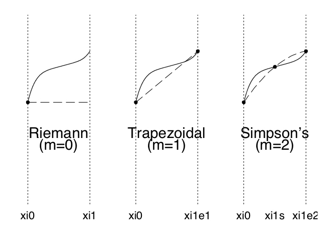

```{r setup, include=FALSE}
knitr::opts_chunk$set(echo = TRUE)
```

#  Introduction
Statisticians often encounter situations where they need to evaluate an integral during the evaluation or fitting of a statistical model.  One may recall that in random effects models, Bayesian methods, and in the evaluation of expectations such integral evaluations are necessary.  

In this section we wish to cover several strategies to evaluate such integrals in practice. In particular, we focus on situations where there is no clear analytical form for the integral.  In such cases we resort to numerical integration to approximate the integral.  

There are a variety of methods to perform numerical integration, some of which you may have already learned in high school calculus.  We will review these methods plus commonly utilized ones in statistics, such as gaussian quadrature and monte carlo integration.  

## Example

Let us take a simple example of an integral below: 

$$\int_{0}^1 x^2dx$$

Here, we wish to integrate the area under the function $x^2$ from $x=0$ to $x=1$.  Graphically, we want to evaluate the area of the shaded region below:

```{r, echo=TRUE}
x = seq(-1.5,1.5,,1000)

# make a plot with this function
plot(x, x^2, ylab = "f(x)", xlab = "x", type= 'l')
polygon( c(0,x[x>=0 & x<=1],1),  c(0,(x^2)[x>=0 & x<=1],0), col="grey")
```

So how do we evaluate this integral?  Clearly there is an analytical form of the integral in this situation, and we can fall back to what we learned in high school calculus to evaluate it:

$$\int_{0}^1 x^2dx = \frac{x^3}{3}\Big|_0^1 = \frac{1}{3}$$

In statistics there are also situations where nice analytical forms of integrals can be found, for example through the use of conjugate priors in Bayesian methods. However, more often than not this will not be the case. 

## A more realistic example

### Intro and data 

Let us use an example from Givens and Hoeting that illustrates an application of the Generalized Linear Mixed Model (GLMM) to a longitudinal Alzheimer’s patient study (example 5.1).  

The example described a set of 22 Alzheimer’s patients that were tracked over a period of 5 months.  Once a month, patients were asked to recall words from a list that was provided at baseline. The outcome variable in this setting is the number of words recalled by each patient in a given month.  These patients were also receiving an experimental therapy during the course of the study.  The investigators sought to determine whether there is any improvement of word recall over time (assumed to be linear) compared to each patient's baseline. Data for 25 control patients was also recorded but not available. 

Clearly, the repeated word count measurements within each subject are not independent, and that there may be substantial between-patient variation in each patient's baseline recall.  We can utilize a Generalized Linear Mixed Model (GLMM) to account for these issues.  

Lets visualize some of the patient data before going further.  The following spaghetti plot shows the individual patient trajectories: 

```{r}
# read in the data
alz = read.table("alzheimers.dat", header = T)

# plot trajectory of each patient as separate lines
for(i in 1:max(alz$subject)){
  
  # select subject indices
  index = which(alz$subject == i)
    
  # plot trajectory
  if(i == 1){
    plot(alz$month[index],alz$words[index], type = 'l', 
         ylim = range(alz$words), ylab = "Words", xlab = "Month", col = i)
  }else{
    lines(alz$month[index],alz$words[index], type = 'l', col = i)
  }
}
```

It appears that the number of words recalled per month in each patient appears to be increasing over time.  This may suggest the experiment treatment appears to be improving performance relative to each patient's untreated baseline.  It is also apparent that significant heterogeneity exist in patient baseline word recall.

### Model setup
We can more formally set up with problem with the following.  Let $y_{ij}$ be the number of words recalled by patient $i$ in month $j$, where $i = 1\ldots 22$ and $j = 1 \ldots 5$.  We assume that each $y_{ij} \sim Po(\lambda_{ij})$, where the mean and variance of $y_{ij}$ is $\lambda_{ij}$.  

We also let the covariate vector for the $i$th patient in the $j$th month be $\boldsymbol{x}_{ij} = (1, j)$, indicating that we assume an intercept $\beta_0$ and linear slope $\beta_1$ for month ($\boldsymbol{\beta} = (\beta_0,\beta_1)^T$).  

Then, the counts can be modeled with a poisson GLMM sich that $$\log(\lambda_{ij}) = \boldsymbol{x}_{ij}^T\boldsymbol{\beta} + \gamma_i$$, where $\gamma_i$ is the unobserved subject-level random effect such that  $\gamma_i \sim N(0,\sigma_{\gamma}^2)$.  

So, how do we write  the likelihood for this poisson GLMM with random intercept?  If say  $\gamma_i$ was observable and known, we could write the likelihood as the following:

$$L(\boldsymbol{\beta}, \sigma^2_{\gamma} | \y, \boldsymbol{\gamma}) = \prod_{i = 1}^{22} \left(\prod_{j = 1}^{5}f(y_{ij} | \lambda_{ij})\right)\phi(\gamma_i| 0, \sigma^2_{\gamma}).$$
Here $f(y_{ij} | \lambda_{ij})$ is the Poisson PMF with mean $\lambda_{ij}$ (defined above, dependent on $\gamma_{i}$), and $\phi(\gamma_i| 0, \sigma^2_{\gamma})$ is the Normal PDF with mean 0 and variance $\sigma^2_{\gamma}$.   Also, $\y$ is the vector of all observations in the study and $\gamma = (\gamma_1,\ldots,\gamma_{22})$.  

However, as in all GLMM's, the random effects are actually unobservable in the model.  Therefore, in order to obtain the likelihood, we must integrate them out the above expression.  

We perform separate integrals for each $\gamma_i$, 22 in total, which share a common distribution determined by $\sigma^2_gamma$.  In some sense, we can interpret these $\gamma_i's$ was 22 iid draws from $\phi(\gamma_i| 0, \sigma^2_{\gamma})$ which represent the baseline subject-level variability about $\beta_0$.  This likelihood can be represented as the following:

$$L(\boldsymbol{\beta}, \sigma^2_{\gamma} | \y) = \prod_{i = 1}^{22}\int \left[\left(\prod_{j = 1}^{5}f(y_{ij} | \lambda_{ij})\right)\phi(\gamma_i| 0, \sigma^2_{\gamma}) \right] d\gamma_i$$

  

The log-likelihood is therefore $$\mathcal{l}(\boldsymbol{\beta}, \sigma^2_{\gamma} | \y) = \sum_{i = 1}^{22}\log\left[\int \left[\left(\prod_{j = 1}^{5}f(y_{ij} | \lambda_{ij})\right)\phi(\gamma_i| 0, \sigma^2_{\gamma}) \right] d\gamma_i\right].$$

Remember, the $\lambda_{ij}$ is dependent on $\gamma_i$ as well.  

### About those parameter estimates...

This is a bread and butter GLMM, specifically a poisson GLMM with a subject-level random intercept.  Now we would like to maximize this log likelihood to obtain estimates for $\boldsymbol{\beta}$ and $\sigma^2_{\gamma}$. But how do we do even do this?

Well, given that the joint density in the integrand does not simplify to a known distribution, there are no simple closed form solutions here to obtain the MLEs.  As a result, we will have to resort to the optimization tools discussed in the prior lectures (no surprise there). 

However, we have the additional complication of the presence of an integral with respect to $\gamma_i$ in the log likelihood. Again, the joint density in the integrand does not simplify to some known distribution, so we must approximate this integral numerically during the maximization process.  We also have to make some assumptions regarding switching the order or integration and derivation when calculating derivatives. 

### A path forward
If we assume that we can switch the order of integration and derivation when computing the 1st and 2nd derivatives of the log likelihood, we can obtain analytical forms for first and second derivatives of the likelihood.  Then, we can implement a few of the optimization schemes discussed in the first lecture of this module. 

However, we still have to worry about evaluating these integrals in each iteration of whatever optimization method we choose.  If the evaluation of the integral is complex or computationally burdensome, this may impact the choice of optimizaton method we may want to use practically. For example, NR may not be an efficient choice in such situations, as we will have to integrate in both the score function (1st derivative) and hessian function (2nd derviative) in each iteration.  Some off the shelf software also evaluates the log likelihood by default at each iteration, adding another round of integration.

The more basic question is how would we even perform this integral to begin with?  The integral clearly does not have a closed form.  In the next several sections we will introduce some general methods to approximate these integrals.  We will then combine these approaches with the methods discussed in the previous lecture for maximization.  

# General numerical integration
Lets consider the general problem of evaluating a one dimensional integral of the function $f(x)$ with respect to $x$ within the range of $a$ to $b$.  We can write this as $\int_a^bf(x)dx$.  As mentioned earlier, oftentimes in bayesian analysis the posterior distribution in question does not have a clear analytical form for the integral, or in frequentists methods such as GLMMs the likelihoods require integration.  

To approximate such integrals, we can first split the interval $[a,b]$ into $n$ parts, say $[x_i,x_{i+1}]$ for $i = 0, \ldots, n-1$, where $x_1 = a$ and $x_n = b$.   Then we can write $$\int_a^bf(x)dx = \sum_{i=0}^{n-1}\int_{x_i}^{x_{i+1}}f(x)dx.$$  

In this sense, we are breaking up the original integral into the sum of integrals on disjoint subintervals spanning the original range of integration.  Then, we then worry about approximating the integral on each individual interval and sum these approximations to obtain the estimate for the original full integral.

On an individual interval $[x_i,x_{i+1}]$, we initiate the approximation by inserting $m+1$ nodes $x_{ij}^*$ for $j = 0, \ldots,m$ across the interval.  Then, we can approximate the intergral in this subinterval in the general form in the following: $$\int_{x_i}^{x_{i+1}}f(x)dx =  \sum_{j=0}^m A_{ij}f(x_{ij}^*)$$ where $A_{ij}$ is some set of constants. 

In other words, we approximate the integral in each subinterval by evaluating the function of interest $f(x)$ at each node in the the subinterval, and then multiplying by some constant prior to summing up over the nodes.  

The length of the intervals in addition to the spacing of the nodes in each integral does not need to be equal as a general rule.  What may be apparent from the above approximation is that the accuracy should improve as we decrease the length of the subintervals and/or increase the number of nodes per subinterval.

For this general class of methods, the main differentiator between approximation is the choice of $A_{ij}$.  

## Newton-Cotes Quadrature
This class of methods is characterized by having nodes equally spaced in $[x_i,x_{i+1}]$ with the name number of nodes used across all subintervals. In a general sense, the function to be intregated in each subinterval is replaced with a polynomial approximation that is easier to intergrate. Three methods in this class include Riemann, trapezoidal, and Simpson's rules.  The main difference in these rules is the order of the polynomial approximation of $f(x)$ in the interval, ranging from 0 (constant, 1 node), 1 (linear, 2 nodes), to 2 (quadratic, 3 nodes), respectively.  This is illustrated in the figure below

{width=65%}

We discuss each of these methods briefly below

## Reimann Rule
The Reimann rule boils down to approximating the function in a given subinterval with a constant function (1 node in the interval, order is 0).  For each, one may use the value of $f(x)$ at a given point in the interval, say $f(x_i)$ for example, pertaining to a 0th degree polynomial.  Then, the intergral in this interval is approximated with $$\int_{x_i}^{x_{i+1}}f(x)dx \approx f(x_i)dx = (x_{i+1} - x_i)f(x_i)$$

In other words, the intergral is approximated as the area of the rectangle formed by the width of the subinterval $(x_{i+1} - x_i)$ multiplied by the height of the rectangle $f(x_i)$.

Then, the total approximation is set by summing over the individual intervals.  If the lengths of each interval are the same, then this overall sum simplifies to $h\sum_{i=0}^{n-1}f(a+ih)$, where $h = \frac{b-a}{n}$, the width of each equally spaced interval.  Note that we did not have to use $f(x_i)$ as the constant function, $f(x_{i+1})$ could be uses as well in the above figure. 

As $n\rightarrow \infty$, the approximation approaches the true value of the intergral.  The approximation is also exact, as one would imagine, when $f(x)$ itself is constant on the interval.  Since it is not known in advance what $n$ would be best to use, we can sequentially increase $n$ and repeat the approximation.  

Similar to the approaches discussed in the first lecture of this module, we can examine when the approximation tends to converge with respect to $n$, stopping the number of intervals at that particular point.  It is recommended to use $n_{k+1} = 2n_k$, doubling the number of intervals relative to the prior evaluation so that half the subinterval endpoints at the next step correspond to the old endpoints from the previous step. This avoids redundant calculations of the function of interest.   

Drawbacks of this approximation is that it is slow to converge with respect to $n$, in that you may need to increase the number of intervals greatly to achieve a good approxmation.  This is not surprising given that the approximation on the sub interval itself is a constant function, so shorter intervals will provide better approximation to the function of interest. One advantage of this approach is that it is quite easy to calculate, particularly when the length of each subinterval is the same. 

### Application to GLMM example
Lets go ahead and apply this to the problem of approximating the integral for the first subject in the alzheimer's dataset.  We will vary the number of intervals so that we can observe how quickly the approximation converges relative to $n$.  First we will define the function $f(x)$, which in this case is $\prod_{j = 1}^{5}f(y_{1j} | \lambda_{1j})\phi(\gamma_1| 0, \sigma^2_{\gamma})$

```{r}
inner = function(gammai, y,beta, s2gamma){
  # y is of length 5
  # x is assumed to be 1:5
  # beta is a length 2 vector
  
  # calculate product over multiple potential values of gammai
  val = rep(NA, length(gammai))
  for(i in 1:length(val)){
    # calculate lambda
    lambda = exp(beta[1] + beta[2]*1:5 + gammai[i])
    val0 = dpois(x = y, lambda = lambda) 
    val[i] = prod(val0)*dnorm(x = gammai[i],mean = 0,sd = sqrt(s2gamma))
  }
  
  return(val)
}
```

Now that we have that, lets go ahead and apply Reimann's rule to the first observation in our dataset.  Remember, we need to integrate out the random effect pertaining to the first observation to obtain the likelihood for the first observation.  To simplify the illustration of this problem, let us assume that we would like to integrate over the range [−0.07, 0.085], and that $\boldsymbol{\beta} = (1.804, 0.165)^T$ and $\sigma^2_{\gamma} = 0.000225$.  Normally we would like to integrate over the real number line, but we will revisit this later. 

Using what we have discussed, we can visualize the integrand with respect to $\gamma_1$:

```{r}
## Set values
range = c(-0.07, 0.085)
beta = c(1.804, 0.165)
s2gamma = 0.000225
y1 = alz$words[alz$subject == 1]

## plot
x = seq(range[1], range[2],length.out = 1000)
plot(x,inner(x, y = y1, beta = beta, s2gamma = s2gamma), 
     ylab = "inner(gamma1)", xlab = "gamma1", type = 'l')
```

So, for the range that we picked, looks like we lucked out in that most of the mass under the curve is concentrated in this region.  Now lets integrate this function using what we just learned

```{r}
## pick number of intervals n
n = 2

## evaluate reimann's rule, assuming intervals of equal length
# get h
h = (range[2] - range[1])/n

# now evaluate.  The book says to sum from 0 to n-1.  0 below pertains to the left most interval boundary
i = 0:(n-1)

# We need to adjust this for how r vector indices are specified (add 1 since no 0 index in r)
points = range[1] + i*h

# now evaluate the reimann rule for equal intervals as described above
val = h*sum(inner(gammai = points, y = y1, beta = beta, s2gamma = s2gamma))

print(val)
```

We can imagine that with only two points this approximation is not very good.  Lets increase the number of intervals by a factor of two each time and reevaluate.

```{r}

for(t in 1:10){
  ## pick number of intervals n
  n = 2^t
  
  ## evaluate reimann's rule, assuming intervals of equal length
  # get h
  h = (range[2] - range[1])/n
  
  # now evaluate.  The book says to sum from 0 to n-1.  0 below pertains to the left most interval boundary
  i = 0:(n-1)
  
  # We need to adjust this for how r vector indices are specified (add 1 since no 0 index in r)
  points = range[1] + i*h
  
  # now evaluate the reimann rule for equal intervals as described above
  val = h*sum(inner(gammai = points, y = y1, beta = beta, s2gamma = s2gamma))
  
  cat(sprintf("t=%d n=%d value=%.10e\n", t, n, val))
}
```

Clearly as we increase the number of intervals (and therefore the total number of nodes evaluated), the integral approximation improves.  The question is whether there are more efficient ways to achieve a similar level of accuracy, for example by using s few number of intervals. 

## Trapezoidal Rule

This rule can be written as the following

$$\int_a^bf(x)dx \approx \sum_{i=0}^{n-1}\frac{(x_{i+1} - x_{i})}{2}(f(x_i) + f(x_{i+1})$$
which you may recognize as the area of a trapezoid, which in this case has the width of the subinterval, left side height as $f(x_i)$ and right side height as $f(x_{i+1})$.  The approximating polynomial here is linear, as can be seen in the figure above pertaining to $m = 1$, two nodes over the interval (left and right bounds).  

With this linear function, the area under the curve is a trapezoid.  We may also derive this expression from the integral of the "fundamental polynomials"  (GH, Section 5.1.2) pertaining to order $m = 1$ (linear).  We wont get into this in too much detail but we note it here in case you are interested in learning more. Simpsons rule is similar with $m = 2$, we will skip it now for time purposes. 

### Application to GLMM example

Given the above lets now implement the trapezoidal rule:

```{r}

for(t in 1:10){
  ## pick number of intervals n
  n = 2^t
  
  ## assume intervals of equal length
  # get h, length of each interval
  h = (range[2] - range[1])/n
  
  # now evaluate.  The book says to sum from 0 to n-1.  0 below pertains to the left most interval boundary
  i = 0:(n-1)
  
  # We need to adjust this for how r vector indices are specified (add 1 since no 0 index in r)
  points_left = range[1] + i*h
  points_right = range[1] + (i+1)*h
  
  # now evaluate the reimann rule for equal intervals as described above
  left  = inner(gammai = points_left, y = y1, beta = beta, s2gamma = s2gamma)
  right  = inner(gammai = points_right, y = y1, beta = beta, s2gamma = s2gamma)
  val = (h/2)*sum(left + right)
  
  cat(sprintf("t=%d n=%d value=%.10e\n", t, n, val))
}
```

Looks like we are able to achieve accuracies similar to the prior approach but with a fewer number of intervals.  This is not surpising as we are using a linear approximation to the integrand in each integral rather than a constant function.  

## Some notes

In general, these approaches may require a large number of intervals of shorter length to converge, particularly with smaller $n$.  In general, the higher the order of the approximating polynomial in each interval, the faster the convergene in the integral approximation with respect to the number of intervals. 

To evaluate over an infinite range, we can perform a change of variable operation on the integral in question, replacing say $\gamma_1$ with variable $y = \frac{\gamma_1}{1+\gamma_1}$ and then integrating over the range of $y$ which is $(-1,1)$.  This may not address the above issues about the mass of the intergral being concentrated in a few intervals.  Of course, such transformations can introduce other types of problems such as singularities.  Other choices of transformations exist, and one may choose the best one based on their problem (GH 5.4.1).  

Alternatively, one may use the methods in the next section (particularly gauss-hermite quadrature) to approximate integrals over the entire real line with very good accuracy. 

# Gaussian Quadrature

When the mass under the integrand is concentrated mostly in just a few intervals, the previous approach may not work well.  In such a case, the majority of the intervals will not contribute to the overall approximation, potentially wasting a lot of computational time.  In addition, the intervals that do span the area of relevance may not be fine enough to approximate the integral in this area.  We could increase the number of intervals to increase the accuracy, but we are also increasing the number of intervals we need to evaluate that do not contribute at all to the integral approximation.  

Instead of having intervals with equally spaced nodes, what if we instead got rid of intervals entirely and just placed the nodes in the range of $x$ where the bulk of the mass is under the curve?  

This is the general intuition behind gaussian quadrature, where the trick is to first determine two quantities:  the locations of each node where the function will be evaluated, as well as the weights that are associated with each node.  With these two values in hand, we can approximate a given interval with relatively good accuracy compared to the methods from the prior section using much fewer nodes.  Exact integration can be obtained for $2(m+1)$the degree polynomial, where $m$ is the number of nodes being utilized.   

Gaussian quadrature is very effective for integrals of the following form: $$ \int_a^b f(x)w(x)dx$$ and  $$ \int_a^b x^kw(x)dx < \infty.$$  You may recall that the former may be relevent in bayesian applications where we have a density function $f(x)$ and some prior $w(x)$.  

You might notice that the former is similar to the original integrand at hand in our problem, where in place of $f(x)$ we have $\prod_{j = 1}^{5}f(y_{1j} | \lambda_{1j})$ and in place of $w(x)$ we have $\phi(\gamma_1| 0, \sigma^2_{\gamma})$ and we wish to integrate with respect to $\gamma_i$.

The latter is relevant to computing finite moments (such as the expectation $k = 1$) with respect to some pdf $w(x)$.  More generally, we can use quadrature to integrate any generic function $f(x)$ via  $$ \int_a^b f^*(x)w(x)dx,$$ where $f^{*}(x) = \frac{f(x)}{w(x)}$.  

In general, as before we have that $$\int_a^b f(x)w(x)dx \approx \sum_{k = 0}^m A_kf(x_k),$$ where $x_0\ldots x_m$ are the selected quadrature nodes, and $A_0 \ldots A_m$ are the weights associates with each node. **In the previous section, we chose nodes and associated weights in each subinterval that allowed exact integration of the approximating polynomial in that subinterval.**  

For gaussian quadrature, the question is how do we pick the nodes and the weights for the function of interest that we wish to integrate?  We do this through the use of orthogonal polynomials.


## Orthogonal Polynomials

Lets say that we can express our integrand into the form $f(x)w(x)$.  Depending on the form of $w(x)$ in this expression, a set of corresponding orthogonal polynomials may be chosen (see Table 5.6 in GH).  One of the biggest differences between each set of orthogonal polynomials, besides the particular form of $w(x)$ that they correspond to, are the ranges for the locations of possible nodes in $x$.  

For example, for the Hermite polynomials, the range is the real number line.  We will see how this is helpful later. The roots of these polynomial are essentially the "best" locations for these nodes given form of $w(x)$.  The weights are chosen at each node to satisfy a series of conditions laid out in GH 5.3.2. 

After choosing $w(x)$, standard software can solve for the roots of the corresponding orthogonal polynomial, as well as the weights pertaining to each root, given a desired number of nodes.  **In practice, you will never need to solve these polynomials by hand**.  These values can then we utilized for integration later.  For time purposes we will not get into more detail into how these orthogonal polynomials are solved, but for all practical purposes many R-based functions exist to do this once the choice of polynomial in Table 5.6 has been made. 

More generally, given that $w(x)$ is non-negative over the range of integration $[a,b]$, there exists a sequence of polynomials that are "orthogonal"  with repect to $w(x)$ over the range $[a^*,b^*]$, a transformed version of the original range of integration.  In practical applications, the choice of polynomial may be easily recognizable from the form of $w(x)$, sometimes requiring some factoring, rearranging of terms, or change of variables. 

### Illustration of Gauss-Hermite Quadrature in the Alzheimers example

If we expand the expression for $\phi(\gamma_i| 0, \sigma^2_{\gamma})$, we can see that we can rewrite the likelihood for the first sample as the following:  

$$\int \left(\prod_{j = 1}^{5}f(y_{1j} | \lambda_{1j})\right) \times \frac{1}{\sqrt{2\pi\sigma_{\gamma}^2}}e^{-\frac{\gamma_1^2}{2\sigma_{\gamma}^2}} d\gamma_1
$$


We can see that a rather easy choice for $w(x)$ is $w(x) = e^{-x^2}$, pertaining to Gauss-Hermite Quadrature, expecially since we would like to ideally integrate over the real number line.  If the assumed distribution for $\gamma_i$ was instead standard normal, we would not have to do any sort of extra work here after obtaining our desired number of quadrature nodes and weights. 
Since this is not the case here, we can achieve this form in a few ways.  The one way is through a change of variable to $\gamma_i^* = \frac{\gamma_i}{\sigma_{\gamma}^2}$, integrating now with respect to $\gamma_i^*$.  A more general approach would be to simply do the following:


$$\int \left(\prod_{j = 1}^{5}f(y_{ij} | \lambda_{ij})\right) \times \frac{1}{\sqrt{2\pi\sigma_{\gamma}^2}}\left[\frac{e^{-\frac{\gamma_i^2}{2\sigma_{\gamma}^2}}}{e^{-\gamma_i^2}}\right]e^{-\gamma_i^2} d\gamma_i = \int f(\gamma_i)w(\gamma_i) d\gamma_i
$$

where $w(\gamma_i) = e^{-\gamma_i^2}$ and $f(\gamma_i) = \left(\prod_{j = 1}^{5}f(y_{ij} | \lambda_{ij})\right) \frac{1}{\sqrt{2\pi\sigma_{\gamma}^2}}\left[\frac{e^{-\frac{\gamma_i^2}{2\sigma_{\gamma}^2}}}{e^{-\gamma_i^2}}\right]$.  With this in hand, now we can apply Gauss Hermite Quadrature.  But how to do this?


## Gaussian Quadrature Rule 

Once the weights and nodes have been determined, the integral is approximated simply using $$\sum_{k=1}^m A_kf(x_k)$$, where $x_k$ is the $k$th quadrature node and $A_k$ is the weight associated with that node.  In general, the more nodes that we select the more accurate the approximation becomes, however at the expense of more computing time.  

Lets start with $m = 5$ nodes.  Note that the total number of nodes here is much much smaller than in the previous approachs (at minimum 1 node per interval). In our current example we have selected Gauss-Hermite Quadrature, which has the advantage of being able to approximate the integral in question over the entire real line.  Lets first start by determing the set of orthogonal polynomials and associated weights for $k = 5$ nodes. Available R functions will either calculate these directly or will simple look them up in precomputed tables.  Here we use the gaussquad package to print the nodes and associated weights for $m = 1,\ldots, 5$:

```{r, echo=TRUE}
# load the gaussquad library
library(statmod)

# get the nodes and associated weights up tto m = 10
gh = gauss.quad(n = 5, kind="hermite")

# print out the resulting list object
print(gh)
```

Now, lets write a function for $f(\gamma_i)$ as we defined earlier, and then use this function to calculate the integral approximation with the nodes and weights associated with.  
```{r}
f_gammai = function(gammai, y,beta, s2gamma){
  # y is of length 5
  # x is assumed to be 1:5
  # beta is a length 2 vector
  
  # calculate product over multiple potential values of gammai
  val = rep(NA, length(gammai))
  for(i in 1:length(val)){
    # calculate lambda
    lambda = exp(beta[1] + beta[2]*1:5 + gammai[i])
    # plug into dpois
    val0 = dpois(x = y, lambda = lambda) 
    # calculate product
    val[i] = prod(val0)* dnorm(x = gammai[i],mean = 0,sd = sqrt(s2gamma))/exp(-gammai[i]^2) 
  }
  
  return(val)
}
```

Now that we have that out of the way, lets approximate the intergral for the first observation

```{r, echo=TRUE}
# set node number
m = 5

# get the nodes for m = 5
x = gh$nodes

# get the weights associated with each node for m = 5
w = gh$weights

# now approximate the intergral using GH quadrature
val = sum(w*f_gammai(gammai = x, y = y1, beta = beta, s2gamma = s2gamma))
  
print(val)
```

Hmm, that didnt work too well.  If we take a look at the nodes, and then look at the original figure plotting the inner function from earlier in this lecture, the range of the nodes themselves seem to be a bit out of the range of where most of the mass under the curve:

```{r, echo=TRUE}
print(x)
```

```{r}
xv = seq(range[1], range[2],length.out = 1000)
plot(xv,inner(gammai = xv, y = y1, beta = beta, s2gamma = s2gamma), 
     ylab = "inner(gamma1)", xlab = "gamma1", type = 'l', xlim = c(-3.5, 3.5))
abline(v = x, lty = 2, col = "grey")
```

Actually, almost all of the quadrature nodes are out of the range since in this example we chose $\sigma^2_{\gamma} = 0.000225$.  Instead, lets try a change of variable.  We could try to increase the number of nodes, but we can try a change of variable instead.  For example, if say for some $x$, $y = h(x)$, then we know that 

$$
\int_a^bf(y)dy = \int_{h^{-1}(a)}^{h^{-1}(b)} f(h(x))h'(x)dx
$$

Here, we want to use $x = \frac{\gamma_1}{\sigma_{\gamma}\sqrt{2}}$, where then $\gamma_1 = h(x) = \sigma_{\gamma}\sqrt{2}x$.   More generally, if say $\gamma_1 \sim N(\mu,\sigma^2)$ then we perform the transformation $x = \frac{\gamma_1 -\mu}{\sigma\sqrt{2}}$ where $\gamma_1 = \sigma\sqrt{2}x + \mu$.

With this, we have that

\begin{aligned}
\int \left(\prod_{j = 1}^{5}f(y_{ij} | \lambda_{ij})\right) \times \frac{1}{\sqrt{2\pi\sigma_{\gamma}^2}}e^{-\frac{\gamma_i^2}{2\sigma_{\gamma}^2}} d\gamma_i &= \int \left(\prod_{j = 1}^{5}f(y_{ij} | \lambda_{ij})\right) \frac{1}{\sqrt{2\pi\sigma_{\gamma}^2}}e^{-x^2}h'(x)dx\\
&=\int \left(\prod_{j = 1}^{5}f(y_{ij} | \lambda_{ij})\right)\frac{1}{\sqrt{2\pi\sigma_{\gamma}^2}} e^{-x^2}\sigma_{\gamma}\sqrt{2}dx\\
&=\int \left(\prod_{j = 1}^{5}f(y_{ij} | \lambda_{ij})\right)\frac{1}{\sqrt{\pi}} e^{-x^2}dx\\
&\approx \sum_{k = 1}^n \frac{1}{\sqrt{\pi}}\prod_{j = 1}^{5}f(y_{ij} | \lambda_{ij})
\end{aligned}

where now $\log(\lambda_{ij}) = \boldsymbol{x}_{ij}^T\boldsymbol{\beta} + \sigma_{\gamma}\sqrt{2}x_k$.  Lets try it out:

```{r}
f_x = function(x, y,beta,s2gamma){
  # y is of length 5
  # x is assumed to be 1:5
  # beta is a length 2 vector
  
  # calculate product over multiple potential values of gammai
  val = rep(NA, length(x))
  for(i in 1:length(val)){
    # calculate lambda
    lambda = exp(beta[1] + beta[2]*1:5 + sqrt(2*s2gamma)*x[i])
    val0 = dpois(x = y, lambda = lambda)
    val[i] = prod(val0)/(sqrt(pi))
  }
  return(val)
}
```

Now evaluate

```{r, echo=TRUE}
# set node number
m = 5

# get the nodes for m = 5
gh = gauss.quad(n = m, kind="hermite")
x = gh$nodes

# get the weights associated with each node for m = 5
w = gh$weights

# now approximate the intergral using GH quadrature
val = sum(w*f_x(x = x, y = y1, beta = beta, s2gamma = s2gamma))
  
print(val)
```

Looks very simlar to what we obtained earlier, and we did so with only 5 nodes! Lets loop over from 1 to 10 nodes instead: 

```{r, echo=TRUE}
for(i in 1:10){
  
  # set node number
  m = i
  
  # get the nodes for m = 5
  gh = gauss.quad(n = m, kind="hermite")
  x = gh$nodes
  
  # get the weights associated with each node for m = 5
  w = gh$weights
  
  # now approximate the intergral using GH quadrature
  val = sum(w*f_x(x = x, y = y1, beta = beta, s2gamma = s2gamma))
    
  cat(sprintf("n=%d value=%.10e\n",  m, val))
}
```

We can see that we achieve very high accuracy in just a small number of nodes with no restriction on the range of integration (with Gauss-Hermite Quadrature).  One reason why we see a slightly higher value for the integral approximation in this application relative to the prior approaches is because we are now integrating over the real number line, where the others were limited to a particular range.  

### Great, but now how do I do optimization?

As mentioned earlier, now that we have a means to integrate the likelihood, we also have the ability to apply NR, BFGS, etc. to optimize the likelihood.  The only difference here is that we will also have to approximate the integral in all subsequent derivatives.  We leave this exercise for a homework problem.  

## Extensions to Multidimensional integrals
Keep in mind that so far, we are dealing with one dimensional integrals.  With multidimensions integrals, alternate approaches relative to this approach as well as the previous one may be preferred.  For example, for Newton-Cotes type methods, we would need to define a two-dimensional grid to approximate the integral with respect to each variable in each subinterval.  

For Gaussian Quadrature, we would have to determine the nodes and weights with respect to each variable, and the integral is then approximated with a double summation if the dimension of the integral is 2.  In one dimensional integration, if $m$ was chosen to be 5, then we would have 5 evaluations of the function $f$.  For a two dimensional integral, this would jump to 25 evaluations of $f$.  

Adaptive Quadrature is another approach to get around some of these issues, where the intervals are adjusted such that they are places in portions of the integrand where more of the mass is located. There are versions of adaptive GQ that centers and rescale the nodes given the posterior mode of the variable(s) to be integrated over, as well as the 2nd derivative of the integrand around this posterior mode.  Such approaches should be considered when using multidimensional integrals.  

Clearly, as the dimension increases the above approaches become more and more computationally difficult.  Software implementations for estimating GLMM's typically use the Laplace approximation (equivalent to using $m=1$ in GQ) to ease some of the burden.  The lme4 package in r contains the function glmer to do this for GLMM's, and uses some additional tricks to improve accuracy.  


