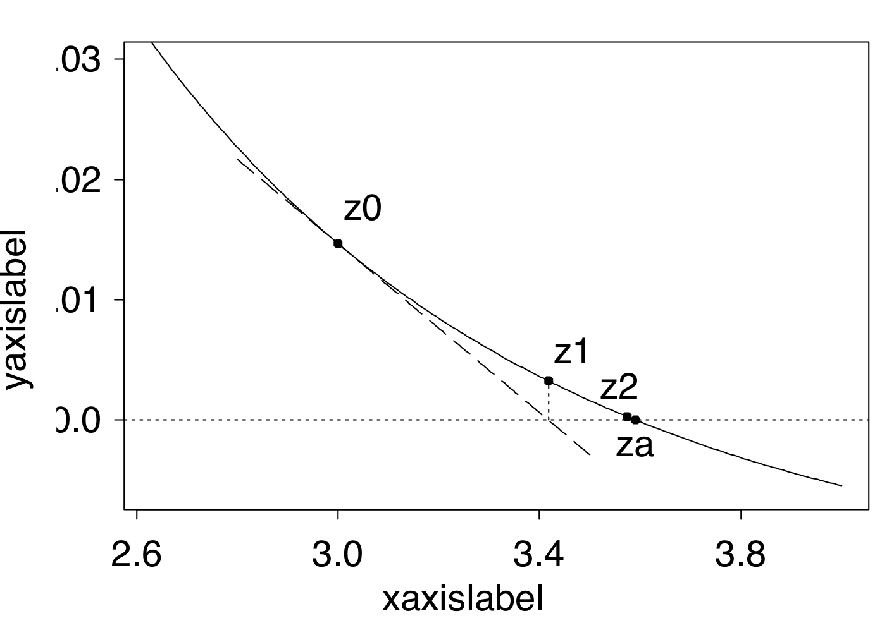

```{r setup, include=FALSE}
knitr::opts_chunk$set(echo = TRUE)
```

# Introduction

A common task in statistics is maximizing (or minimizing) complex univariate or multivariate functions.  This is typically done in the context of maximizing likelihood functions with respect to a vector of unknown parameters, given the observed data.  
The term "parameter estimation" may be one that you may have commonly heard in the past during discussions of fitting statistical models to data.  In doing so, One seeks to find a set of parameter values that "best fit"" or "explain" the data.  

More generally, this task pertains to an "optimization" problem, where we seek to finding a set of parameter values that minimizes or maximizes some pre-defined objective function.  When this objective function is a log likelihood function, this reduces to the problem of maximum likelihood estimation.  

As we will see in this lecture, there are many potential approaches to use for optimization in this context.  How best to optimize a function of interest depends on the the nature of the function to be optimized as well as practical concerns regarding the complexity of the procedures considered. As such, another goal of this lecture is to help indicate the pro's and con' of various approaches to help determine which approch best fits your problem.  

Our discussion of optimization in this lecture will give a broad overview of existing approaches for unconstrained optimization, touching the many of the special cases that may have been covered in previous coursework.  In a later lecture we will discuss the topic of "constrained" optimization, where the potential set of allowable solutions is no longer unrestricted. We focus on the class of problems where the function to be optimized is smooth, real valued, and is differentiable.

## Example: Height data
Let us assume that we have obtained a random sample of 100 individuals from Chapel Hill.  Let us define $\mathbf{y} = (y_1,\ldots,y_{100})$, where $y_i$ pertains to the measured height of the $i$th individual in inches, $i =1,\ldots,100$. 

Let us further assume that the distribution of these heights is distributed normally with some unknown mean $\mu$ and **known** variance $\sigma^2 = 10$.  That is, we assume that $y_i \sim N(\mu,\sigma^2)$, where $\sigma = 10$.  

A common question in this situation is what is the "best" estimate of $\mu$ given the data, and how do we obtain it?   Answering this question can depend on the domain of the question being asked.

From introductory statistical courses, one may remember that an estimator for $\mu$, say $\hat{\mu}$ , in this setting may be $\bar{\y}$, or the mean of the observed heights.  In more advanced statistical courses, you may have shown why this is the case via **analytically** deriving the maximum likelihood estimator for $\mu$, and proving its optimality relative to other potential estimators.  

We can also rexpress the original form of this problem as an intercept-only linear regression model:  $$y_i = \X_i\beta + \epsilon_i$$ where $\epsilon_i \sim N(0,\sigma^2)$, $\X_1$ is simply one, and $\beta = \mu$, a scalar parameter in this setting.  Again,  $\sigma^2$ is known in this case.   Given this, we can show that an estimate for $\beta$ ($\mu$) is also $\bar{\mathbf{y}}$. Based on the normal equations from the linear model framework, we have closed form solution $\hat{\beta} = (\X'\X)^{-1}\X'\y$,  which, plugging in $\X$ and $\y$ from this situation, also yields $\bar{\y}$.  

Regardless of the approach used here, we can show that we can obtain $\hat{\mu}$ analytically via optimizing some function of the data with respect to the parameters of interest $\mu$.  In the linear regression case, we are minimizing the residual sum of squares of the model with respect to $\beta$ ($\mu$), and in the latter, we are maximizing the likelihood function assumed for the data with respect to $\mu$.  

### Writing out the likelihood
The likelihood function $L(\thetab)$, given the assumptions we made, for this sample can be written as 

\begin{eqnarray}
L(\thetab) &=& f(y_1 | \mu, \sigma^2)f(y_2 | \mu, \sigma^2)\ldots f(y_{100} | \mu, \sigma^2)\\
  &=& \prod_{i=1}^{100} f(y_i | \mu, \sigma^2)\\
  &=& \frac{1}{(2\sigma^{2})^{n/2}}e^{-\frac{1}{2\sigma}\sum_{i=1}^{100}(y_i-\mu)^2}
\end{eqnarray}

Here, $\thetab = \mu$ since we are assuming that $\sigma^2$ is known.  Taking logs of both sides, we can write the optimization of $L(\thetab)$ above in terms of the optimization of $\mathcal{l}(\thetab)$, the log-likelihood, as it is a monotonic transformation of the original likelihood function.  

Why does this matter? This implies that the maximum of one function will be the maximum of the other function, as the log transformation is a one-to-one mapping from the likelihood to the log-likelihood (example in figure below).  Using approaches from prior courses, we can show that this function is smooth and convex in $\thetab$, and therefore the maximum of the log-likelihood (and hence the likelihood) will be attained at the value of $\thetab$ where the first derivative of $\mathcal{l}(\thetab)$ is equal to zero.  

In the current problem, the MLE for $\mu$, $\hat{\mu} = \hat{\y}$, is then obtained  by setting the 1st derivative of the log-likelihood (also known as the "score function") equal to 0 and then solving for $\mu$ (can you show this?).  In other words, we find the root of the score function with respect to $\mu$.  For the regression based approaach, we are simply minimizing the residual sum of squares (RSS), defined as $\sum_{i = 1}^{100} (y_i - \mu)^2$.

In previous courses you may have found that this log transformation often facilitates the taking of derivatives when solving for $\mu$.  This approach of using another function as a proxy of the original function to simplify maximization can be found in several examples of optimation we will cover this semester. 


### Visualizing the optimization problem for $\mu$
We can illustrate this approach using the following simulation example:

```{r, echo=TRUE}
## set simulation parameters
mu = 67 
sigma2 = 10
n = 100

## generate random normally distributed samples
y = rnorm(n, mu, sd = sqrt(sigma2))

## print MLE of mu, mu_hat
cat("mean of y\n")
(mean(y))

## print estimate of mu in linear model framework (intercept only model)
cat("beta_hat from intercept only linear model\n")
print(lm(y ~1)$coef)

```

Now, lets write some functions that will help generate some figures in the next code chunk. These will help plot the likelihood, log likelihood, and RSS with respect to $\mu$ based on the setup above.  

```{r, echo=TRUE}
## returns a vector of likelihood values over a given range of mu values
## helps for plotting later
lik = function(mu, sigma2, y){
  # create empty vector
  likelihood.vector = rep(NA, length(mu))
  
  # for each mu, calculate the likelihood value
  for(i in 1:length(likelihood.vector)){
    likelihood.vector[i] = prod(dnorm(y, mu[i], sqrt(sigma2)))
  }
  
  # return vector of likelihood values spanning range of mu
  return(likelihood.vector)
}

## define the log-likelihood function with respect to mu
loglik = function(mu, sigma2, y){
  # create empty vector  
  log.likelihood.vector = rep(NA, length(mu))
  
  # calculate log likelihood
  for(i in 1:length(log.likelihood.vector)){
    log.likelihood.vector[i] = sum(dnorm(y, mu[i], sqrt(sigma2), log = T))
  }
  
  return(log.likelihood.vector)
}

## define the residual sum of squares function with respect to mu
RSS = function(mu, sigma2, y){
  # create empty vector  
  RSS.vector = rep(NA, length(mu))
  
  # calculate log likelihood
  for(i in 1:length(RSS.vector)){
    RSS.vector[i] = sum((y - mu[i])^2)
  }
  
  return(RSS.vector)
}


```

Now that we got that out of the way, lets plot each of these functions with respect to $\mu$:

```{r, echo=TRUE}
## range of mu to plot over
range = seq(45, 85,,1000)

## arrange the two plots in 1 row, three columns
par(mfrow = c(1,3)) 

## likelihood plot
plot(range, lik(mu = range,sigma2 = sigma2, y = y), type = "l", ylab = "likelihood", xlab = "mu")
# add vertical line at the mean of y
abline(v = mean(y), lty = 2, col = "grey") 

## log likelihood plot
plot(range, loglik(mu = range,sigma2 = sigma2, y = y), type = "l", ylab = "log likelihood", xlab = "mu")
# vertical line at the mean of y
abline(v = mean(y), lty = 2, col = "grey" ) 

## RSS plot
plot(range, RSS(mu = range,sigma2 = sigma2, y = y), type = "l", ylab = "RSS", xlab = "mu")
# vertical line at the mean of y
abline(v = mean(y), lty = 2, col = "grey" ) 
```


We can clearly see that the maximum of the likelihood, log-likelihood, and RSS functions occurs at the MLE of $\mu$, $\hat{\mu}=$ `r round(mean(y),5)`.  At the MLE, we can see that the derivative of each of the functions are equal to zero, following the intuition of the procedures used to solve for $\hat{\mu}$.  We will see that many of the algorithms proposed in this section are based upon this principle when trying to find the minimum/maximum of a function when no closed form solutions are available. 

## Calculating the MLE for $\lambda$ for the mean of the Poisson Distribution

We know that the pmf for a Poisson random variable $Y$ with mean $\lambda$ may be written as $$Po(Y=y | \lambda) = \frac{e^{-\lambda}\lambda^y}{y!},$$ where $y$ is a draw from this distribution.  Suppose we draw a sample of $n$ observations from this distribution and we wish to determine the MLE of $\lambda$, $\hat{\lambda}$.  

As discussed in prior courses, the MLE can be obtained by simply taking the first derivative of the likelihood (or more easily, the log likelihood), setting it equal to 0, and then solving for the parameter of interest. 

The log likelihood here is $$\mathcal{l}(\lambda) = -n\lambda + \left(\sum_{i = 1}^{n} y_i \right)\log(\lambda) - \sum_{i = 1}^{n}\log(y_i!).$$ Then, taking the first derivative of the log likelihood, also known as the score function, we then solve the following:  $$0 = -n + \left(\sum_{i = 1}^{n} y_i \right)/\lambda$$ which gives the MLE $\hat{\lambda} = \left(\sum_{i = 1}^{n} y_i \right)/n$.  

In this example, as in the prior one, we can derive closed form solutions to obtain a parameter estimate for $\lambda$ by maximizing log-liklihood function. 

**However, what if we do not have such nice closed-form solutions for the model at hand?**  

### Something Less Straightforward :  Poisson Regression 

For example, what if instead $\lambda = \exp(\X\betab)$, where $\X$ is an $n \times p$ matrix of covariates, and $\betab$ is a $p$-dimensional vector of unknown regression coefficients?  Here we wish to maximize with the log likelihood respect to $\betab$.  This is equivalent to fitting a Poisson GLM, which we will talk about later in this lecture.  

The log likelihood would then be $$\mathcal{l}(\betab) =   \sum_{i=1}^n \left(y_iX_i\betab -e^{\X_i\betab}-\log(y_i!)\right).$$  Not so easy to obtain a closed form solution for the derivative here... 

This problem gets at the heart of why we need to use numerical optimization.   

# Univariate Optimization

In this module we will discuss some fundamental methods for the optimization of smooth nonlinear functions (Givens and Hoeting Chapter 2), beginning with single univariate functions and then discussing extensions to the multivariate case.  Combinatorial optimization (Givens and Hoeting Chapter 3) will not be emphasized here but students can read this chapter if interested.  We will also cover the EM algorithm (Givens and Hoeting Chapter 4) in more detail in a later lecture.  There we will discuss the optimization of functions with missing data and also how the algorithm has been widely applied to general problems in statistics.  

Let us consider the numerical optimization of the following function $f(\theta)$, which we seek to maximize with respect to $\theta$: $$f(\theta) = \frac{\log(\theta)}{1+\theta}.$$  The traditional approaches to maximizing $f(\theta)$, such as the approach described in the previous example, are difficult to apply in this case where the analytical solution for $\theta$ after setting $f'(\theta) = 0$  is not easy to determine.  

Here,  $$f'(\theta) = \frac{1+\theta - \theta\log(\theta)}{\theta(1+\theta)^2}.$$ So...not easy to solve for.

Lets first plot this function to determine its shape:

```{r, echo=TRUE}
# define function 
f1 = function(theta){
  log(theta)/(1+theta)
}

# make a plot with this function, where the x-axis ranges from 0 to 10
plot(f1, from = 0, to = 10, ylab = "f(theta)", xlab = "theta")
```

Plotting this function, the maximum of $f(\theta)$ appears to be between 3 and 4. So how exactly do we find the maximum of this function, and the value of $\theta$ that pertains to the maximum, $\hat{\theta}$?  

## Basics of Numerical Optimization

Most numerical optimization methods are **iterative** and rely on the concept of successive approximations to find the value of $\theta$ pertaining to the minimum or maximum of the function of interest.  Such algorithms require a **starting value** $\theta^{(0)}$, an initial guess for $\hat{\theta}$.  

From this point, an algorithm will **iteratively update** its guess for $\hat{\theta}$ based on a predefined updating formula.  Each update may be referred to an "iteration".  

Ideally, the value of $\hat{\theta} \rightarrow \theta^*$ as $t \rightarrow \infty$, where $t$ is the iteration number such that $t>0$ and $\theta^*$ is the "true" value of $\theta$ where the maximum of $f(\theta)$ is achieved.   That is, as the number of iterations increases, we hope that $\hat{\theta}$ will approach its true optimum $\theta^*$, or **converge** to $\theta^*$.

However, given the iterative updating nature of these algorithms, $\hat{\theta}$ will never equal value of $\theta^*$ exactly, and will only approach $\theta^*$ as $t$ increases.  As a result, we need to define criteria or **stopping rules** indicating that the algorithm has **converged**, indicating that $\hat{\theta}$ is reasonably close to the prior value of $\theta^*$ within some **tolerance** or distance.  In some cases, the algorithm may converge to some value other than $\theta^*$, or may not converge at all.  We will discuss these situations later in this lecture.  

### Graphical Illustration

To illustrate an application of numerical optimization to $f(\theta)$ (introduced earlier), see the following plot.  Here, we utilized the commonly used Newton-Raphson algorithm to optimize $f(\theta)$.  In it, we choose a starting value $\theta^{(0)} = 0.25$  to initialize the algorithm.  

```{r chunk-label, fig.show='animate', ffmpeg.format='gif', dev='jpeg', echo = F}
  th = 0.25
    i = h = 0
  plot(f1, from = 0, to = 10, ylab = "f(theta)", xlab = "theta")
  points(th, f1(th), pch = 19, cex = 2)
  abline(v = 3.6)
  text(x = 7, y = -1.5,labels = sprintf("Iteration %d\n theta_(t) %f \n Difference from prior %f", i, th, h), cex = 1.25)
  for(i in 1:12){
    h = ((th + 1)*(1+1/th - log(th)))/(3+4/th+1/th^2-2*log(th))
     th = th + h
     plot(f1, from = 0, to = 10, ylab = "f(theta)", xlab = "theta")
     points(th, f1(th), pch = 19, cex = 2)
     abline(v = 3.6)
     text(x = 7, y = -1.5,labels = sprintf("Iteration %d\n theta_(t) %f \n Difference from prior %f", i, th, h), cex = 1.25)
  }

```

You can see that the algorithm appears to **converge** in approximately 12 iterations to `r round(th, 5)` (the value of $\theta$ pertaining to the true maximum of the $f(\theta)$), where the difference between the value of $\hat{\theta}$ at the 11th step ($\hat{\theta}^{(11)}$) and the 12th step ($\hat{\theta}^{(12)}$) is very small, and our final estimate for $\hat{\theta}^{(11)}$ is `r round(th,5)`.  

### Criteria for convergence: absolute versus relative  
If we define our **tolerance** for convergence, or convergence threshold, at step $t$ as some small fixed value $\epsilon$,  we may formally terminate the algorithm when $|\hat{\theta}^{(t)} - \hat{\theta}^{(t-1)}| < \epsilon$.  Here, the true value of $\hat{\theta}$ =  `r round(th,5)`.  

Clearly, larger values of $\epsilon$ will result in convergence in fewer iterations, however the resulting $\hat{\theta}$ may be less accurate (further aware from $\theta^*$).  Depending on the application, a higher or lower convergence threshold may be warranted, where in some cases 10 decimal places of accuracy (and potentially requiring many more iterations for meeting the convergence threshold) may not be necessary.  

Other criteria for determing convergence exist.  You may notice from the definition above that the algorithm converges if the raw difference in $\theta^{(t+1)}$ and $\theta^{(t)}$ becomes small.  However, if  $\theta^*$  is generally large in scale (say, typically > 10000 in value), an $\epsilon$ of $10^{-6}$ may be too restrictive or difficult to reach, whereas if $\theta^*$ is in the range of $10^{-12}-10^{-16}$, an of $\epsilon$ of $10^{-6}$ may simply be too liberal.  All in all, the threshold's stringency may depend on the scale of $\theta^*$.  

For these reasons some may prefer a relative convergence threshold, such as $|\frac{\theta^{(t+1)} - \theta^{(t)}}{\theta^{(t)}}| < \epsilon$, where convergence is now met if the change relative to $\theta^{(t)}$ is smaller than some proportion $\epsilon$. For example we may instead to terminate the algorithm when the change is less than say $1%$ of the previous value rather then specifying an exact value of the difference.   There are additional problem-specific variants of this theme, however we will get into this in more detail as we discuss other optimization algorithms. 

It is also helpful to add a maximum iteration limit to prevent runaway divergence or to halt poorly converging algorithms (sometimes indicative of bad starting points).  This limit may also be hit if your convergence threshold is too stringent and/or the iteration limit may be too low.  Printing a warning message when this limit is reached is common among algorithms.  

### Impact of starting values on convergence
Lets now examine the impact of a different starting point for the algorithm, $\theta^{(0)} = 1$.  

```{r chunk-label2, fig.show='animate', ffmpeg.format='gif', dev='jpeg', echo = F}
  th = 1
    i = h = 0
  plot(f1, from = 0, to = 10, ylab = "f(theta)", xlab = "theta")
  points(th, f1(th), pch = 19, cex = 2)
  abline(v = 3.6)
  text(x = 7, y = -1.5,labels = sprintf("Iteration %d\n theta_(t) %f \n Difference from prior %f", i, th, h), cex = 1.25)
  for(i in 1:12){
    h = ((th + 1)*(1+1/th - log(th)))/(3+4/th+1/th^2-2*log(th))
     th = th + h
     plot(f1, from = 0, to = 10, ylab = "f(theta)", xlab = "theta")
     points(th, f1(th), pch = 19, cex = 2)
     abline(v = 3.6)
     text(x = 7, y = -1.5,labels = sprintf("Iteration %d\n theta_(t) %f \n Difference from prior %f", i, th, h), cex = 1.25)
  }
```

Now lets lets try $\theta^{(0)} = 4$.  

```{r chunk-label22, fig.show='animate', ffmpeg.format='gif', dev='jpeg', echo = F}
  th = 4
  i = h = 0
  plot(f1, from = 0, to = 10, ylab = "f(theta)", xlab = "theta")
  points(th, f1(th), pch = 19, cex = 2)
  abline(v = 3.6)
  text(x = 7, y = -1.5,labels = sprintf("Iteration %d\n theta_(t) %f \n Difference from prior %f", i, th, h), cex = 1.25)
     
  for(i in 1:12){
    h = ((th + 1)*(1+1/th - log(th)))/(3+4/th+1/th^2-2*log(th))
     th = th + h
     plot(f1, from = 0, to = 10, ylab = "f(theta)", xlab = "theta")
     points(th, f1(th), pch = 19, cex = 2)
     abline(v = 3.6)
     text(x = 7, y = -1.5,labels = sprintf("Iteration %d\n theta_(t) %f \n Difference from prior %f", i, th, h), cex = 1.25)
  }
```


Now lets try something further away, $\theta^{(0)} = 8$.  

```{r chunk-label3, fig.show='animate', ffmpeg.format='gif', dev='jpeg', echo = F}
  th = 8
    i = h = 0
  plot(f1, from = 0, to = 10, ylab = "f(theta)", xlab = "theta")
  points(th, f1(th), pch = 19, cex = 2)
  abline(v = 3.6)
  text(x = 7, y = -1.5,labels = sprintf("Iteration %d\n theta_(t) %f \n Difference from prior %f", i, th, h), cex = 1.25)
  for(i in 1:12){
    h = ((th + 1)*(1+1/th - log(th)))/(3+4/th+1/th^2-2*log(th))
     th = th + h
     plot(f1, from = 0, to = 10, ylab = "f(theta)", xlab = "theta")
     points(th, f1(th), pch = 19, cex = 2)
     abline(v = 3.6)
     text(x = 7, y = -1.5,labels = sprintf("Iteration %d\n theta_(t) %f \n Difference from prior %f", i, th, h), cex = 1.25)
  }
```

In some cases, the end result of the algorithm is the same regardless of the chosen starting point of the algorithm, however fewer iterations may be required for $\theta^{(t)} \rightarrow \theta^*$ (due to a better starting point).  In other cases, you can see that the model may converge to an  value other than $\theta^*$, representing a **local optimum** rather than the **global optimum**.   Or, the algorithm may not converge at all (diverges), as in the last example example above.  

In general, utilizing a starting value closer to the $\theta^*$ results in convergence in fewer iterations.  This illustrates the importance of choosing an informative starting point for the algorithm, and there are several strategies to do this and can vary by application. Evaluating several starting points (perhaps chosen randomly) and choosing the starting point the ends in the best value of the objective function is the best way to avoid getting trapped in a local optimum or hitting convergence failures. 

### Basics of Numerical Optimization Summary 
To summarize, the following concepts are important for understanding the set of optimzation algorithms covered in the rest of this module:

1. Algorithm starting point or intialization
2. Choice of updating algoritm
3. Specification of stopping criteria

In the next few sections we will go into detail regarding various approaches for numerical optimazation and their pros and cons for use. We will also discuss algorithm-specific aspects of computational complexity and convergence speed of each approach to help you decide which algorithm may be better to utilize for your specifical application. 


## Newton-Raphson
In the previous illustration we used a common technique called **Newton-Raphson** (NR) to optimize the function of interest with respect to $\theta$. This approach is also referred to as Newton's Method, and is an iterative updating scheme to arrive at $\hat{\theta}$.  

One notable requirement of this method is that expressions for  the **first and second derivatives of the function of interest must be given**.  In some situations such derivatives may be difficult to derive or evaluate in practice. We will introduce several alternative numerical optimization procedures to handle these situations later in this lecture. 

Let $\theta^{(0)}$ denote the starting value for the estimate of $\theta$ and assume that we wish to maximize some function $f(\theta)$.  Then, based on this scheme, we update our estimate of $\theta$ at the $t$th step of the algorithm ($\theta^{(t)}$) using the following expression: $$\theta^{(t+1)} = \theta^{(t)} + h^{(t)},$$ where $h^{(t)} = -\frac{f'(\theta^{(t)})}{f''(\theta^{(t)})},$ $f'(\theta)$ is the first derivative of $f(\theta)$ with respect to $\theta$, and $f''(\theta)$ is the second derivative of $f(\theta)$ with respect to $\theta$.

If we sought to instead minimize $f(\theta)$, the same update would apply.  After choosing an appropriate starting point for the algorithm and stopping rule, we can apply the updating rule above as we had in the previous example to arrive at $\hat{\theta}$.  

A few obvious questions:

1.  How did we get this expression?
2.  Why would we even expect $\theta^{(t)} \rightarrow \theta^*$?
3.  Under what conditions do we expect the algorithm to work well or not work well?
4.  How quickly would we expect $\theta^{(t)} \rightarrow \theta^*$ in $t$?

There may be situations where the algorithm may not converge or do so in a suitable timeframe.  Understanding the rationale behind this approach and its properties may help navigate these situation may provide clues to what alternative approaches may work. 

### Rationale and Derivation
Let us suppose that $f'(\theta)$ is continually differentiable, $f''(\theta)$ exists, and that $f''(\theta) \neq 0$ (suggesting that the derivative is non-constant).  At a given iteration $t$, $f'(\theta^*)$ can be approximated by a linear Taylor Series Expansion about $\theta^*$, the unknown true value of $\theta$ that maximized $f(\theta)$.  Yes, we do not know what $\theta^*$ is in reality, but this term is important when we talk about the conditions that may impact the performance of this approach later on. 

Under this approximation, we have $$0 = f'(\theta^*)  \approx f'(\theta^*) + (\theta^* - \theta^{(t)})f''(\theta^{(t)}).$$  Lets unpack what this means for one second.  If you recall, most analytic approaches to optimizing algorithms start with setting the 1st derivative to 0 and solving for the value of $\theta$ satisfying this equality.  In this setting, we assume that such an analytic solution does not exist.  Therefore, we approximate this derivative using this linear Taylor Series approximation around $\theta^*$, and then set this approximation to zero.  Here, $f'(\theta^*)$ is approximated by its tangent line at $\theta^{(t)}$ (see figure below).  
 
{width=65%}

Since we are approximating $f'(\theta^*)$ with  its tangent line at $\theta^{(t)}$, it makes sense that we can approximate the root of $f'(\theta^*)$ (the point at which it equals 0) with the root of the tangent line at  $\theta^{(t)}$ (see example in above figure at step 1).  Under this rationale, we solve for $\theta^{(*)}$ in the linear Taylor Series approximation above.  Doing this, we have $$\theta^*  = \theta^{(t)} - \frac{f'(\theta^{(t)})}{f''(\theta^{(t)})} = \theta^{(t)} + h^{(t)}.$$  In other words, the value for $\theta^*$ is approximated using the current guess $\theta^{(t)}$ and a refinement step $h^{(t)}$, and sucessive iterations of this approach will yield closer and closer approximations to $\theta^*$.  

### Updating Equation
Using the above rationale, we can define the updating strategy as  $$\theta^{(t+1)}  = \theta^{(t)} - \frac{f'(\theta^{(t)})}{f''(\theta^{(t)})} = \theta^{(t)} + h^{(t)}.$$  

When the optimization of $g$ corresponds to maximum likelihood estimation, where $\hat{\theta}$ is the solution to $l'(\theta) = 0$, the updating equation is given as $$\theta^{(t+1)}  = \theta^{(t)} - \frac{l'(\theta^{(t)})}{l''(\theta^{(t)})}.$$  


### Requirements and Convergence
But how do we know that successive iterations using the updating equation above will result in convergence to $\theta^*$, rather than diverging or converging to some other value?  In practice, this depends on the shape of the function you are maximizing as well as your chosen starting value.  

As we can see from the prior examples, choosing starting values too far away from $\theta^*$ results in slower convergence or even divergence.  Choosing values closer to the $\theta^*$ results in quicker convergence.  

We can show that if $f'''(\theta)$ is continuous and that $\theta^*$ is a simple root of $f'(\theta)$ (implying that $f'(\theta^*) = 0$), then there exists a *neighborhood* around $\theta^*$ for which NR converges to $\theta^*$ from any starting value $\theta^{(0)}$ within that neighborhood (GH 2.1.1, eq. 2.18).  The definition of "neighborhood" in this sense is somewhat arbitrary, but is meant to indicate that convergence is likely if you are in some close vicinity of $\theta^*$.  GH provides this proof using arguments based upon the error of a quadratic Taylor Series approximation for $f'(\theta)$ in Section 2.1.1. 

More specifically, if $f'(\theta)$ is twice differentiable, is convex, and has a root, then NR will converge from any point!  These conditions are typically met by common likelihood functions in statistics (but not always).

If you are starting in some arbitrary interval $[a,b]$, you can check the following conditions to determine whether the NR algorithm will converge from any $\theta^{(0)}$ in that interval:

1.  $f''(\theta) \neq 0$ on $[a,b]$
2.  $f'''(\theta)$ does not change sign on $[a,b]$
3.  $f'(a)f'(b) < 0$, and
4.  $|f'(a)/f''(a)| < b-a$ and $|f'(b)/''(b)| < b-a$

These statements follow from the proof given in GH 2.1.1.  In practice most do not manually evaluate these statements  before applying NR, but in cases were problems arise, can help explain problems relating to convergence if observed.  Rephrased, we can translate these conditions into the following:

1.  The 2nd derivative is never equal to zero in the interval $\rightarrow$ $f'(\theta)$ is never flat on $[a,b]$ $\rightarrow$ $f'(\theta)$ can potentially to intersect 0 in the interval $\rightarrow$ $f'(\theta)$ has the potential have a root in $[a,b]$ 
2.  The third derivative does not change sign on $[a,b]$ $\rightarrow$ the sign of the second derivative stays the same in the interval on $[a,b]$ \rightarrow no change in convexity/concavity in interval
3.  Implies that the 1st derivative at $a$ is positive and negative at $b$ (or vice versa) $\rightarrow$ $f'(\theta)$ changes sign at some point in $[a,b]$ $\rightarrow$ implies a root for $f'(\theta)$ must exist in $[a,b]$
4.  The absolute value of $h$ at $a$ or at $b$ is less than the length of the interval $\rightarrow$ the step size (refinement) assuming $\theta^{(0)} = a$ or $\theta^{(0)} = b$ is smaller than the length of the interval being considered.  If this is not true, the update will definitely not be contained in $[a,b]$. 

Using similar arguments, we can show that the convergence order for NR is *quadratic*, meaning the accuracy of the solution will double with each iteration $t$.   Higher convergence order implies that accurate approximations for the parameter(s) of interest are achieved in fewer iterations.  However, we will see that algorithms with higher convergence orders may also be less robust to different conditions and may fail more frequently than slower algorithms.  For example, NR is relatively more sensitive to the starting value compared to other methods.  


### Pros and Cons
* Pros
    + Speed:  Extremely Fast convergence
* Cons
    + Requires derivation and evaluation of 1st and 2nd derivatives
    + Relatively more sensitive to choice of starting value
    + In multivariate setting, need checks on hessian to avoid singularties, other issues
  
If the derivatives and/or likelihood are complicated NR may not be an attractive alternative.  In addition, if the derivatives required additional work for evaluation (such as likelihoods involving integration), performing additional evaluations in the 1st and 2nd derivatives may be unattractive. 

### Example of NR applied to the simpler Poisson problem

Lets determine the 1st and 2nd derivatives in the Poisson example from earlier.  This is the same approach will apply to Poisson Regression but we will tackle that in a later section.  Here $\mathcal{l}'(\lambda) = -n + \left(\sum_{i = 1}^{n} y_i \right)/\lambda$ and the second derivative is $\mathcal{l}''(\lambda) = -\left(\sum_{i = 1}^{n} y_i \right)/\lambda^2$.  

Now, lets generate some data and apply NR:

```{r, echo=TRUE}
# generate 100 poisson(10) samples
set.seed(10)
n = 100
lambda = 10
y = rpois(n, lambda)
mean(y)

```

Now lets get our functions in order

```{r, echo=TRUE}
# loglikelihood function
logLik = function(lambda, y){
  value = sum(dpois(y, lambda = lambda, log = T))
  return(value)
}

# lets write a function for the first derivative
d1 = function(lambda, y){
  first = -length(y) + sum(y)/lambda
  return(first)
}

# now the second
d2 = function(lambda, y){
  second = -sum(y)/lambda^2
  return(second)
}
```

Now lets apply NR.  We pick a tolerance level and starting value.  Here the choice of starting value is arbitrary. We can vary this to see its impact on the final value later.   Its also helpful to specify a maximum number of iterations to halt the algorithm so it does not loop infinitely if there is a convergence issue.  We can also add conditions to check whether $\lambda^{(t)} > 0$.  

```{r, echo=TRUE}
# now lets apply NR. First lets set the tolerance and choose a starting value
# the start
tol = 10^-4
lam = 0.1
maxit = 50
iter = 0
eps = Inf
start = Sys.time()
while(eps > tol & iter < maxit){
  # save the previous value
  lam0 = lam
  
  # calculate h, the increment
  h = - d1(lambda = lam, y = y)/d2(lambda = lam, y = y)
  
  # update lambda
  lam = lam + h
  
  # update the log likelihood 
  logL = logLik(lambda = lam, y= y)
  
  # calculate the diff in lambda, could also use the log likelihood if we wanted
  eps  = abs(lam - lam0)
  
  # update the iteration number
  iter = iter + 1
  if(iter == maxit) warning("Iteration limit reached without convergence")
  
  # print out info to keep track
  cat(sprintf("Iter: %d logL: %f lam: %f h: %f eps:%f\n",iter, logL,lam, h, eps))
}
end = Sys.time()
print(end - start)
```


We can also visualize this below


```{r chunk-label_poisNR, fig.show='animate', ffmpeg.format='gif', dev='jpeg', echo = F}
 
  
tol = 10^-4
lam = 0.1
maxit = 50
iter = 0
eps = Inf

range = seq(0.001,30,,1000)
plot(range,sapply(range,logLik, y = y), ylab = "logLik(lambda)", xlab = "lambda", type = 'l')
points(lam0, logLik(lam0, y = y), pch = 19, cex = 2)
abline(v = mean(y))

while(eps > tol & iter < maxit){
  # save the previous value
  lam0 = lam
  
  # calculate h, the increment
  h = - d1(lambda = lam, y = y)/d2(lambda = lam, y = y)
  
  # update lambda
  lam = lam + h
  
  # update the log likelihood 
  logL = logLik(lambda = lam, y= y)
  
  # calculate the diff, could also use the log likelihood if we wanted
  eps  = abs(lam - lam0)
  
  # update the iteration number
  iter = iter + 1
  
  plot(range,sapply(range,logLik, y = y), ylab = "logLik(lambda)", xlab = "lambda", type = 'l')
  points(lam, logLik(lam, y = y), pch = 19, cex = 2)
  abline(v = mean(y))
}
```
 

## Fisher Scoring
Fisher Scoring is an alternative to NR when performing maximum likelihood estimation, where we simply replace $l''(\theta^{(t)})$ with $I(\theta^{(t)})$, the expected Fisher Information matrix at iteration $t$.  We can show that $l''(\theta)$ is simply an approximation for $I(\theta)$ (GH 1.4), so it is not surprising that the asymptopic properties for NR and FS are similar. 

The updating equation is given as $$\theta^{(t+1)}  = \theta^{(t)} - I(\theta^{(t)})^{-1}l'(\theta^{(t)}).$$ Given the particular problem at hand, NR or FS may be easier to derive analytically, where the latter only needs knowledge of the 1st derivatives and avoids computation of the 2nd derivatives. According to GH, FS may be used in early iterations for rapid improvements, and NR can be used to make better refinements near the end.  

* Pros
    + Avoids derivation and computation of the 2nd derivative
    + Similar asymptotic properties of NR
    + In multivariate setting, may be more stable than NR (will talk about this later)
    + Works better in the beginning to make rapid improvements
* Cons
    + May not be as fast for refinement near end 

## Secant Method
This approach is similar to NR, except that the second derivative in the updating equation is replaced with a finite-difference approximation, where now the updating equation is $$\theta^{(t+1)}  = \theta^{(t)} - f'(\theta^{(t)})\frac{\theta^{(t)} - \theta^{(t-1)}}{f'(\theta^{(t)}) - f'(\theta^{(t-1)})}.$$ Conditions for convergence are similar to NR, but we can show through similar arguments that that the convergence order for the secant method is 1.62 instead of 2.

* Pros
    + Avoids derivation and computation of the 2nd derivative
    + Similar asymptotic properties of NR
* Cons
    + Slower convergence relative to NR 

## Examples

Lets apply FS to our simple Poisson problem.  To do this, lets first calculate the expected information $I(\theta)$, which is $I(\theta) = -E[l'(\theta)^2]$ in the univariate setting.  This expression can be calculated by brute force using the following

\begin{aligned}
E[l'(\theta)^2] &=E\left[\left(-n + \left(\sum_{i = 1}^{n} y_i \right)/\lambda\right)^2\right]\\
&=E\left[\left(\sum_{i = 1}^{n} y_i \right)^2/\lambda^2 - 2n\left(\sum_{i = 1}^{n} y_i \right)/\lambda + n^2\right]\\
&= E\left[\left(\sum_{i = 1}^{n} y_i \right)^2\right]/\lambda^2 - 2n\left(\sum_{i = 1}^{n} E[y_i] \right)/\lambda + n^2\\
&= (n\lambda + (n\lambda)^2)/\lambda^2 - 2n\left(\sum_{i = 1}^{n} \lambda \right)/\lambda + n^2\\
&= n/\lambda + n^2 - 2n^2 + n^2\\
&= n/\lambda  \\
\end{aligned}

We can see this has a nice form and avoids having to analytically determine a second derivative.  
```{r, echo=TRUE}
# now lets apply FS using same framework as before
# the start
tol = 10^-4
lam = 0.1
maxit = 50
iter = 0
eps = Inf

start = Sys.time()
while(eps > tol & iter < maxit){
  # save the previous value
  lam0 = lam
  
  # calculate h, the increment
  h = -d1(lambda = lam, y = y)/(-n/lam)
  
  # update lambda
  lam = lam + h
  
  # lambda cant be less than or equal to 0, so put a check for this
  if(lam <= 0) stop("lambda leq 0")
  
  # update the log likelihood 
  logL = logLik(lambda = lam, y= y)
  
  # calculate the diff, could also use the log likelihood if we wanted
  eps  = abs(lam - lam0)
  
  # update the iteration number
  iter = iter + 1
  if(iter == maxit) warning("Iteration limit reached without convergence")
  
  # print out info to keep track
  cat(sprintf("Iter: %d logL: %f lam: %f h: %f eps:%f\n",iter, logL,lam, h, eps))
}
end = Sys.time()
print(end - start)
```


# Multivariate Optimization

The approaches that we have described also extend to the multivariate setting, where we seek to optimize a function with respect to more than one parameter at the same time.  More formally, we see to find the optimum of some real valued function $f(\thetab)$, where $\thetab$ is now some $p-$dimensional vector of parameters such that $\thetab = (\theta_1,\ldots,\theta_p)^T$.  Similar to before, the estimate of $\thetab$ at step $t$ will be denoted as $\thetab^{(t)}$.  Most of the prior concepts covered in univariate maximimization, such as regarding starting points, iterative updating, and specification of convergence criteria for termination, also applies here.  

## Note about convergence in the multivariate setting 

Obviously in the multivariate setting we cannot directly utilize the same convergence criteria defined earlier.  To extend this to the multivariate setting, we may use distance-based measures for convergence, for example based one the sum of the absolute differences between iterations $$D(\mathbf{u},\mathbf{v}) = \sum_{i-1}^p | u_i - v_i|$$ or the euclidean distance between iterations $$D(\mathbf{u},\mathbf{v}) = \sqrt{\left(\sum_{i-1}^p (u_i - v_i)^2\right)}$$.  The output of these functions are scalars, so given a particular choice of $D(\mathbf{u},\mathbf{v})$, we can define a particular absolute convergence threshold $\epsilon$ to terminate the algorithm such that $D(\thetab^{(t+1)},\thetab^{(t)}) < \epsilon$.  We can similarly define a relative convergence threshold $\epsilon$ such that $$\frac{D(\thetab^{(t+1)},\thetab^{(t)})}{D(\thetab^{(t)},0)} < \epsilon$$.  

We will now discuss multivariate extensions to the methods introduced in the previous section.  

##  Newton-Raphson and Fisher Scoring

Using the rationale described in the univariate setting, we can define the updating algorithm in this setting using a quadradtic Taylor Series expansion around $f(\thetab^*)$:  $$f(\thetab^*) = f(\thetab^{(t)}) + (\thetab^* - \thetab^{(t)})^T f'(\theta^{(t)}) + \frac{1}{2}(\thetab^* - \thetab^{(t)})^T f''(\theta^{(t)})(\thetab^* - \thetab^{(t)}).$$ If we take the derivative of this expansion and set it equal to zero, we get $$0 = f'(\thetab^{(t)}) + f''(\thetab^{(t)})(\thetab^* - \thetab^{(t)}),$$  which provides the update $$\thetab^{(t+1)} = \thetab^{(t)} - f''(\thetab^{(t)})^{-1}f'(\thetab^{(t)}).$$ 

As a side note, if you recall, in our derivation from the univariate setting we started with a linear Taylor Series expansion of $f'(\theta^*)$.  Doing the same in this setting, rather than starting with a quadratic Taylor Series expansion around $f(\thetab^*)$ would allow us to arrive at the same expression given above.  So, our increment $\mathbf{h}^{(t)}$ is simply  $\mathbf{h}^{(t)} = -f''(\thetab^{(t)})^{-1}f'(\thetab^{(t)})$.  Fisher scoring in this case also has a similar updating function $$\thetab^{(t+1)} = \thetab^{(t)} - \I(\thetab^{(t)})^{-1}\l'(\thetab^{(t)}).$$  The properties of these algorithms will be similar to those described in the univariate section.  

We will illustrate these multivariate section with an example in the next section. 

## Iteratively Reweighted Least Squares
Generalized Linear Models (GLMs) encompass a large family of models including linear regression, logistic regression (binary responses), poisson regression (count responses), and many others.  In contrast to linear regression, the class of models encompassed by GLMs can handle response variables of different distributions, where such distributions are members of what we call the "exponential family" of distributions.  

This family has the general form $$f(y; \theta,\phi) = \exp\left[(y\theta-b(\theta)]/a(\phi)) + c(y,\phi)\right],$$ where $\theta$ is called the "natural" or "canonical" parameter and $\phi$ is a fixed dispersion parameter.  The following distributions can be factored into this form, and therefore belong to the exponential family:

* Bernoulli
* Poisson
* Normal
* Exponential
* Gamma
* Chi-Squared
* Beta
* Dirichlet
* Wishart
* Geometic
* Binomial (fixed number of trials)
* Negative Binomial (fixed number of failures or fixed overdispersion parameter)
* Multinomial (fixed number of trials)

Note that the last three distributions have conditional membership to this family of distributions, which in some cases impacts how they are maximized (an example of this will be given later). 

For these distributions, we  can factor their densities into the form above to determine $b(\theta)$, $a(\phi)$, and $c(y,\phi)$.  We can then utilize these quantities to estimate the parameters of interest in our model in a general unified framework.  For example, we can show that $E[Y] = b'(\theta)$ and $var[Y] = b''(\theta)a(\phi)$.  

Similar to linear regression, we often wish to model $Y_i$ with respect to some vector of covariates $\X_i$, the $i$th row an $n \times p$ matrix of covariates $\X$.  Let us define $\mu_i =E[Y_i |\X_i]$.  In this particular model, we assume that the relationship between $\X_i$ and $\mu_i$ are related such that $g(\mu_i) = \X_i\betab = \eta_i$, where $\betab$ is a vector of unknown parameters to be estimated, $g$ is called the "link function", and $\eta_i$ is the "linear predictor".  The inverse link function, $g^{-1}(\eta_i) = \mu_i$, can be used to back transform the linear predictor for subject $i$ to obtain $\mu_i$.  That is, we can model some function of $E[Y_i |\X_i]$ with a set of regression coefficients, where this function is the selected link function g.   

For example, in linear regression $g$ is simply the "identity link" where $E[Y_i |\x_i] =\mu_i =  \x_i\betab$ and no transformation is performed.  For each member of the exponential family, different link functions may be utilized, although some may be more mathematically convenient to use than others as we will see.  In general, if we find that $b'(\theta_i) = \mu_i = g^{-1}(\theta_i)$, then this implies that $\theta_i = \eta_i$ and that $g(\cdot)$ is the "canonical" link function and is an example of such a mathematically convenient link function.  Here $g^{-1}(\cdot)$ is the inverse link function.  If this is new to you, dont worry we will walk through an example of this in a bit.  

Given the wide range of distributions that may be covered by the exponential family, a general estimation framework to obtain $\hat{\betab}$ may be advantageous for modeling, as separate algorithms for different distributions can be avoided.  You will learn more about these models and various link functions in Bios 762.  


### Logistic Regression Example
If we take the example of logistic regression, we assume that the response variable $Y_i$ is distributed Bernoulli with parameter $\pi_i$, where $E[Y_i |\x_i] = \mu_i = \pi_i$ and $i =  1,\ldots,n$.  We wish to model the probability of success for each individual $i$, $\pi_i$,  with respect to an $1 \times p$ vector of predictors $\X_i$ and a set of unknown regression coefficients $\betab$, a $p\times 1$ vector. The log likelihood can be written as $$\mathcal{l}(\pi_i) = \sum_{i=1}^n y_i\log\left(\frac{\pi_i}{1-\pi_i}\right) + \log(1-\pi_i)$$. 

Since this distribution is part of the exponential family, we can factor the PDF into exponential family form such that the natural parameter is $\theta_i = \log(\frac{\pi_i}{1-\pi_i})$, $a(\phi) = 1$, and $b(\theta_i) = \log(1+exp(\theta_i))$.  If we choose $g(\mu_i) = \log(\frac{\pi_i}{1-\pi_i})$, we can show that this link function, often called the logit function, is also the "canonical"" link function: $$b'(\theta_i) = \frac{e^\theta_i}{1+e^\theta_i} = \mu_i = g^{-1}(\theta),$$  and therefore $\theta_i = \eta_i = X_i\betab$. We will see why this is convenient when we rewrite the likelihood below.  The inverse link function here is  $g^{-1}(\theta_i) = \frac{e^\theta_i}{1+e^\theta_i} = \mu_i$.  

We can  show that the likelihood for this model can then be written in the form $$l(\thetab) = \sum_{i = 1}^n Y_i\theta_i - b(\theta_i) = \sum_{i = 1}^n Y_i\X_i\betab - b(\theta_i) = \Y^T\X\betab - \textbf{b}^T(\theta)\mathbf{1},$$ where we can conveniently replace $\log(\frac{\pi_i}{1-\pi_i})$ in the original log likelihood with $\X_i\betab$ through the use of the canonical link function. 

## NR-based approach to maximization
Using similar logic as before to maximize the likelihood with respect to $\betab$, let us try to find $\betab$ such that the first derivative of the likelihood function above is equal to zero.  We can show that the first derivative of the likelihood function (also called the score function) can be written as $$\l'(\betab) = \X^T(\Y - \pib),$$ where $\pib = (\pi_1,\ldots,\pi_n)$.  Notice that this expression is now a $p$-dimensional vector, as we are taking the derivative of the likelihood with repect to each element of $\betab$, which is also $p$-dimensional.  

The second derivative of the likelihood function (called the "Hessian") is given as $$\l''(\betab) = \frac{d}{d\betab}(\X^T(\Y-\pib)) = -\left(\frac{d\pib}{d\betab}\right)^T\X = -\X^T\W\X,$$ where $\W$ is a diagonal matrix with the $i$th diagonal element having value equal to $\pi_i(1-\pi_i)$.  Note that the Hessian is a matrix.  

Plugging in these values into the NR algorithm defined earlier, the updating algorithm is given as $$\beta^{(t+1)} = \beta^{(t)} - \l''(\betab)^{-1}l'(\beta^{(t+1)}) =  \beta^{(t)} + (\X^T\W^{(t)}\X)^{-1}\X^T(\Y - \pib^{(t)}),$$ where $\pib^{(t)}$ depends on $\betab^{(t)}$ and $\W$ is a function of $\pib^{(t)}$.  Given the fact that the Hessian does not depend on the observed data, we can see that the expected Fisher Information Matrix is equal to the Observed information matrix, where $\I(\betab) = E[-\l''(\betab)]  = E[\X^T\W\X] = -l''(\betab)$.  

As a result, FS and NR for this particular example are exactly the same when the link function is chosen as the canonical link (but will not always hold in other scenarios).  

## FS and IRLS-based approach to maximization for arbitrary link functions

Under non-canonical links, the derivatives of the likelihood function become much more complicated, and methods such as FS may be more amenable to implement in this scenario.

More generally, we can show that FS (for both canonical and non-canonical links) in this setting is similar to performing weighted least squares, where we can defined an "error" or "residual" value $$e_i^{(t)} = g'\left(\mu_i^{(t)}\right)(Y_i - \mu_i^{(t)}),$$ a "working response" value $$z_i^{(t)} = \X_i\betab^{(t)} + e_i^{(t)},$$ and a weight value $$w_i^{(t)} =   \left(g'\left(\mu_i^{(t)}\right)^2b''(\theta^{(t)})\alpha(\phi^{(t)})\right)^{-1}.$$ Then, we can solve for $\betab^{(t+1)}$ such that $$\betab^{(t+1)} = (\X^T\W^{(t)}\X)^{-1}\X^T\W^{(t)}z^{(t)},$$ where $\W^{(t)} = diag(w_1^{(t)},\ldots,w_n^{(t)})$ and $z = (z_1^{(t)},\ldots,z_n^{(t)})^T$.     

This result comes from again a Taylors Series expansion approximating the score function.  Looking to results from Bios 663, it is clear that this expression has a form somewhat similar to the estimate for $\hat{\betab}$ in the standard linear model ($(\X^T\X)^{-1}\X^ty)$, except instead of $\y$ we have the working response vector $\z$ and a weight matrix $\W$ involved.  This diagonal weight matrix is often found in weighted linear regression, where such weights are used to correct for non-constant variance between observations (heteroscedasticity).  Therefore, no special computation is needed to complete the update, provided that $\W$ and $\z$ are specified.  

In any case, in each iteration we update the estimate of $\betab^{(t+1)}$ given the current values of $\e^{(t)}$ and $\W^{(t)}$, then then in turn update these intermediate quantities given $\betab^{(t+1)}$, continuing until convergence.  This update for $\betab^{(t+1)}$ can be computed manually using matrix computation, or using existing off the shelf software/algorithms for weighted least squares.  **We call this iterative approach of applying weighted least squares as Iteratively Reweighted Least Squares (IRLS).** 

The ease in the application of this algorithm to broad variety of models is one reason why we see IRLS as the standard approach for maximimizing GLMs in R and SAS.  Its connection to weighted least squares is another reason why it is often used in tandem with penalized likelihood approaches for high dimensional variable selection, as one can apply the similar procedures used in linear models to GLMs given the framework above. 

In summary, we have the following pro's and cons for using IRLS

* Pros
    + Single implementation for wide range of models belonging to the exponential family (update form of $\W$ and $\e$ and given distribution)
    + Can handle arbitrary link functions
    + Easy to extend certain methods developed for the linear model to the GLM setting (penalization, etc)
    + Can use off the shelf applications of weighted least squares to fit
* Cons
    +  Can be slow and unreliable, unless the model fits the data well

### Example:  Poisson regression with NR
Lets generate some data from a poisson regression model and fit it with NR

```{r, echo=TRUE}
# 100 samples
n = 100

# create X from two normally distributed predictors, assume intercept
x1 = rnorm(100)
x2 = rnorm(100)
X = model.matrix(~1+x1+x2)

# pick beta
beta = c(1, 1, 1)

# simulate samples
lambda = exp(X%*%beta) 
y = rpois(n, lambda)
```

Now lets plot the data

```{r, echo=TRUE}
data.matrix = cbind(log(y+1), x1, x2)
pairs(data.matrix)
```

Now lets write out the derivative functions, using the likelihood given earlier in this lecture.  We have $l'(\betab) = \sum_{i=1}^n (y_i - exp(X_i\betab))X^T_i$ and $l''(\betab) = \sum_{i=1}^n exp(X_i\betab))X_iX_i^T$

```{r, echo=TRUE}
# loglikelihood function
logLik.reg = function(beta, y, X){
  lambda_hat = exp(X%*%beta)
  value = sum(dpois(y, lambda = lambda_hat, log = T))
  return(value)
}

# lets write a function for the first derivative
d1.reg = function(beta, y, X){
  lambda_hat = exp(X %*% beta)
  r = y - lambda_hat
  first = matrix(0, ncol = 1, nrow = ncol(X))
  for(i in 1:length(y)) first =  first + r[i]*X[i,] # also can be done with colSums(sweep(X,MARGIN=2,r,`*`))
  return(first)
}

# now the second
d2.reg = function(beta, y, X){
  lambda_hat = exp(X %*% beta)
  second = 0 
  for(i in 1:length(y)) second =  second + -lambda_hat[i]*X[i,] %*% t(X[i,])
  return(second)
}
```

Now lets apply this:

```{r, echo=TRUE}
# the start
tol = 10^-4
beta = c(log(mean(y)),0,0) # multivariate now
maxit = 50
iter = 0
eps = Inf

# given this, the result below will be the same as NR
start = Sys.time()
while(eps > tol & iter < maxit){
  # save the previous value
  beta0 = beta
  
  # calculate h, the increment
  h = -solve(d2.reg(beta = beta, y = y, X = X)) %*% d1.reg(beta = beta, y = y, X = X)
  
  # update lambda
  beta = beta + h
  
  # update the log likelihood 
  logL = logLik(lambda = exp(X%*%beta), y= y)
  
  # calculate the euclidean distance, could also use the log likelihood if we wanted
  eps  = sqrt(sum((beta - beta0)^2))
  
  # update the iteration number
  iter = iter + 1
  if(iter == maxit) warning("Iteration limit reached without convergence")
  
  # print out info to keep track
  cat(sprintf("Iter: %d logL: %.2f beta0: %.3f beta1: %.3f beta2: %.3f eps:%f\n",iter, logL,beta[1],beta[2],beta[3],eps))
}
end = Sys.time()
print(end - start)
```

Now lets check the result against R's glm function

```{r, echo=TRUE}
print(beta)
print(glm(y ~ X -1, family = poisson()))
```

We get the same thing

### Example:  Poisson regression with IRLS

Now lets try IRLS.  We can show $\theta_i = g(\mu_i) = g(\lambda_i)  = \log(\lambda_i)$, $a(\phi) = 1$, and $b(\theta_i) = e^\theta_i = \lambda_i$.   Here, $g(\mu_i)$ is the chosen link function for this case, where $g^{-1}(\eta_i) =e^\eta_i$.  We can show that this link function, often called the log link function, is also the canonical link function: $$b'(\theta_i) = e^\theta_i = g^{-1}(\theta_i),$$  and therefore $\theta_i = \eta_i = \X_i\beta$.

The IRLS update here can be written in general as the following: $$e_i^{(t)} = g'\left(\mu_i^{(t)}\right)(Y_i - \mu_i^{(t)}) = e^{-X_i\betab^{(t)}}\left(Y_i - e^{X_i\betab^{(t)}}\right),$$ $$z_i^{(t)} = \X_i\betab^{(t)} + e_i^{(t)},$$ and a weight value $$w_i^{(t)} =   \left(g'\left(\mu_i^{(t)}\right)^2b''(\theta^{(t)})\alpha(\phi^{(t)})\right)^{-1} =  \left(e^{-2X_i\betab^{(t)}}e^{X_i\betab^{(t)}}\right)^{-1} = e^{X_i\betab^{(t)}}$$. Then, we can solve for $\betab^{(t+1)}$ such that $$\betab^{(t+1)} = (\X^T\W^{(t)}\X)^{-1}\X^T\W^{(t)}z^{(t)},$$ where $\W^{(t)} = diag(w_1^{(t)},\ldots,w_n^{(t)})$ and $z^{(t)} = (z_1^{(t)},\ldots,z_n^{(t)})^T$. 


```{r, echo=TRUE}
# the start
tol = 10^-4
beta = c(log(mean(y)),0,0) # multivariate now
maxit = 50
iter = 0
eps = Inf

# given this, the result below will be the same as NR
start = Sys.time()
while(eps > tol & iter < maxit){
  # save the previous value
  beta0 = beta
  
  # set up  values
  eta_t = X %*% beta0
  e = exp(-eta_t)*(y - exp(eta_t))
  w = exp(eta_t)
  W = diag(as.vector(w))
  z = eta_t + e 
  
  # solve for beta(t+1)
  beta = solve(t(X) %*% W %*% X)%*% t(X)%*%W %*% z
  
  # update the log likelihood 
  eta_t1 = X%*%beta
  logL = logLik(lambda = exp(eta_t1), y= y)
  
  # calculate the euclidean distance, could also use the log likelihood if we wanted
  eps  = sqrt(sum((beta - beta0)^2))
  
  # update the iteration number
  iter = iter + 1
  if(iter == maxit) warning("Iteration limit reached without convergence")
  
  # print out info to keep track
  cat(sprintf("Iter: %d logL: %.2f beta0: %.3f beta1: %.3f beta2: %.3f eps:%f\n",iter, logL,beta[1],beta[2],beta[3],eps))
}
end = Sys.time()
print(beta)
print(end - start)

```

Again, similar to the previous results.

## Newton-like methods

A wide variety of "Newton-Like" or "Quasi-Newton" approaches exist, where the updating equation takes on a form similar to NR but usually **approximates** the matrix of 2nd derivatives (Hessian).  Here, expressions for only the **first derivatives of the function of interest are needed** and analytical forms for the **second derivatives are not needed**.  

This is helpful when the second derivatives may be difficult to derive, have a complicated form, or are computationally expensive to evaluate in practice. 

In this class of methods we may write the updating equation as $$\thetab^{(t+1)} = \thetab^{(t)} - (\M^{(t)})^{-1}f'(\thetab),$$ where $\M^{(t)}$ is a $p\times p$ matrix approximating the Hessian $f''(\thetab)$ (assuming $\thetab$ is a $p$-dimensional vector).  We may choose to do this because either evaluating the Hessian is too computationally expensive, or the steps selected by NR may not go uphill, as it is not guarunteed that $f(\thetab^{(t+1)}) > f(\thetab^{(t)})$ when we are maximizing some function $f(\thetab)$.  

Alternatively, we can choose an $\M^{(t)}$ that can guarantee $f(\thetab^{(t+1)}) > f(\thetab^{(t)})$ (ascent).  Due to time purposes, we will not cover Discrete Newton, Fixed Point Methods or Gauss-Newton in detail.  However, if interested you can find these topics covered in GH 2.2.2.   We will instead cover more commonly used algorithms such as BFGS (which in general has better performance than the aforementioned methods), Nelder-Mead, gradient descent/ascent, and stochastic gradient descent/ascent.   

In general, one may try to avoid calculation of the Hessian matrix by approximating it using an approach akin to the secant-based finite-difference approaches detailed in the univariate maximization portion of this lecture (discrete Newton or fixed point methods also do this).  However, this can become computationally burdensome especially if $M$ is of larger dimension and because of the fact that $M^{(t)}$ may have to be updated at each iteration to ensure faster convergence.  

### Quasi-Newton Methods:  BFGS

Instead, we can use "Quasi-Newton" methods where $M^{(t)}$ is updated with knowledge of the curvature of $f$ in the direction of the proposed step $h^{(t)}$ near $\thetab^{(t)}$ while we are performing the update $\thetab^{(t+1)} = \thetab^{(t)} + h^{(t)}$.  We would like to to avoid computing the approximation of each element the Hessian matrix one-by-one to reduce computational burden.  At the same time, we would also like to retain a similar secant-type condition where $$f'(\theta^{(t+1)}) - f'(\thetab^{(t)}) = M^{(t+1)}(\thetab^{(t+1)} - \thetab^{(t)}),$$ essentially approximating the finite-difference approach using $M^{(t+1)}$.  This equation implies that the specification of some Matrix $\M^{(t+1)}$ times the difference in the estimate of $\thetab$ between iterations is equal to the finite difference approximation, preserving the secant condition.   

The question is how do we obtain an $\M^{(t+1)}$ that satisfies this condition and is computable in a manner that is efficient?  Quasi-Newton (or "variable step") methods are one such approach that can do this when approximating the Hessian at each iteration  The update to the Hessian has the following form $$\M^{(t+1)} = \M^{(t)} - \frac{\M^{(t)}\z^{(t)}(\M^{(t)}\z^{(t)})^T}{(\z^{(t)})^T\M^{(t)}\z^{(t)}} + \frac{\y^{(t)}(\y^{(t)})^T}{(\z^{(t)})^T\y^{(t)}} + \delta^{(t)}(\z^{(t)})^T\M^{(t)}\z^{(t)})\d^{(t)}(\d^{(t)})^T,$$ where $$\d^{(t)} = \frac{\y^{(t)}}{(\z^{(t)})^T\y^{(t)}} - \frac{\M^{(t)}\z^{(t)}}{(\z^{(t)})^T\M^{(t)}\z^{(t)}},$$  

where here $\z^{(t)} = \thetab^{(t+1)} - \thetab^{(t)}$ and $\y^{(t)} = f'(\thetab^{(t+1)}) - f'(\thetab^{(t)})$.  This class of algorithms is indexed by the value of $\delta^{(t)}$, where $\delta^{(t)} = 0$ represents the popular BFGS update.  BFGS is generally regarded as the best performing method in this class and is commonly used.  We wont worry about the specific details regarding how this update was specifically derived.  Many off-the-shelf methods are available implementing this procedure, given a known likelihood function and 1st derivative (we will give an example of this later), so no manual implementation of this approach is necessary. 

### Tips for improving performance and stability

Performance of BFGS is senstive to the starting value of $\M^{(0)}$.  For maximum likelihood estimation, it is good to set $\M^{(0)} = -I(\thetab^{(0)})$ the negative expected Fisher Information Matrix.  For other problems, setting $\M^{(0)} = -I_{p\times p}$, the negative identity matrix, may work well if all the parameters are on similar scales.  

Rescaling parameters is generally helpful if parameters are on very different scales, for example if you have a function $f(\theta_1, \theta_2) = exp(1+\theta_1) + \theta_2$.  Clearly, similar changes in $\theta_1$ and $\theta_2$ will have very different impacts on $f(\theta_1, \theta_2)$.  This may also prevent the stopping criterion from being influenced by those variables that have the largest units or most influence on the function to be maximized over.   We will go more in how to do this in the section on $\texttt{optimx} in R.


### Pros and Cons for using BFGS:

* Pros
    + Avoids calculation of the Hessian in an efficient manner, while retaining the secant condition
    + Fast and powerful
    + Backtracking approach can ensure asecent
* Cons
    + Not as fast as NR (convergence order between 1 and 2), faster than linear but slower than quadratic convergence
    + Complicated to implement manually, so reliance on off the shelf methods are needed. 

### Examples

In R, optimx() is a great general purpose solver that employs many of the methods we will discuss in this lecture in one single function.  It also provides a nice comparison of various methods if you specify more than one method to be evaluated.  This is related to an older function called optim() that contains a more limited set of methods.  

One thing you might notice in optim() and optimx() that despite being very common, NR is not listed as one of the options in these general purpose solvers.  John Nash, one of the original developers of optim(), has stated that this was intentional.  This is mainly due to the hessian matrix potentially not being positive definite in certain cases in NR, which made writing the code to check for these issues quite difficult.  He states that methods like BFGS avoids some of these issues in the approximated version of the hessian and thus are more stable.  Overall, he prefers BFGS. 

One only needs to pass the likelihood, 1st derivative, and/or second derivative functions to optim, depending on the method requested.   The user also specify control parameters regarding convergence tolerances, max number of iterations and many other things.  

One small caveat:  optimx() expects the function to specify the argument pertaining to the vector of parmeters to be optimized as "x".  Since this is not the case with our likelihood and gradient functions, we have to edit these  a bit to get the optimx() command to work.  Alternatively, you can change the function directly to take x as a vector of parameters.  If there is only one parameter to be maximized, then x is a scalar. 

Lets apply it to the Poisson Regression Example from Earlier:

```{r, echo=TRUE}
# load the optimx librar
library(optimx)
start = Sys.time()
fit = optimx(
  par = c(log(mean(y)),0,0), # initial values for the parameters. 
  fn = function(x, X, y){logLik.reg(beta = x,X = X, y= y)}, # log likelihood
  gr = function(x, X, y){d1.reg(beta = x,X = X, y= y)}, # gradient/1st derivative
  method = "BFGS",
  y = y,
  X = X,
  #itmax = maxit, # max number of iterations
  control = list(
              trace = 0, # higher number print more detailed output
              maximize = T, # default is to minimize
              abstol= tol
              # parscale = vector of scaling values to correct for scale differencs in parameters.  Should be the same length as the num of parmaters
              )
)
end = Sys.time()
print(end - start)
print(fit)  
```

## Gradient Descent

Before we discuss gradient descent, we can introduce a related method discussed in GH called "steepest descent" or "steepest ascent", depending on whether the objective function is being minimized or maximized.  

Simply put, this method replaces $M$ in the previous section with the identity matrix $I$, and  does away with using the hessian or any approximation of it completely. In this manner we completely avoid any computational expense computing/approximating/storing/inverting the hessian, which can get prohibitive in high dimension.  

That is, the update in this setting is simply $$x^{(t+1)} = x^{(t)} - \alpha{(t)}f'(x^{(t)}),$$ where $f(x)$ is the function to be minimized.  In this manner, the update takes the direction of steepest descent at $x^{(t)}$.  The step size may be scaled by some value $\alpha{(t)} > 0$, where if the direction taken at $x^{(t)}$ is negative  $\alpha{(t)}$ may be halved repeatedly to decrease the step size until a sufficiently small step size finds an downhill route ($\alpha{(t)}=1$ initially), where "downhill" is determined by the change in the objective function from the original position. This approach is called "backtracking".   

The intution behind this approach may be described as to trying to find one's way down a hill when blindfolded.  The only information available to you is how steep the hill is at the point where you are standing, and moving in the direction where the slope appears the steepest. We do not have an idea of the curvature (change in the slope) around that point, so we just follow the slope instead. 

Gradient Descent, depending on who you talk to, is either the same thing as steepest descent, or a more general form of steepest descent that fixes $\alpha{(t)}$ rather than letting it vary within each iteration.  Regardless, the idea is similar in that it avoids computing the hession and uses the gradient to choose the direction for the next update.  For the same qualities mentioned above, gradient descent is very popular for machine learning methods, particularly for high dimensional problems. 

However, for very large sample size problems the computation may become prohibitive.  Standard gradient descent described above can be called "batch" gradient descent, where all data points are utilized for computing the next search direction. Lets replace $f'(x^{(t)})$ with $l'(\betab^{(t)})$ where we wish to estimate $\betab$ in the prior poisson regression example: $$\betab^{(t+1)} = \betab^{(t)} - \alpha{(t)}l'(\betab^{(t)}).$$  One thing that is clear from here is that $$l'(\betab) = \sum_{i=1}^n (y_i - \exp(X_i\betab))X^T_i,$$ which is computed off of $n$ observations.  When $n$ is very large, these updates can become computationally prohibitive.  

## Stochastic Gradient Descent (SGD)

Stochastic gradient descent instead randomly subsamples the data and performs an update for $\betab$ with a random observation drawn from the data.  Rather than updating $\betab$ with a full pass over the data, we instead update $\betab$ with each draw from the data, such that now $$\betab^{s+1} = \betab^{(s)} - \alpha l_i'(\betab^{(s)}),$$ where $s>0$ is the subsample index, $i$ is the index of the sample that is randomly drawn from the data, and $l_i'(\betab^{(s)})$ is the value of the gradient computed off of the $i$th subject.  One continues to draw samples until convergence is observed in $\betab^{s+1}$, which may take multiple loops over the entire data set.  Given the variability from sample to sample, $\alpha{(t)}$ is typically held fixed at a small value rather than varied.  Other variants include in-order looping across observations rather than random sampling. Modifications of this approach include "mini-batching", where instead of a single sample drawn from the dataset a group of $m$ samples may be drawn.  This has the effect of reducing variability between iterations and assisting with convergence. 

### Application of GD and SGD to our Poisson Regression Example
Lets try it out on our poisson regression example.  Here is regular gradient ascent with just a fixed $\alpha^{(t)}$:


```{r, echo=TRUE}
# the start
tol = 10^-6
beta = c(log(mean(y)),0,0) # multivariate now
maxit = 10000
iter = 0
alpha = 0.0001
eps = Inf

# given this, the result below will be the same as NR
start = Sys.time()
while(eps > tol & iter < maxit){
  # save the previous value
  beta0 = beta
  
  # calculate h, the increment
  h =  alpha*d1.reg(beta = beta, y = y, X = X)
  
  # update lambda
  beta = beta + h
  
  # update the log likelihood 
  logL = logLik(lambda = exp(X%*%beta), y= y)
  
  # calculate the euclidean distance, could also use the log likelihood if we wanted
  eps  = sqrt(sum((beta - beta0)^2))
  
  # update the iteration number
  iter = iter + 1
  if(iter == maxit) warning("Iteration limit reached without convergence")
  
  # print out info to keep track
  if(floor(iter/20) == ceiling(iter/20)) cat(sprintf("Iter: %d logL: %.2f beta0: %.3f beta1: %.3f beta2: %.3f eps:%f\n",iter, logL,beta[1],beta[2],beta[3],eps))
}
end = Sys.time()
print(end - start)
```

Takes more iterations and time than some of the prior methods, but is not surpising since it does not utilized or approximate the hessian.  We could drop this time further by increasing alpha or the convergence threshold, but at the expense of accuracy/convergence.

Now here is a mini batched version of stochastic gradient descent, taking samples of 10


```{r, echo=TRUE}
# the start
tol = 10^-6 # lowered threshold to protect against random convergence
beta = c(log(mean(y)),0,0) # multivariate now
maxit = 50000 # increased iteration limit
iter = 0
alpha = 0.00001
subsample.size = 10
eps = Inf
epscount = 0

# given this, the result below will be the same as NR
start = Sys.time()
while(eps > tol & iter < maxit & epscount <2){
  # save the previous value
  beta0 = beta
  
  # take subsample
  index = sample(1:n,size = subsample.size,replace = T)
  
  # calculate h, the increment
  h =  alpha*d1.reg(beta = beta, y = y[index], X = X[index,])
  
  # update lambda
  beta = beta + h
  
  # update the log likelihood 
  logL = logLik(lambda = exp(X%*%beta), y= y)
  
  # calculate the euclidean distance, could also use the log likelihood if we wanted
  eps  = sqrt(sum((beta - beta0)^2))
  if(eps < tol) epscount = epscount+1
  
  # update the iteration number
  iter = iter + 1
  if(iter == maxit) warning("Iteration limit reached without convergence")
  
  # print out info to keep track
  if(floor(iter/1000) == ceiling(iter/1000)) cat(sprintf("Iter: %d logL: %.2f beta0: %.3f beta1: %.3f beta2: %.3f eps:%f\n",iter, logL,beta[1],beta[2],beta[3],eps))
}
end = Sys.time()
print(end - start)
```


## Nelder-Mead

In certain situations we may find that neither the first nor the second derivative may be easily derived or easy to evaluate computationally.  Nelder-Mead , sometimes called the "Simplex Search Method" is one such algorithm that only requires the specification and evaluation of the function in question $f(\thetab)$ in order to perform optimization. Hence this algorithm falls into the class of iterative "direct search" algorithms as it only depends on the ranks of function search evaluations at possible solutions as it attempts to nominate a better point for the algorithm to move to in the parameter space. 

In the maximum likelihood estimation context, this means that only the likelihood function is evaluated during optimization.  This method may also be applied in more general situations where only some objective function exists that you wish to maximize or minimize but not clear analytical derivatives exists. 

Prior descriptions of this algorithm describe it as "amoeba-like", where the algorithm sequentially updates the "best" set of model parameters, crawling uphill or downhill in terms of the objective function surface until it reaches and optimal set of parameters.  The specific algorithm and its development are somewhat out of the scope of this course, however we will cover it briefly here.  

The main ideas behind this approach is similar to the prior two classes of algorithms covered so far, where the algorithm starts from an initial set of guesses for the parameter estimates, and then iteratively updates until some convergence criteria is met.  

### Updating algorithm
The basic idea behind this algorithm is based upon the definition of the "simplex", which is essentially a $p +1$ dimensional space based upon the $p$ parameters of a given model.  Each of the $p+1$ elements of the simplex contains a $p$ dimensional vector representing a particular combination of the $p$ parameter values.  Each one of these $p$ combinations represent a "vertex" in the simplex space.  The method begins from set of initial vertices in the simplex based upon $\thetab^{(0)}$ through a predefined algorithm.  The set of vertices is then then modified one by one, keeping modifications that leads to an improvement in the objective function.  

In this iterative fashion, the vertices in the simplex slowly start to move towards regions of higher value until no further updates to the parameters results in an appreciable increase in the objective function.  The simplex may also "shrink" in size to better encapsulate regions of higher values when proposed moves in the simplex do not result in significant improvements in the objective function.  In general, the algorithm in each iteration tries to improve the worst point in the simplex (corresponding to a single parameter in the original model). 

The details of this updating procedure is given in GH, however we illustrate this graphically in the video below pertaining to the optimization of a 2D model (containing two parameters).

<iframe width="420" height="315" src="https://www.youtube.com/embed/HUqLxHfxWqU"></iframe>


### Convergence

Relative or absolute convergence criteria may be based upon the objective function values at each iteration of the algorithm or based on the volume of the simplex at the given set of vertices.  

### Pros and Cons
* Pros
    + Does not require 1st or 2nd derivatives
    + Robust:  can be applied to a wide range of algorithms
* Cons
    + Typically requires many more iterations for convergence, and therefore may not be optimal for large-scale testing problems. 
    + Difficult to implement manually but many off-the-shelf solutions exist (such as optim in R)
    +  Not suitable for high dimensional problems
  
### Examples 

```{r, echo=TRUE}
# load the optimx librar
library(optimx)
start = Sys.time()
fit = optimx(
  par = c(log(mean(y)),0,0), # initial values for the parameters. 
  fn = function(x, X, y){logLik.reg(beta = x,X = X, y= y)}, # log likelihood
  gr = function(x, X, y){d1.reg(beta = x,X = X, y= y)}, # gradient/1st derivative
  method = "Nelder-Mead",
  y = y,
  X = X,
  #itmax = maxit, # max number of iterations
  control = list(
              trace = 0, # higher number print more detailed output
              maximize = T, # default is to minimize
              abstol= tol
              # parscale = vector of scaling values to correct for scale differencs in parameters.  Should be the same length as the num of parmaters
              )
)
end = Sys.time()
print(end - start)
print(fit)  
```


# For more detail

See Given and Hoeting Chapters 1 and 2


