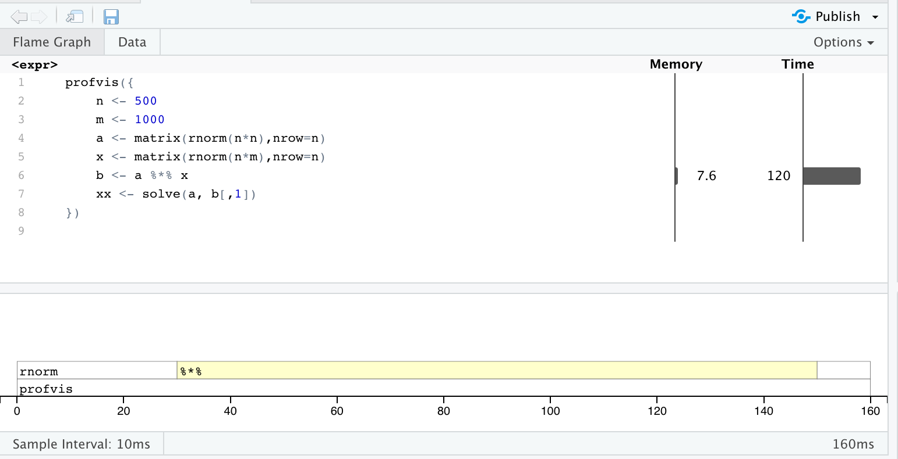

# Why write readable and efficient code?

In this document we will discuss some strategies for writing readable
and efficient code in R (the strategies may sometimes extend to
other high-level programming languages like python, Julia, or Matlab).

First, why do we care about these *secondary* properties of our
code. Perhaps the most important thing about an implementation of a
statistical method is that it *works*. You want it to be accurate, in
that you have faithfully translated the mathematical formulation of a
statistical method into code and that it runs without crashing on
typical input data. This is true, and yet these other properties are
also very important.

The main reason to care about readability and efficiency is because
*you want others to use your method, or be able to understand your
analysis*. There is a lot of chance involved in your method becoming
popular, but you give yourself a much better chance if it can be
easily understood by reading the code, and if it has been written in a
clever way, avoiding unnecessary inefficiencies. And similarly,
someone is more likely to trust your analysis if it doesn't look
like [spaghetti code](https://en.wikipedia.org/wiki/Spaghetti_code).

Trust that someone will probably look at your code (whether for a
method or a published analysis) and decide whether it makes sense.

# Readable code

**Readable code** for a high-level programming language will look
similar across whatever language you use. 

* *Visual space:* Code within a file is broken into meaningful
  vertical chunks, and code within a project is broken into meaningful
  files (this varies a bit from person to person). Use spaces between
  operators, e.g. `x <- 1` rather than `x<-1`.
  
* *Non-repeating:* Functions are used to define operations that will
  be repeated more than once. There should almost never be any code
  that looks as if it were *copy-pasted* within a project. Variations
  among similar code chunks can be turned into arguments of a
  function.
  
* *Inline documentation:* User-facing functions should have arguments
  that are documented above the function, along with a description of
  what the function returns. (We will discuss strategies for doing
  this in R using *roxygen2* and the *devtools* package.)
  
* *Comments:* Use lots of comments to describe the choices that are
  made in the code. It's difficult to actually provide *too many*
  comments. This helps others, and it will certainly help yourself in
  the future as you return to your code to make sense of what you were
  trying to do.
  
* *Meaningful names:* Function and variable naming is actually quite
  difficult. Simple and descriptive is good. If you have a function
  that estimates weights, e.g.  `estimateWeights`. For the main
  variables/objects (such as the ones the user provides as an
  argument), short variable names are acceptable, especially when
  these align with standard notation, e.g. `y`, `x`, or abbreviations,
  `wts`. For intermediate variables/objects it is best to be more
  descriptive, e.g. `robustEstVar` for a robust estimate of
  variance. Some R developers use "camel-case" for functions and
  variables (`estimateWeights`), while others use underscores
  (`estimate_weights`) for functions or periods for variables names
  `robust.est.var`. This is not so important, but try to be consistent
  within a project. 

It is also important to maintain a consistent coding style, as this consistency throughout your code helps with readability.  I would recommend reading Hadley Wickham's [R style guide](http://adv-r.had.co.nz/Style.html) as a good place to start (there are others that exist).  This guide goes through naming conventions, syntax, indentation, and other items, some of which were already covered in the list above.  

# Efficient code

**Efficient code** is a bit more language specific, and here we will
focus on efficiency in the R language. The most important factor
below however is true also for the other high-level programming
languages.

* *Use vectorized functions:* The most important thing to recognize
  about high-level programming languages is that they are built on top
  of fast routines written in Fortran, C, or C++ mostly. Iteration in
  the high-level language will always be slower than the *vectorized*
  function which iterates in the lower-level language. Use of row- or
  column-based operations over matrices, or matrix multiplication,
  that avoids iterating over rows or columns is one of the keys to
  efficient programming in R. 
* *Allocate first:* Another pitfall for writing R code is any
  operation which grows the memory space required for an object at
  each iteration. You should almost never have a loop where the inside
  of the loop has `out <- c(out, new.thing)`. Concatenation is ok, but
  remember that it has a time cost, so you don't want to be doing it
  often. Loops in R are not as bad as you may have heard, as long
  as the space has been pre-allocated. Loops in R will likely be
  slower than using a vectorized function, or a loop in C or C++, but
  they don't need to be avoided at all cost.
* *Avoid copying large objects:* This goes along with the above point,
  but copying large objects takes up a lot of time in R. To the extent
  that you can avoid [making copies](https://adv-r.hadley.nz/names-values.html) of a data object, you will avoid unnecessary slowdowns. We will discuss this in more detail later.
* *Go to C or C++:* You can typically gain a lot of speed by moving a
  repetitive operation from R to C or C++. We will see how to do this
  easily and in a way that the code is still readable in later lecture
  notes.
* *Memoization:* If you happen to be writing a function that will take
  input which has repeated elements, and it is very important for this
  function to be very fast, memoization can be a useful
  technique. Memoization entails storing the values of expensive
  function calls so that they don't have to be repeated. There is a
  small overhead in saving and looking up the precomputed values, but
  if the degree of repeated input is high, the savings of memoization
  can be large. The *memoise* package helps with this in R.
* *Parallelization:*  One can think of the standard for loop as a serial operation: the $(i+1)$th    iteration is always ran after the $(i)$th iteration has completed.  On machines with more than one CPU available, say with $P$ CPUs, parallelization of iterations may allow for the execution of up to $P$ iterations of the for loop at the same time. This is particularly helpful when there are a large number of loop iterations that are non-recursive, meaning the next iteration of the loop does not depend on the prior one (simulations for example).  One thing to note is that each parallel instance invoked in R requires additional memory, and therefore in memory-intensive operations this may quickly exhaust the available memory on your machine if you are not careful.    

Two short notes on avoiding making copies, from Section 2.5 in [Advanced R](https://adv-r.hadley.nz/names-values.html):

> For loops have a reputation for being slow in R, but often that slowness is caused by every iteration of the loop creating a copy. Consider the following code. It subtracts the median from each column of a large data frame:

and

> While it’s not hard to determine when a copy is made, it is hard to prevent it. If you find yourself resorting to exotic tricks to avoid copies, it may be time to rewrite your function in C++

# Learning more about efficient code

This course has many topics to cover, and so we can only cover some of
the basics for each module, and within each module on each topic. Of
course, efficient code is a topic that could expand to fill a
semester. We will show some of the most important topics for a
Biostatistics student in this lecture note, but I highly recommend
this online textbook by Colin Gillespie and Robin Lovelace:

* [Efficient R Programming](https://csgillespie.github.io/efficientR/)

We don't have time to sufficiently cover everything in this note, but it's worth reading on your own.  Some of the topics in this book, for example usage of *Rcpp* and *data.table* will be covered in later lecture notes.


# Benchmarking R code

We will make use of *microbenchmark* package to assess efficiency of
methods here and again in the course. It is not part of the core set
of R packages, so you will need to install it with `install.packages`.

## Pre-allocation

You can compare two implementations by passing them to the
`microbenchmark` function:

```{r}
library(microbenchmark)
slow.sqrt <- function(x) {
  ans <- numeric(0)
  for (i in seq_along(x)) {
    ans <- c(ans, sqrt(x[i]))
  }
  ans
}
microbenchmark(sqrt(1:1000), slow.sqrt(1:1000))
```

This benchmark indicates that the vectorized version of the square
root is many orders of magnitude faster than a naive
implementation. Let's compare `slow.sqrt` with a version where we
preallocate the vector that stores the eventual output of the function:

```{r}
pre.sqrt <- function(x) {
  ans <- numeric(length(x))
  for (i in seq_along(x)) {
    ans[i] <- sqrt(x[i])
  }
  ans
}
microbenchmark(pre.sqrt(1:1000), slow.sqrt(1:1000))
```

So simply pre-allocating saves us about an order of magnitude in
speed.

## Initial attempts at C++

We can also assess the speed of R's vectorized `sqrt` comparing to our
own implementations in C++. Here we use the *Rcpp* package to define
some inline C++ code which is then compiled and accessible as an R
function. We will show more details on incorporating C++ code in
future lecture notes.

```{r}
library(Rcpp)
cppFunction(
"NumericVector rcpp_sqrt1(NumericVector x) {
  int n = x.size();
  Rcpp::NumericVector y(x);
  for (int i=0; i < n; i++) {
    y[i] = sqrt(x[i]);
  }
  return y;
}")
cppFunction(
"NumericVector rcpp_sqrt2(NumericVector x) {
  return sqrt(x);
}")
microbenchmark(sqrt(1:1000),
               rcpp_sqrt1(1:1000),
               rcpp_sqrt2(1:1000))
```

Our two C++ implementations are comparable, and now only about 3 times
slower than R's `sqrt`. 

## Memoization

We also show an example of how memoization can help in certain
circumstances when there is repeated input.

```{r}
library(memoise)
x <- sample(10, 1000, TRUE)
slow.fn <- function(x) {
  Sys.sleep(.001)
  x + pi
}
mem.fn <- memoise(slow.fn)
system.time(sapply(x, slow.fn))
system.time(sapply(x, mem.fn))
forget(mem.fn)
```

We defined an arbitrary function `slow.fn` which waits a millisecond
before returning the input plus `pi`. We then run `slow.fn` on a
vector of length 1000, although the values of the vector are limited
to then numbers 1 to 10. When we instead call the memoized version of
the function, we only incur the millisecond cost of `slow.fn` 10 times
(for each time we need to calculate the value of `slow.fn` on the
numbers 1 to 10). Any repeated calls to `slow.fn` on a number that
`mem.fn` has already seen instead incur the cost of looking up the
value of `slow.fn` in an in-memory cache.

## Matrices when possible

Finally, one can be using vectorized functions in R and still not
writing the most efficient code possible, if one is not making use of
functions which can operate on matrices, but instead working "one row
at a time". Here we give a simple example of $A X = B$ where all three
are matrices. If we treat this problem as a series of $A x = b$ where
$x$ and $b$ are vectors, then we will incur a cost in speed.

```{r}
n <- 50
m <- 1000
a <- matrix(rnorm(n*n),nrow=n)
x <- matrix(rnorm(n*m),nrow=n)
b <- a %*% x
xx <- solve(a, b[,1])
all.equal(x[,1], xx)
```

Implementing this as a function:

```{r}
slow.solve <- function(a, b) {
  xx <- matrix(nrow=nrow(b), ncol=ncol(b))
  for (i in seq_len(ncol(b))) {
    xx[,i] <- solve(a, b[,i])
  }
  xx
}
x1 <- solve(a, b)
x2 <- slow.solve(a, b)
all.equal(x1, x2)
microbenchmark(solve(a,b), slow.solve(a,b))
```

## Parallelization

The *parallel* package in R is commonly use for parallelizing functions. Let see how much faster we can speed up the slow.solve function by parallelizing it. First we have to load the parallel library and detect the max number of cores available on your machine.

```{r}
library("parallel")
no_of_cores = detectCores()
```

Then, we can utilize the parallelized version of sapply, apply, and lapply from the parallel package (parSapply, parApply, and parLapply). We start by requesting the number of cores we would like to use (here we use two).

```{r}
## creates a set of copies of R running in parallel
cl = makeCluster(2)

## now we create a function representing the inner portion of the slow.solve for loop
# bi is assumed to be the i'th column of b being passed to slow.solve.i
slow.solve.i = function(bi, a){
  xxi <- solve(a, bi)
  return(xxi)
}

## now run benchmark comparing slow.solve, the apply version, and the parApply version
microbenchmark(
  slow.solve(a,b), 
  apply(X = b, MARGIN = 2, FUN = slow.solve.i, a = a), 
  parApply(cl = cl, X = b,  FUN = slow.solve.i, MARGIN = 2, a = a)
)

# Close the cores after use of parApply to prevent memory leaks
stopCluster(cl)
```

We see that the parallelized version is twice as fast than slow.solve and the apply function.   Still, it is not as fast as using a vectorized function. For a smaller number of iterations paralellization may not be as helpful given the overhead required to coordinate tasks across cores. If using within a function, sometimes an error in the function may cause it to terminate earlier.  Adding "on.exit(stopCluster(cl))" after makeCluster() above helps to simplify this issue, where whatever function is within on.exit() will be executed regardless of how the function ends. 

On linux and mac, one can alternatively ue the mcapply() and mclapply() functions, where the main difference is that one does not need to explictly start and stop the cluster objects as in the above example. This simplifies its use, especially when nested within other functions. 

One important note when using parallelization on high performance computing clusters.  Such clusters consist of multiple compute nodes connected to a login node.  Typically jobs that are submitted to the cluster are handled from the login nodes and distributed to the compute nodes.  A single job may also request multiple cpu's to run operations within the job in parallel. However for the parallel package and most other parallelized routines in R, parallelization cannot go beyond a single node, and is therefore limited to the number of CPUs on that node.  For parallelization across a large number of CPUs, one needs to utilize Message Passing Interface (MPI) enabled versions of R, with accompanying MPI-enabled R packages (*Rmpi*) and cluster software (*openMPI*). 

Additional detail can be found in Section 7.5 of the Efficient R Programming book. An up-to-date listing of other R packages that enable parallel computing can be [found here](https://cran.r-project.org/web/views/HighPerformanceComputing.html).  Examples include *Rmpi*, which is an R-wrapper for MPI, as well as *foreach*, which is an R package that allows for the execution of parallelized loops in R. 

## Code Profiling

[Code profiling](https://csgillespie.github.io/efficientR/performance.html#performance-profvis) is a really useful way to figure out what lines of code are
causing the greatest bottlenecks in your package or script. I highly recommend using code profiling if you end up making a package where speed and memory usage are a critical factors.  A popular package used for this purpose is the *profvis* package via the profvis() function.  One way to use this function is to apply it directly to several lines of R code, which can be passed to the first argument of the function.  We demonstrate this with an example from earlier:


```{r, eval = F}
library("profvis")
profvis({
  n <- 500
  m <- 1000
  a <- matrix(rnorm(n*n),nrow=n)
  x <- matrix(rnorm(n*m),nrow=n)
  b <- a %*% x
  xx <- solve(a, b[,1])
})
```

After running the above example, we can see a new interactive html panel open where the top pane breaks up the code chunk by line and lists the memory usage and timing of each (in milliseconds).



We can see that the matrix multiplication step is the most time consuming here, and would a place to focus our efforts if we would like to speed up the overall run time of this chunk.  The bottom pane is called a "flame graph" and lists the call stack on the vertical axis and time (in milliseconds) on the horizontal axis. We can see here that again the matrix multiplication step was the most time consuming.  Since we are using simple functions here the call stack is not that deep, but you can find more examples [here](https://rstudio.github.io/profvis/) on the package website.  

You can also run profiling on individual functions, such as the ones we defined earlier:

```{r, eval = F}
profvis(slow.solve(a, b))
```

Interpreting memory use in the top pane is a little more tricky, see the following quote from the *profvis* package page:

> The code panel also shows memory allocation and deallocation. Interpreting this information can be a little tricky, because it does not necessarily reflect memory allocated and deallcated at that line of code. The sampling profiler records information about memory allocations that happen between the previous sample and the current one. This means that the allocation/deallocation values on that line may have actually occurred in a previous line of code.

In general, code profiling allows one to focus your speed and memory optimization efforts on those parts that are *actually*  resource intensive in your code. 

# Example: Monte-Carlo integration 

Suppose we wish to estimate the integral
\[
\int_0^1 x^2 dx
\]
using Monte-Carlo Integration. We will learn more about this in Module 2, but for now, we focus on the programming aspect.

_Monte Carlo Integration Psuedocode_

1. Initialise: `hits = 0`
1. __for i in 1:N__
1. $~~~$ Generate two random numbers, $U_1, U_2$, between 0 and 1
1. $~~~$ If $U_2 < U_1^2$, then `hits = hits + 1`
1. __end for__
1. Area estimate = `hits/N`

Implementing this Monte-Carlo algorithm in R would typically lead to something like:

```{r tidy=FALSE}
monte_carlo = function(N) {
  hits = 0
  for (i in seq_len(N)) {
    u1 = runif(1)
    u2 = runif(1)
    if (u1 ^ 2 > u2)
      hits = hits + 1
  }
  return(hits / N)
}
```

In R this takes a few seconds

```{r cache=TRUE}
N = 500000
system.time(monte_carlo(N))
```

Derive a more R-centric, vectorized approach to the above function to make it faster.  Can you explain the intuition behind why this algorithm works for estimating the value of an integral?


