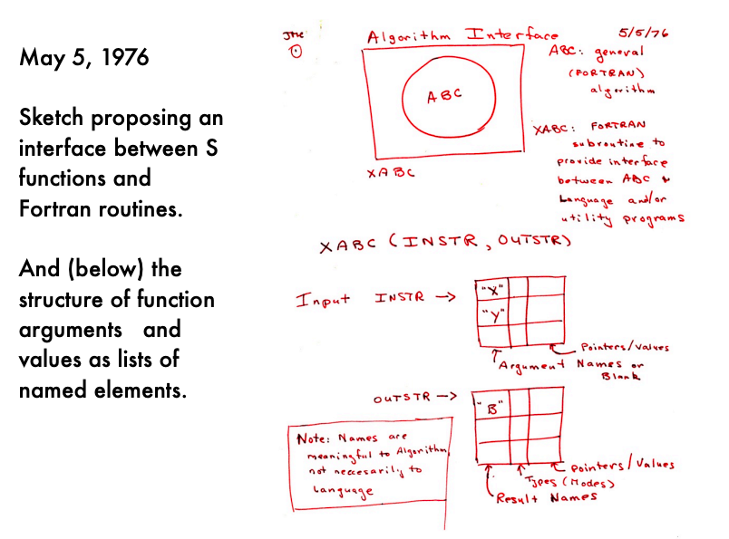

# Calling languages from R: nothing new here

Calling languages like C and C++ from R can be a very powerful
framework, and you'll see that many successful R packages will use C
or C++ (or Fortran) to run the most computationally intensive part of
the method. R then provides a useful interface, and a way to make nice
plots and summaries of the results, or to link to other datasets. R is
also useful for reading in a variety of data, as we will see in a
series of notes about working with large data.

R being the glue tying together fast low-level routines is actually
how most of R works. Note for example the `.f` and `.c` files in the 
[R source directory](https://svn.r-project.org/R/trunk/src/library/stats/src/).
This R-as-glue framework goes back to the design proposal for the
original language S, as conceived by one of its creators John
Chambers in the 1970s:



[Slide from John Chambers' useR 2006 talk](https://www.r-project.org/conferences/useR-2006/Slides/Chambers.pdf)

# Introduction to compilation errors

In this lecture note, we are going to focus on adding C++ code to an R
package. We already showed a small example in the efficient code
lecture note about using the `cppFunction` in *Rcpp* to write some
inline C++ code. This is not the approach that you should take however
if you want to include C++ code in an R package. Instead you will put
your C++ code into one or more files with a `.cpp` ending, which go
into the `src` directory of your R package.

We will not teach C++ itself in this class, but just show some simple
examples and let you continue on your own in your research. 
There are numerous resources online for learning C++,
but you can also stick closely to the operations defined in the *Rcpp*
and *RcppArmadillo* guides and implement many statistical routines
with experimentation and use of Google and Internet forums.
It is perfectly normal that you will encounter compilations errors if
you are new to writing C++ code, and as you learn how to work with new
packages and new C++ libraries. As you encounter errors, look for
examples of well written R packages using Rcpp, read the 
[Rcpp vignettes](https://cran.r-project.org/web/packages/Rcpp/index.html),
and use Google to find relevant threads. In
fact, the compilation errors will sometimes point you straightaway to
the problems in your code. Other times it will take some more
investigation, but this is all totally normal. For students more
familiar with writing R code, typically the errors involve working
with a
[static typed language](https://en.wikipedia.org/wiki/Type_system#Type_checking).

Why C++? You can also combine R with C or with Fortran. We choose C++
because there is an R package Rcpp which *greatly* simplifies the
interface between R and a fast language. It is even possible to
perform vectorized operations in C++ as described in the 
[Rcpp-sugar vignette](https://cran.r-project.org/web/packages/Rcpp/vignettes/Rcpp-sugar.pdf).
In addition there are sister packages like *RcppArmadillo*
providing access to the fast and elegant linear algebra library
[Armadillo](http://arma.sourceforge.net/), which leverage the Rcpp interface.
By elegant, I mean that the C++ code is still quite "high-level" in
that it is easily readable as linear algebra. I find this very
compelling as statistical software is both a useful product to
scientists who may want to use the statistical method, and *the source
code should be readable as a research product itself*, so that other
statisticians can be inspired by it to create related methods.

As background, here are some of the first few lines from 
[the introductory vignette to Rcpp](https://cran.r-project.org/web/packages/Rcpp/vignettes/Rcpp-introduction.pdf):

> Since the beginning, and as we argue below, “by design”, the R
> system has always provided an application programming interface
> (API) suitable for extending R with code written in C or Fortran.
> Being implemented chiefly in R and C (with a generous sprinkling of
> Fortran for well-established numerical subroutines), R has always
> been extensible via a C interface. ...
> And with the introduction of the Rcpp package (Eddelbuettel and
> François, 2011; Eddelbuettel, 2013; Eddelbuettel et al., 2018a),
> and its later refinements, this process of extending R has become
> considerably easier yet also more robust.

# Hello world example

We will first focus on a "hello world" example of getting a C++
function that we can incorporate into an R package and call from
R. The first step is to install the *Rcpp* package.

We then write a simple example of a C++ function (this one from the 
[Rcpp-package vignette](https://cran.r-project.org/web/packages/Rcpp/vignettes/Rcpp-package.pdf)).

```{Rcpp eval=FALSE}
#include <Rcpp.h>
using namespace Rcpp;

// [[Rcpp::export]]
List rcpp_hello_world() {
  CharacterVector x = CharacterVector::create( "foo", "bar" ) ;
  NumericVector y = NumericVector::create( 0.0, 1.0 ) ;
  List z = List::create( x, y ) ;
  return z ;
}
```

The top two lines include the Rcpp header file, and declare that we
will use the Rcpp namespace. If we did not use the Rcpp namespace we
would have to put `Rcpp::` in front of all Rcpp functions,
e.g. `Rcpp::NumericVector`.
The line beginning with `//` indicates that we want to export this
function to be used in R (more on this later). The body of the
function follows, were we indicate that `rcpp_hello_world` returns a
*List* and takes no arguments. Inside the function are some simple
commands, creating a pre-specified character vector, and numeric
vector, then making a *List* from these two and returning this
*List*. 

We can add this to a `.cpp` file in the `src` directory, for example,
`src/foo.cpp`. One last step is that we need to add the following to
our `DESCRIPTION` file (don't add a new Imports line if you already
have one, but just add Rcpp to the comma separated list). The
LinkingTo line will allow us to include the Rcpp header file. 

```
Imports: Rcpp (>= 0.11.0)
LinkingTo: Rcpp
```

We can try out our function by running the `load_all()`
function from *devtools*. This will trigger a call to the
`compileAttributes` function in *Rcpp*, but since we've already
introduced `load_all`, we won't worry about `compileAttributes`. The
other way to try out the new C++ function in the R package without
running `load_all()` would be to run `compileAttributes()`, then build and
install the package.

Running `load_all()` produces the following files (here, using version
0.12.19 of *Rcpp*): 

* `src/RcppExports.cpp`
* `R/RcppExports.R`

The first file `src/RcppExports.cpp` has the following auto-generated
contents (as it says at the top, these auto-generated files should not
be edited by hand):

```{Rcpp, eval=FALSE}
// Generated by using Rcpp::compileAttributes() -> do not edit by hand
// Generator token: 10BE3573-1514-4C36-9D1C-5A225CD40393

#include <Rcpp.h>

using namespace Rcpp;

// rcpp_hello_world
List rcpp_hello_world();
RcppExport SEXP _foo_rcpp_hello_world() {
BEGIN_RCPP
    Rcpp::RObject rcpp_result_gen;
    Rcpp::RNGScope rcpp_rngScope_gen;
    rcpp_result_gen = Rcpp::wrap(rcpp_hello_world());
    return rcpp_result_gen;
END_RCPP
}

static const R_CallMethodDef CallEntries[] = {
    {"_foo_rcpp_hello_world", (DL_FUNC) &_foo_rcpp_hello_world, 0},
    {NULL, NULL, 0}
};

RcppExport void R_init_foo(DllInfo *dll) {
    R_registerRoutines(dll, NULL, CallEntries, NULL, NULL);
    R_useDynamicSymbols(dll, FALSE);
}
```

We can see this has a wrapper function for our C++ function
`_foo_rcpp_hello_world`, where *foo* is the name of the package, and
the rest is the name of the C++ function being exported.

The second file `R/RcppExports.R` has the following contents:

```{r eval=FALSE}
# Generated by using Rcpp::compileAttributes() -> do not edit by hand
# Generator token: 10BE3573-1514-4C36-9D1C-5A225CD40393

rcpp_hello_world <- function() {
    .Call('_foo_rcpp_hello_world', PACKAGE = 'foo')
}
```

The second file creates a function in R which calls the C++ function
we wrote. The R function is called `rcpp_hello_world`, and you can see
that it is calling the wrapper function in C++,
`_foo_rcpp_hello_world`. 

I typically do not export the R wrapper functions such as
`rcpp_hello_world`, but instead put these functions inside of other R
functions. This makes sense, because the wrapper function defined
above is auto-generated and incredibly minimal. It makes sense to
provide argument checks and messages/warnings/errors before going
straight into the C++ function. Those checks and
messages/warnings/errors would be appropriate to put into the
following type of R function, which lives in a separate R file (not in
`R/RcppExports.R`, which is re-written every time you run `load_all()`
or `compileAttributes()`). 

```{r eval=FALSE}
#' @useDynLib foo
#' @export
rcpp.hello.world <- function() {
  rcpp_hello_world()
}
```

The `@export` tag indicates that this function will be exported and
visible when the *foo* package is loaded. The `@useDynLib foo` line
is necessary to add to the *roxygen* block above only one function of
your package (not needed twice). The `foo` here refers to the package
name. As we added *roxygen* code blocks, we need to then run
`document()`, and then `load_all()` again. 

Finally we can run our example function:

```{r echo=FALSE}
load_all("foo")
```

```{r}
rcpp.hello.world()
```

# Another Rcpp example

While the example above took no input and returned a list, we can also
show an example where we take a numeric vector as input and return a
numeric vector:

```
// [[Rcpp::export]]
NumericVector add_one_sqrt(NumericVector x) {
  NumericVector y(x);
  y = sqrt(x + 1.0);
  return y;
}
```

We then add an R wrapper function:

```{r eval=FALSE}
#' @export
add.one.sqrt <- function(x) {
  add_one_sqrt(x)
}
```

We then repeat the steps above to load our package, which are to run
`document()` so that the `add.one.sqrt` function is exported and the
`src/RcppExports.cpp` and `R/RcppExports.R` files are updated
(`document()` triggers these compilation steps as well as
`load_all()`). Then we can load the package with `load_all()`.

```{r}
add.one.sqrt(1:5)
```

For more details on all of the C++ functions that can be used in
*Rcpp* one should check the 
[vignettes](https://cran.r-project.org/web/packages/Rcpp/index.html).
There is typically a lot of practice and debugging when taking a bit
of working code in R and translating to C++, so be persistent.

# RcppArmadillo example

Finally, as we mentioned in the introduction to this lecture note,
there are other libraries that make *Rcpp* a compelling interface,
including the [Armadillo](http://arma.sourceforge.net/) linear algebra
library for C++. In the *Armadillo* documentation, a table presents 
[common matrix operations](http://arma.sourceforge.net/docs.html#syntax) in
Matlab and the corresponding code in *Armadillo*.

*Armadillo* can be run within the *Rcpp* framework using an additional
R package *RcppArmadillo*. The objects are represented differently in
comparison to *Rcpp*. Below the objects typed with `arma::` prefix are 
*Armadillo* classes of objects. *RcppArmadillo* has a different set of 
[vignettes](https://cran.r-project.org/web/packages/RcppArmadillo/index.html) and
you should read the introduction vignette to become acquainted with
the interface. This example is derived from the 
[fastLm.cpp](http://dirk.eddelbuettel.com/code/rcpp.armadillo.html) example
from *RcppArmadillo* and uses the `const arma::mat&` typing in order
to avoid making an extra copy of the matrices `X` and `Y`.

```
#include <RcppArmadillo.h>
using namespace Rcpp;

// [[Rcpp::export]]
arma::mat matrix_mult(const arma::mat& X, const arma::mat& Y) {
  int m = X.n_rows;
  int n = Y.n_cols;
  arma::mat Z(m,n);
  Z = X * Y;
  return Z;
}
```

We need to update our `DESCRIPTION` file to include *RcppArmadillo* in
both Imports and LinkingTo fields:

```
Imports: Rcpp (>= 0.11.0), RcppArmadillo
LinkingTo: Rcpp, RcppArmadillo
```

And we write and mark for export our wrapper function:

```{r eval=FALSE}
#' @export
matrix.mult <- function(X,Y) {
  matrix_mult(X,Y)
}
```

Then running `document()` and `load_all()` we can try out our new
function: 

```{r}
m1 <- matrix(1:12,ncol=4)
m2 <- matrix(13:24,nrow=4)
matrix.mult(m1, m2)
```

